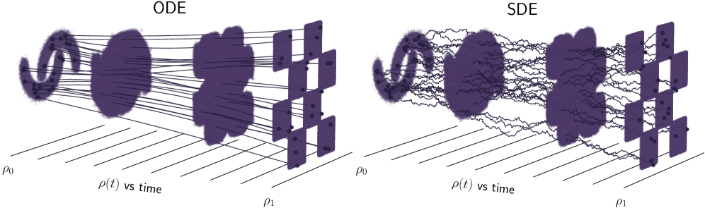
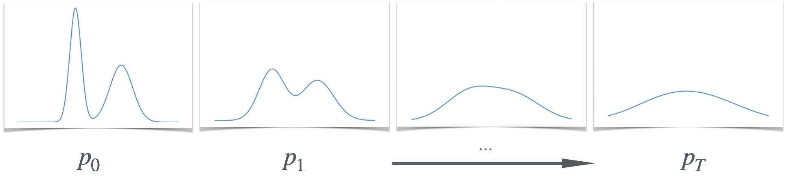
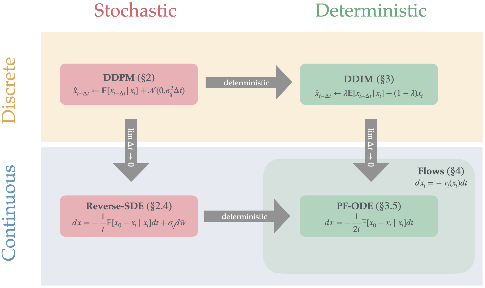

## 从“先设计概率路径”到“再构造生成动力学”

本文希望回答一个核心问题：

> 给定易采样的噪声分布和目标数据分布，怎样先设计一条连接二者的概率路径，再用 ODE 或 SDE 在生成阶段实现这条路径？

全文最重要的逻辑链是

$$
\boxed{
\begin{array}{c}
\text{训练时构造随机插值 }x_t
\\[1mm]
\Downarrow
\\[1mm]
\text{得到目标边际路径 }\rho(t)
\text{ 和随机速度标签 }Y_t
\\[1mm]
\Downarrow
\\[1mm]
u(t,x)=\mathbb E[Y_t\mid x_t=x]
\\[1mm]
\Downarrow
\\[1mm]
\begin{cases}
\text{ODE 产生的密度 }q(t)=\rho(t),\\
\text{适当 SDE 产生的密度 }p(t)=\rho(t).
\end{cases}
\end{array}}
$$

这里的关键不是说 ODE、SDE 和随机插值具有相同的单条轨迹，而是说：

$$
\boxed{
\text{它们可以具有相同的单时刻边际分布。}
}
$$

---

## 1. 三个层次必须分开

为了避免混淆，先区分全文中的三类对象。

| 层次 | 随机变量或过程 | 密度 | 作用 |
|---|---|---|---|
| 训练时设计的随机插值 | $x_t$ | $\rho(t,x)$ | 定义希望模型复现的概率路径 |
| 生成 ODE | $X_t$ | $q(t,x)$ | 从噪声出发进行确定性生成 |
| 生成 SDE | $Z_t$ | $p(t,x)$ | 从噪声出发进行随机生成 |

另外还要区分两类速度：

| 符号 | 含义 |
|---|---|
| $Y_t=\dot x_t$ | 一条随机插值轨迹的随机速度 |
| $u(t,x)=\mathbb E[Y_t\mid x_t=x]$ | 给定时间和位置后的条件平均速度场 |

其中：

- $\rho,q,p$ 都是概率密度，不是速度场；
- $Y_t$ 是依赖隐藏变量的随机速度；
- $u(t,x)$ 是只依赖当前时间和位置的确定性速度场；
- 理论中的 $u$ 是精确条件期望，实际模型学习的是近似 $u_\theta$。

---

## 2. 第一步：用随机插值设计目标概率路径

### 2.1 两个端点与耦合

约定生成时间 $t$ 从 $0$ 增长到 $1$：

$$
\rho_0=\text{易采样的基分布，通常为高斯噪声},
\qquad
\rho_1=\text{目标数据分布}.
$$

采样

$$
(x_0,x_1)\sim\nu,
$$

其中 $\nu$ 的两个边际分别是 $\rho_0$ 和 $\rho_1$。最简单的选择是独立耦合

$$
\nu=\rho_0\otimes\rho_1.
$$

耦合 $\nu$ 决定哪些噪声样本与哪些数据样本配对，但不改变两个端点分布。

### 2.2 双端点随机插值

取满足端点条件的确定性插值函数

$$
I(0,x_0,x_1)=x_0,
\qquad
I(1,x_0,x_1)=x_1.
$$

再采样独立高斯潜变量

$$
z\sim\mathcal N(0,\mathrm{Id}),
\qquad
z\perp(x_0,x_1),
$$

定义

$$
\boxed{
x_t=I(t,x_0,x_1)+\gamma(t)z.
}
\tag{2.1}
$$

对本节的双端点随机插值，要求

$$
\gamma(0)=\gamma(1)=0.
$$

于是

$$
x_0\sim\rho_0,
\qquad
x_1\sim\rho_1.
$$

定义 $x_t$ 的边际密度为

$$
\boxed{
x_t\sim\rho(t,\cdot).
}
\tag{2.2}
$$

因此 $\rho(t)$ 是由随机插值预先设计出来的目标概率路径。此时它还没有被证明是某个生成 ODE 或生成 SDE 的密度。

### 2.3 为什么随机插值本身通常不是生成算法

训练时可以同时取得噪声样本 $x_0$ 和数据样本 $x_1$，所以容易构造 $x_t$。

但生成时只有

$$
x_0\sim\rho_0,
$$

并不知道目标端点 $x_1$。因此不能直接依靠式 (2.1) 生成新数据。

随机插值的主要作用是：

1. 定义希望生成模型复现的中间边际 $\rho(t)$；
2. 提供可以直接采样的监督信号；
3. 帮助构造只依赖 $(t,x)$ 的 ODE 或 SDE。

---

## 3. 从随机轨迹速度得到确定速度场

对式 (2.1) 关于时间求导：

$$
\boxed{
Y_t:=\dot x_t
\mathrel{=}
\partial_tI(t,x_0,x_1)+\dot\gamma(t)z.
}
\tag{3.1}
$$

$Y_t$ 是单条随机插值轨迹的速度。即使给定 $x_t=x$，仍可能有多组不同的 $(x_0,x_1,z)$ 经过该位置，并产生不同的 $Y_t$。

而 ODE 的速度场必须满足：给定 $(t,x)$ 后，速度是一个确定向量。

因此定义

$$
\boxed{
u(t,x)
:=
\mathbb E[Y_t\mid x_t=x].
}
\tag{3.2}
$$

这一步可以理解为从“拉格朗日随机轨迹速度”得到“欧拉确定速度场”。

需要特别注意：

$$
Y_t=u(t,x_t)
$$

一般不会逐样本成立。成立的是条件平均关系

$$
\boxed{
\mathbb E[Y_t\mid x_t]=u(t,x_t).
}
\tag{3.3}
$$

---

## 4. 为什么随机插值密度 $\rho$ 满足连续性方程

### 4.1 测试函数证明

为突出主要逻辑，以下假设 $I$ 和 $\gamma$ 对时间可微、相关期望有限、允许交换时间求导与期望，并假设涉及的密度和速度场足够光滑。

取任意光滑紧支撑测试函数

$$
\varphi\in C_c^\infty(\mathbb R^d).
$$

> **备注：什么是测试函数？**
>
> $\varphi\in C_c^\infty(\mathbb R^d)$ 表示 $\varphi$ 是定义在 $d$ 维空间上的光滑函数：$C^\infty$ 表示可以无限次求导，右下角的 $c$ 表示它只在某个有限区域内非零，称为“紧支撑”。
>
> 可以把 $\varphi$ 看成一个光滑探测器。若它在区域 $A$ 内接近 $1$、区域外接近 $0$，那么 $\mathbb E[\varphi(x_t)]$ 就近似测量 $x_t$ 落在区域 $A$ 内的概率。紧支撑还保证分部积分时无穷远处不会产生边界项。

由链式法则，

$$
\frac{\mathrm d}{\mathrm dt}\varphi(x_t)
\mathrel{=}
\nabla\varphi(x_t)\cdot Y_t.
$$

> **备注：为什么链式法则给出这个等式？**
>
> 写成坐标形式，$x_t=(x_t^{(1)},\ldots,x_t^{(d)})$。多变量链式法则给出：$\displaystyle \frac{\mathrm d}{\mathrm dt}\varphi(x_t)=\sum_{i=1}^d\frac{\partial\varphi}{\partial x_i}(x_t)\frac{\mathrm dx_t^{(i)}}{\mathrm dt}$。
>
> 梯度是 $\nabla\varphi=(\partial_{x_1}\varphi,\ldots,\partial_{x_d}\varphi)$，而 $Y_t=\dot x_t$，所以上面的求和正是点积 $\nabla\varphi(x_t)\cdot Y_t$。虽然 $x_t$ 是随机的，但固定一次随机采样后，它就是一条普通的时间轨迹，因此可以逐轨迹使用链式法则。

取期望：

$$
\frac{\mathrm d}{\mathrm dt}
\mathbb E[\varphi(x_t)]
\mathrel{=}
\mathbb E[
\nabla\varphi(x_t)\cdot Y_t
].
\tag{4.1}
$$

对 $x_t$ 使用条件期望：

$$
\begin{aligned}
\mathbb E[
\nabla\varphi(x_t)\cdot Y_t
]
&=
\mathbb E\!\left[
\nabla\varphi(x_t)\cdot
\mathbb E[Y_t\mid x_t]
\right]
\\
&=
\mathbb E[
\nabla\varphi(x_t)\cdot u(t,x_t)
]
\\
&=
\int_{\mathbb R^d}
\nabla\varphi(x)\cdot u(t,x)\rho(t,x)\,\mathrm dx.
\end{aligned}
\tag{4.2}
$$

> **备注：这里使用了塔式法则和条件期望的“已知量提出”性质。**
>
> 条件期望 $\mathbb E[Y_t\mid x_t]$ 可以理解为：按照 $x_t$ 的取值把样本分组，然后在每一组内对 $Y_t$ 求平均。
>
> **塔式法则：** 先在每个 $x_t$ 分组内求平均，再对所有分组求总体平均，等于直接求总体平均：$\mathbb E[Z]=\mathbb E\!\left[\mathbb E[Z\mid x_t]\right]$。
>
> **已知量提出：** 给定 $x_t$ 后，任何只依赖 $x_t$ 的量都已经确定。因此对任意函数 $g$，有 $\mathbb E[g(x_t)Y_t\mid x_t]=g(x_t)\mathbb E[Y_t\mid x_t]$。
>
> 这里 $g(x_t)=\nabla\varphi(x_t)$，所以 $\mathbb E[\nabla\varphi(x_t)\cdot Y_t]=\mathbb E[\nabla\varphi(x_t)\cdot\mathbb E[Y_t\mid x_t]]$。
>
> 最后使用 $u(t,x)=\mathbb E[Y_t\mid x_t=x]$，便得到式 (4.2)。

分部积分得到

$$
\frac{\mathrm d}{\mathrm dt}
\mathbb E[\varphi(x_t)]
\mathrel{=}
-\int_{\mathbb R^d}
\varphi(x)\nabla\cdot(\rho u)(t,x)\,\mathrm dx.
\tag{4.3}
$$

> **备注：分部积分做了什么？**
>
> 令概率流量 $F=\rho u$。乘积求导公式为 $\nabla\cdot(\varphi F)=\nabla\varphi\cdot F+\varphi\nabla\cdot F$。
>
> 在整个 $\mathbb R^d$ 上积分时，由于 $\varphi$ 在足够远处为零，边界项消失，因此 $\displaystyle \int_{\mathbb R^d}\nabla\varphi\cdot F\,\mathrm dx=-\int_{\mathbb R^d}\varphi\,\nabla\cdot F\,\mathrm dx$。
>
> 代入 $F=\rho u$ 就得到式 (4.3)。其中 $\rho u$ 表示概率流量，$\nabla\cdot(\rho u)$ 表示一个位置附近的净流出程度：净流出为正时，该处概率密度会下降，所以公式中出现负号。

另一方面，

$$
\mathbb E[\varphi(x_t)]
\mathrel{=}
\int_{\mathbb R^d}
\varphi(x)\rho(t,x)\,\mathrm dx,
$$

所以

$$
\frac{\mathrm d}{\mathrm dt}
\mathbb E[\varphi(x_t)]
\mathrel{=}
\int_{\mathbb R^d}
\varphi(x)\partial_t\rho(t,x)\,\mathrm dx.
\tag{4.4}
$$

比较式 (4.3) 和式 (4.4)：

$$
\int_{\mathbb R^d}
\varphi(x)
\left[
\partial_t\rho+\nabla\cdot(\rho u)
\right](t,x)\,\mathrm dx
=0.
$$

由于测试函数 $\varphi$ 可以任意选择，在上述光滑假设下，只能有

$$
\boxed{
\partial_t\rho(t,x)
+
\nabla\cdot\bigl(\rho(t,x)u(t,x)\bigr)
=0
}
\tag{4.5}
$$

### 4.2 这一步表达了什么

随机插值的单条轨迹使用随机速度 $Y_t$，但其边际密度只感受到条件平均后的概率流量

$$
\boxed{
J_\rho(t,x)=\rho(t,x)u(t,x).
}
\tag{4.6}
$$

连续性方程就是概率质量守恒：

$$
\text{局部密度变化}
+
\text{净流出量}
=0.
$$

---

## 5. 构造 ODE，并证明其密度 $q$ 等于 $\rho$

### 5.1 ODE 中的 $u$ 从哪里来

为了避免误解，暂时把式 (3.2) 得到的速度记作

$$
u_{\mathrm{SI}}(t,x)
\mathrel{=}
\mathbb E[Y_t\mid x_t=x].
$$

接下来人为构造 ODE：

$$
\boxed{
\dot X_t=u_{\mathrm{SI}}(t,X_t),
\qquad
X_0\sim\rho_0.
}
\tag{5.1}
$$

因此并不存在两个独立推导出来、后来才被证明相同的速度场。逻辑是

$$
\boxed{
\text{先从随机插值得到 }u_{\mathrm{SI}},
\quad
\text{再把同一个 }u_{\mathrm{SI}}\text{ 放入 ODE。}
}
$$

后文重新把 $u_{\mathrm{SI}}$ 简写为 $u$。

定义 ODE 解的密度：

$$
\boxed{
X_t\sim q(t,\cdot).
}
\tag{5.2}
$$

这里 $q$ 是 ODE 粒子群的密度，不是速度场。

### 5.2 为什么 $q$ 也满足连续性方程

因为

$$
\dot X_t=u(t,X_t),
$$

所以对测试函数 $\varphi$，

$$
\begin{aligned}
\frac{\mathrm d}{\mathrm dt}
\mathbb E[\varphi(X_t)]
&=
\mathbb E[
\nabla\varphi(X_t)\cdot\dot X_t
]
\\
&=
\mathbb E[
\nabla\varphi(X_t)\cdot u(t,X_t)
]
\\
&=
\int_{\mathbb R^d}
\nabla\varphi(x)\cdot u(t,x)q(t,x)\,\mathrm dx
\\
&=
-\int_{\mathbb R^d}
\varphi(x)\nabla\cdot(qu)(t,x)\,\mathrm dx.
\end{aligned}
\tag{5.3}
$$

另一方面，

$$
\frac{\mathrm d}{\mathrm dt}
\mathbb E[\varphi(X_t)]
\mathrel{=}
\int_{\mathbb R^d}
\varphi(x)\partial_tq(t,x)\,\mathrm dx.
\tag{5.4}
$$

因此

$$
\boxed{
\partial_tq+\nabla\cdot(qu)=0.
}
\tag{5.5}
$$

这个证明与第 4 节的数学骨架相同。区别是：

- 对随机插值，$\dot x_t=Y_t$ 不是 $x_t$ 的确定函数，需要条件平均；
- 对 ODE，$\dot X_t=u(t,X_t)$ 已经是当前位置的确定函数。

#### 两个证明的核心差异

> 下式中，黑色部分是两个证明共有的操作；红色部分才是两者真正不同的地方。

$$
\boxed{
\begin{aligned}
\text{随机插值：}\quad
\frac{\mathrm d}{\mathrm dt}\mathbb E[\varphi(x_t)]
&=
\mathbb E[
\nabla\varphi(x_t)\cdot
Y_t
]
\\
&\mathrel{\overset{
{\color{red}{\text{对 }x_t\text{ 做条件平均}}}
}{=}}
\mathbb E[
\nabla\varphi(x_t)\cdot u(t,x_t)
],
\\[3mm]
\text{ODE：}\quad
\frac{\mathrm d}{\mathrm dt}\mathbb E[\varphi(X_t)]
&=
\mathbb E[
\nabla\varphi(X_t)\cdot
\dot X_t
]
\\
&\mathrel{\overset{
{\color{red}{\dot X_t=u(t,X_t)}}
}{=}}
\mathbb E[
\nabla\varphi(X_t)\cdot u(t,X_t)
].
\end{aligned}
}
\tag{5.5a}
$$

红色文字就是唯一的关键区别：随机插值需要先对随机速度做条件平均；ODE 直接使用定义中的确定速度。完成这一步以后，两边都变成“密度由同一个速度场 $u$ 输运”，后续的分部积分完全相同：

$$
\boxed{
\begin{aligned}
\text{随机插值：}\quad&
\partial_t\rho
+
\nabla\cdot(\rho u)=0,
\\
\text{ODE：}\quad&
\partial_tq
+
\nabla\cdot(qu)=0.
\end{aligned}
}
\tag{5.5b}
$$

事实上

$$
\mathbb E[\dot X_t\mid X_t=x]
\mathrel{=}
\mathbb E[u(t,X_t)\mid X_t=x]
\mathrel{=}
u(t,x).
$$

所以 ODE 是一般“条件平均速度定理”的特殊情况。

### 5.3 为什么能推出 $q=\rho$

目前已经分别证明

$$
\partial_t\rho+\nabla\cdot(\rho u)=0,
\qquad
\rho(0)=\rho_0,
\tag{5.6}
$$

以及

$$
\partial_tq+\nabla\cdot(qu)=0,
\qquad
q(0)=\rho_0.
\tag{5.7}
$$

在 $u$ 对空间变量具有足够正则性，例如 Lipschitz，并满足适当增长条件时，连续性方程的初值问题具有唯一解。因此

$$
\boxed{
q(t,x)=\rho(t,x).
}
\tag{5.8}
$$

特别地，

$$
X_1\sim q(1,\cdot)=\rho(1,\cdot)=\rho_1.
$$

这正是生成建模需要的结论：

> 训练时借助已知数据端点设计随机插值；生成时不再使用数据端点，只从噪声出发运行 ODE，仍能在理想条件下到达目标数据分布。

需要注意，$q=\rho$ 只表示单时刻边际相同。随机插值轨迹 $x_t$ 与 ODE 轨迹 $X_t$ 通常不同。

---

## 6. 同一条 $\rho(t)$ 也可以由 SDE 实现

### 6.1 本章要证明什么

第 4 章已经从随机插值得到目标边际密度 $\rho$ 和速度场 $u$，并证明

$$
\boxed{
\partial_t\rho+\nabla\cdot(\rho u)=0,
\qquad
\rho(0,x)=\rho_0(x).
}
\tag{6.1}
$$

第 5 章构造了 ODE $\dot X_t=u(t,X_t)$，并证明 ODE 的密度 $q$ 满足 $q=\rho$。

本章的目标是再构造一个 SDE $Z_t$，并证明它的密度 $p$ 也满足

$$
\boxed{p(t,x)=\rho(t,x).}
$$

所以要区分三个随机对象：

| 对象 | 来源 | 时刻 $t$ 的密度 |
|---|---|---|
| $x_t$ | 训练时构造的随机插值 | $\rho(t,x)$ |
| $X_t$ | 速度场 $u$ 驱动的 ODE | $q(t,x)$ |
| $Z_t$ | 本章构造的 SDE | $p(t,x)$ |

### 6.2 SDE 中的符号

先定义目标边际密度 $\rho$ 的 score：

$$
\boxed{
s(t,x)
:=
\nabla_x\log\rho(t,x).
}
\tag{6.2}
$$

再取一个只依赖时间的非负函数

$$
\kappa(t)\ge0.
$$

本章使用的符号如下。

| 符号 | 含义 |
|---|---|
| $Z_t\in\mathbb R^d$ | SDE 在时刻 $t$ 的随机状态 |
| $p(t,x)$ | $Z_t$ 的概率密度，即 $Z_t\sim p(t,\cdot)$ |
| $\mathrm dt$ | 一个无穷小的时间增量 |
| $\mathrm dZ_t$ | 随机状态 $Z_t$ 在时间 $\mathrm dt$ 内的增量 |
| $W_t$ | $d$ 维标准 Wiener 过程，也称布朗运动 |
| $\mathrm dW_t$ | 一个极小时间步中的高斯随机增量 |
| $\mathrm{Id}$ | $d\times d$ 单位矩阵 |
| $u(t,x)$ | 第 3—5 章得到的条件平均速度场 |
| $s(t,x)$ | $\rho(t,x)$ 的 score |
| $\kappa(t)$ | 可调的扩散强度 |
| $b(t,x)$ | SDE 的漂移速度 |
| $\nabla\cdot$ | 散度，描述流量的局部净流出 |
| $\Delta=\sum_{i=1}^d\partial_{x_i}^2$ | Laplace 算子，描述扩散带来的平滑效应 |

这里假设内部时刻的 $\rho(t,x)$ 足够光滑并且为正，使 score 有定义。

### 6.3 构造 SDE

定义漂移速度

$$
\boxed{
b(t,x)
\mathrel{=}
u(t,x)+\kappa(t)s(t,x).
}
\tag{6.3}
$$

用这个漂移构造 SDE：

$$
\boxed{
\mathrm dZ_t
\mathrel{=}
b(t,Z_t)\,\mathrm dt
+
\sqrt{2\kappa(t)}\,\mathrm dW_t,
\qquad
Z_0\sim\rho_0.
}
\tag{6.4}
$$

将 $b=u+\kappa s$ 展开就是

$$
\mathrm dZ_t
\mathrel{=}
\bigl(u+\kappa s\bigr)(t,Z_t)\,\mathrm dt
+
\sqrt{2\kappa(t)}\,\mathrm dW_t.
$$

> **备注：SDE 的两部分分别表示什么？**
>
> 在一个很小的时间长度 $\Delta t$ 内，式 (6.4) 可以直观地读成
>
> $Z_{t+\Delta t}-Z_t\approx b(t,Z_t)\Delta t+\sqrt{2\kappa(t)\Delta t}\,\xi$，其中 $\xi\sim\mathcal N(0,\mathrm{Id})$。
>
> $b\Delta t$ 是确定性漂移；$\sqrt{2\kappa\Delta t}\,\xi$ 是随机扩散。给定初始点后，ODE 轨迹是确定的，而 SDE 仍会在运行中不断获得新的随机性。

记 $Z_t$ 的密度为

$$
\boxed{Z_t\sim p(t,\cdot).}
\tag{6.5}
$$

### 6.4 从 SDE 推导密度 $p$ 的方程

这一步对应第 4、5 章的“对测试函数求期望”，只是 SDE 需要使用 Itô 公式。

对光滑测试函数 $\varphi$，Itô 公式给出

$$
\begin{aligned}
\mathrm d\varphi(Z_t)
={}&
\nabla\varphi(Z_t)\cdot b(t,Z_t)\,\mathrm dt
\\
&+
\kappa(t)\Delta\varphi(Z_t)\,\mathrm dt
\\
&+
\sqrt{2\kappa(t)}
\nabla\varphi(Z_t)\cdot\mathrm dW_t.
\end{aligned}
\tag{6.6}
$$

> **备注：为什么比普通链式法则多出 $\kappa\Delta\varphi$？**
>
> Brownian 增量的大小是 $\sqrt{\Delta t}$ 级别，所以它的平方是 $\Delta t$ 级别，不能忽略。Itô 公式会保留这个二阶贡献，最终得到 $\kappa\Delta\varphi$。这正是 SDE 与 ODE 在密度方程上的主要区别。

对式 (6.6) 取期望。Itô 随机积分的期望为零，因此

$$
\begin{aligned}
\frac{\mathrm d}{\mathrm dt}
\mathbb E[\varphi(Z_t)]
={}&
\mathbb E[
\nabla\varphi(Z_t)\cdot b(t,Z_t)
]
\\
&+
\kappa(t)\mathbb E[\Delta\varphi(Z_t)].
\end{aligned}
\tag{6.7}
$$

因为 $Z_t$ 的密度是 $p(t,x)$，所以

$$
\begin{aligned}
\frac{\mathrm d}{\mathrm dt}
\mathbb E[\varphi(Z_t)]
={}&
\int_{\mathbb R^d}
\nabla\varphi(x)\cdot b(t,x)p(t,x)\,\mathrm dx
\\
&+
\kappa(t)
\int_{\mathbb R^d}
\Delta\varphi(x)p(t,x)\,\mathrm dx.
\end{aligned}
\tag{6.8}
$$

对第一项分部积分一次，对第二项分部积分两次，得到

$$
\frac{\mathrm d}{\mathrm dt}
\mathbb E[\varphi(Z_t)]
\mathrel{=}
\int_{\mathbb R^d}
\varphi(x)
\left[
-\nabla\cdot(bp)+\kappa\Delta p
\right](t,x)\,\mathrm dx.
\tag{6.9}
$$

另一方面，

$$
\frac{\mathrm d}{\mathrm dt}
\mathbb E[\varphi(Z_t)]
\mathrel{=}
\int_{\mathbb R^d}
\varphi(x)\partial_t p(t,x)\,\mathrm dx.
\tag{6.10}
$$

比较式 (6.9) 和式 (6.10)，得到 $p$ 满足的 Fokker--Planck 方程：

$$
\boxed{
\partial_t p
\mathrel{=}
-\nabla\cdot(bp)
+
\kappa\Delta p.
}
\tag{6.11}
$$

代入 $b=u+\kappa s$：

$$
\boxed{
\partial_t p
\mathrel{=}
-\nabla\cdot\bigl((u+\kappa s)p\bigr)
+
\kappa\Delta p.
}
\tag{6.12}
$$

> **备注：Fokker--Planck 方程中的两项。**
>
> $-\nabla\cdot(bp)$ 描述漂移速度 $b$ 对密度的输运；$\kappa\Delta p$ 描述 Brownian 噪声对密度的扩散和平滑。ODE 的连续性方程只有第一项，SDE 因为不断注入噪声，所以多出第二项。

### 6.5 为什么漂移要选成 $u+\kappa s$

如果直接写成

$$
\mathrm dZ_t
\mathrel{=}
u(t,Z_t)\,\mathrm dt
+
\sqrt{2\kappa(t)}\,\mathrm dW_t,
$$

那么密度方程会变成

$$
\partial_t p
\mathrel{=}
-\nabla\cdot(up)
+
\kappa\Delta p.
$$

多出的 $\kappa\Delta p$ 会改变原来的概率路径，因此不能只在 ODE 上直接加噪声。

为了抵消这个扩散效果，漂移中加入 $\kappa s$。由 score 的定义，

$$
\begin{aligned}
\rho s
&=
\rho\nabla\log\rho
\\
&=
\rho\frac{\nabla\rho}{\rho}
\\
&=
\nabla\rho.
\end{aligned}
\tag{6.13}
$$

因此

$$
\boxed{
\nabla\cdot(\rho s)=\Delta\rho.
}
\tag{6.14}
$$

现在检查目标密度 $\rho$ 是否满足 SDE 的 Fokker--Planck 方程：

$$
\begin{aligned}
&-\nabla\cdot\bigl((u+\kappa s)\rho\bigr)
+\kappa\Delta\rho
\\
&\quad=
-\nabla\cdot(u\rho)
-\kappa\nabla\cdot(\rho s)
+\kappa\Delta\rho
\\
&\quad=
-\nabla\cdot(u\rho)
-\kappa\Delta\rho
+\kappa\Delta\rho
\\
&\quad=
-\nabla\cdot(u\rho)
\\
&\quad=
\partial_t\rho.
\end{aligned}
\tag{6.15}
$$

最后一个等号使用了第 4 章已经证明的

$$
\partial_t\rho=-\nabla\cdot(u\rho).
$$

> **备注：把 $p=\rho$ 代入方程，是不是预先假设了结论？**
>
> 不是。这里只是把 $\rho$ 当作一个候选函数，检查它是否满足 SDE 的密度方程。式 (6.15) 证明了“$\rho$ 确实是该方程的一个解”；下一步还需要相同初值和解的唯一性，才能推出 SDE 的实际密度 $p$ 就是 $\rho$。

### 6.6 用相同方程、相同初值和唯一性证明 $p=\rho$

SDE 实际密度 $p$ 满足

$$
\begin{cases}
\partial_t p
\mathrel{=}
-\nabla\cdot\bigl((u+\kappa s)p\bigr)
+\kappa\Delta p,\\
p(0,x)=\rho_0(x).
\end{cases}
\tag{6.16}
$$

式 (6.15) 证明目标密度 $\rho$ 也满足

$$
\begin{cases}
\partial_t\rho
\mathrel{=}
-\nabla\cdot\bigl((u+\kappa s)\rho\bigr)
+\kappa\Delta\rho,\\
\rho(0,x)=\rho_0(x).
\end{cases}
\tag{6.17}
$$

在漂移、score 和扩散系数具有适当正则性时，Fokker--Planck 初值问题的解唯一。因此

$$
\boxed{
p(t,x)=\rho(t,x).
}
\tag{6.18}
$$

特别地，

$$
Z_1\sim p(1,\cdot)=\rho(1,\cdot)=\rho_1.
$$

这说明：从 $Z_0\sim\rho_0$ 出发运行 SDE，在理想速度场和 score 下，终点分布也是目标数据分布。

### 6.7 用“概率流量”再看一次抵消关系

Fokker--Planck 方程可以写成

$$
\partial_t p+\nabla\cdot J_p=0,
$$

其中 SDE 的总概率流量是

$$
\boxed{
J_p
\mathrel{=}
bp-\kappa\nabla p.
}
\tag{6.19}
$$

它由两部分组成：

$$
\underbrace{bp}_{\text{漂移流量}}
\quad+
\underbrace{(-\kappa\nabla p)}_{\text{扩散流量}}.
$$

当 $p=\rho$ 且 $b=u+\kappa s$ 时，

$$
\begin{aligned}
J_\rho
&=
(u+\kappa s)\rho-\kappa\nabla\rho
\\
&=
u\rho+\kappa\rho s-\kappa\nabla\rho
\\
&=
u\rho.
\end{aligned}
\tag{6.20}
$$

因为 $\rho s=\nabla\rho$，所以额外漂移流量 $\kappa\rho s$ 和扩散流量 $-\kappa\nabla\rho$ 恰好抵消。最后剩下的总流量仍然是

$$
\boxed{J_\rho=\rho u.}
$$

这是“ODE 和 SDE 可以共享同一边际密度路径”最直观的原因。

### 6.8 ODE、前向 SDE 与反向 SDE

| 动力学 | 方程 | 单条轨迹 | 理想边际密度 |
|---|---|---|---|
| 概率流 ODE | $\mathrm dX_t=u(t,X_t)\,\mathrm dt$ | 给定初值后确定 | $\rho(t)$ |
| 前向 SDE | $\mathrm dZ_t=(u+\kappa s)(t,Z_t)\,\mathrm dt+\sqrt{2\kappa(t)}\,\mathrm dW_t$ | 随机 | $\rho(t)$ |

- 当 $\kappa(t)=0$ 时，前向 SDE 退化为概率流 ODE。
- 当 $\kappa(t)>0$ 时，单样本轨迹带有随机性，但理想边际仍然是 $\rho(t)$。

与前向 SDE 相对应的反向时间 SDE 为

$$
\boxed{
\mathrm dZ_t
\mathrel{=}
\bigl(u-\kappa s\bigr)(t,Z_t)\,\mathrm dt
+
\sqrt{2\kappa(t)}\,\mathrm d\overline W_t,
\qquad
\mathrm dt<0.
}
\tag{6.21}
$$

其中：

- $\overline W_t$ 表示反向时间 Wiener 过程；
- 方程从 $t=1$ 向 $t=0$ 积分；
- 在理想 score 下，它沿相反时间方向经过同一组边际 $\rho(t)$。

需要再次强调：

$$
\boxed{
\text{ODE 轨迹、前向 SDE 轨迹和反向 SDE 轨迹通常不同；相同的是每个时刻的边际密度。}
}
$$

*图 1：ODE 与 SDE 的单样本轨迹不同，但可以共享同一条边际密度路径。图源：Albergo、Boffi、Vanden-Eijnden，Stochastic Interpolants, Figure 1。*

---

## 7. 平方回归：为什么随机标签可以学习出确定速度场

### 7.1 条件期望是平方损失的最优预测

令神经网络 $u_\theta(t,x)$ 逼近速度场。考虑均方损失

$$
\boxed{
\mathcal J_{\mathrm{vel}}(\theta)
\mathrel{=}
\mathbb E_{t,x_0,x_1,z}
\left[
\left\|
u_\theta(t,x_t)-Y_t
\right\|^2
\right].
}
\tag{7.1}
$$

其中通常取

$$
t\sim\mathrm{Unif}(0,1),
$$

并按式 (2.1) 构造

$$
x_t=I(t,x_0,x_1)+\gamma(t)z,
$$

按式 (3.1) 构造随机速度标签

$$
Y_t
\mathrel{=}
\partial_tI(t,x_0,x_1)+\dot\gamma(t)z.
$$

对固定的 $t$，记

$$
m_t(x)
:=
\mathbb E[Y_t\mid x_t=x],
\qquad
R_t
:=
Y_t-m_t(x_t).
$$

$m_t(x)$ 是给定位置后的条件平均速度，实际上就是

$$
m_t(x)=u(t,x).
$$

$R_t$ 是单个随机速度标签相对于条件平均的剩余项。由条件期望的定义，

$$
\boxed{
\mathbb E[R_t\mid x_t]=0.
}
$$

也就是说：在固定 $x_t$ 后，剩余项 $R_t$ 的平均为零。

对任意候选预测器 $f(t,x_t)$，将

$$
Y_t=m_t(x_t)+R_t
$$

代入平方误差：

$$
\begin{aligned}
\|f(t,x_t)-Y_t\|^2
&=
\|f(t,x_t)-m_t(x_t)-R_t\|^2
\\
&=
\|f(t,x_t)-m_t(x_t)\|^2
+
\|R_t\|^2
\\
&\quad
-2\bigl(f(t,x_t)-m_t(x_t)\bigr)\cdot R_t.
\end{aligned}
$$

对上式取期望。交叉项的期望为零，因为

$$
\begin{aligned}
&\mathbb E[
\bigl(f(t,x_t)-m_t(x_t)\bigr)\cdot R_t
]
\\
&=
\mathbb E\!\left[
\mathbb E[
\bigl(f(t,x_t)-m_t(x_t)\bigr)\cdot R_t
\mid x_t]
\right]
\\
&=
\mathbb E\!\left[
\bigl(f(t,x_t)-m_t(x_t)\bigr)\cdot
\mathbb E[R_t\mid x_t]
\right]
\\
&=0.
\end{aligned}
$$

第二个等号使用了：给定 $x_t$ 后，$f(t,x_t)-m_t(x_t)$ 已经是确定量，因此可以移到内层条件期望之外。

于是得到正交分解恒等式

$$
\boxed{
\begin{aligned}
\mathbb E\|f(t,x_t)-Y_t\|^2
&=
\mathbb E\left\|
f(t,x_t)-m_t(x_t)
\right\|^2
\\
&\quad+
\mathbb E\left\|
Y_t-m_t(x_t)
\right\|^2.
\end{aligned}
}
\tag{7.2}
$$

右侧两项的含义是：

1. 第一项

   $$
   \mathbb E\|f(t,x_t)-m_t(x_t)\|^2
   $$

   表示预测器 $f$ 与条件平均速度之间的误差，它可以通过选择 $f$ 来减小。

2. 第二项

   $$
   \mathbb E\|Y_t-m_t(x_t)\|^2
   $$

   是隐藏端点和高斯潜变量造成的不可约条件方差，它与预测器 $f$ 无关。

因此，右侧唯一能通过 $f$ 改变的是第一项。它在

$$
f(t,x)=m_t(x)
$$

时达到最小值零。令 $f=u_\theta$，再对时间 $t$ 取期望，得到总体最优解

$$
\boxed{
u_\theta^*(t,x)
\mathrel{=}
\mathbb E[Y_t\mid x_t=x]
\mathrel{=}
u(t,x).
}
\tag{7.3}
$$

这正是“带隐藏变量的随机监督标签为什么仍能训练出确定速度场”的原因。单个标签 $Y_t$ 可以有很大方差，但网络只观察 $(t,x_t)$；平方回归会把同一 $(t,x)$ 对应的隐藏端点与噪声平均掉，输出条件均值 $u(t,x)$。

### 7.2 与论文二次目标的关系

参考论文使用

$$
\boxed{
\mathcal L_u[\hat u]
\mathrel{=}
\int_0^1
\mathbb E\left[
\frac12\|\hat u(t,x_t)\|^2
-Y_t\cdot\hat u(t,x_t)
\right]\mathrm dt.
}
\tag{7.4}
$$

因为

$$
\frac12\|\hat u-Y_t\|^2
\mathrel{=}
\frac12\|\hat u\|^2
-Y_t\cdot\hat u
+
\frac12\|Y_t\|^2,
$$

所以式 (7.4) 与均方损失只相差

$$
\frac12\mathbb E\|Y_t\|^2,
$$

这一项不依赖网络 $\hat u$。因此两个目标函数具有完全相同的最优解。

### 7.3 实际训练步骤

一次无偏的随机训练迭代可以写成：

1. 采样 $t\sim\mathrm{Unif}(0,1)$；
2. 采样 $(x_0,x_1)\sim\nu$；
3. 采样 $z\sim\mathcal N(0,\mathrm{Id})$；
4. 构造

   $$
   x_t=I(t,x_0,x_1)+\gamma(t)z;
   $$

5. 构造监督标签

   $$
   Y_t=\partial_tI(t,x_0,x_1)+\dot\gamma(t)z;
   $$

6. 最小化

   $$
   \|u_\theta(t,x_t)-Y_t\|^2.
   $$

训练阶段只需要从端点分布和高斯分布采样，不需要知道中间密度 $\rho(t,x)$，也不需要显式计算

$$
\mathbb E[Y_t\mid x_t=x].
$$

条件期望由平方回归自动实现。

---

## 8. Flow Matching 是上述框架的一个特例

### 8.1 去掉额外高斯潜变量

令

$$
\gamma(t)=0,
\qquad
x_t=I(t,x_0,x_1).
$$

则

$$
Y_t=\partial_tI(t,x_0,x_1),
$$

速度场为

$$
\boxed{
u(t,x)
\mathrel{=}
\mathbb E[
\partial_tI(t,x_0,x_1)
\mid
I(t,x_0,x_1)=x
].
}
\tag{8.1}
$$

训练目标为

$$
\boxed{
\mathcal L_{\mathrm{FM}}(\theta)
\mathrel{=}
\mathbb E
\left\|
u_\theta(t,I(t,x_0,x_1))
\mathbin{-}
\partial_tI(t,x_0,x_1)
\right\|^2.
}
\tag{8.2}
$$

这是端点插值形式的 Flow Matching。更一般的 Conditional Flow Matching 也可以从条件概率路径出发；这里讨论的是最直接、最常见的一种表示。

### 8.2 线性插值与 Rectified Flow

取

$$
I(t,x_0,x_1)
\mathrel{=}
(1-t)x_0+tx_1.
$$

则

$$
\partial_tI=x_1-x_0.
$$

因此

$$
\boxed{
\mathcal L_{\mathrm{linear\text{-}FM}}
\mathrel{=}
\mathbb E
\left\|
u_\theta\bigl(t,(1-t)x_0+tx_1\bigr)
\mathbin{-}
(x_1-x_0)
\right\|^2.
}
\tag{8.3}
$$

这也是 Rectified Flow 的基础训练形式。

即使每条条件路径都是直线，条件平均后的边际速度场 $u(t,x)$ 也不必产生直的 ODE 轨迹。端点耦合会影响条件速度的方差、边际轨迹的弯曲程度和学习难度。

---

## 9. 从高斯潜变量得到 score

回到双端点随机插值

$$
x_t=I(t,x_0,x_1)+\gamma(t)z.
$$

对满足 $\gamma(t)>0$ 的内部时刻，给定

$$
m=I(t,x_0,x_1)
$$

后，$x_t$ 是均值为 $m$、协方差为 $\gamma^2(t)\mathrm{Id}$ 的高斯变量。高斯分部积分给出

$$
\boxed{
s(t,x)
\mathrel{=}
\nabla_x\log\rho(t,x)
\mathrel{=}
-\frac{1}{\gamma(t)}
\mathbb E[z\mid x_t=x].
}
\tag{9.1}
$$

定义噪声预测器

$$
\eta_z(t,x)
\mathrel{=}
\mathbb E[z\mid x_t=x],
$$

则

$$
\boxed{
s(t,x)=-\frac{\eta_z(t,x)}{\gamma(t)}.
}
\tag{9.2}
$$

它可以通过平方回归学习：

$$
\mathcal L_{\mathrm{noise}}
\mathrel{=}
\mathbb E
\left\|
\eta_\theta(t,x_t)-z
\right\|^2.
\tag{9.3}
$$

另外定义

$$
v(t,x)
\mathrel{=}
\mathbb E[
\partial_tI(t,x_0,x_1)
\mid x_t=x
].
$$

由

$$
\mathbb E[z\mid x_t=x]
\mathrel{=}
-\gamma(t)s(t,x)
$$

得到

$$
\boxed{
u(t,x)
\mathrel{=}
v(t,x)-\dot\gamma(t)\gamma(t)s(t,x).
}
\tag{9.4}
$$

这条公式连接了速度预测、噪声预测和 score 预测。

---

## 10. 扩散模型使用的是一侧高斯加噪路径

这一节需要与第 2 节的“双端点随机插值”明确区分。

### 10.1 加噪时间约定

扩散模型通常使用加噪时间 $\tau$：

$$
\tau=0\text{ 是数据},
\qquad
\tau=T\text{ 是近似高斯噪声}.
$$

设

$$
y_0\sim p_{\mathrm{data}},
\qquad
\varepsilon\sim\mathcal N(0,\mathrm{Id}),
$$

并定义一侧高斯加噪路径

$$
\boxed{
y_\tau
\mathrel{=}
a(\tau)y_0+\sigma(\tau)\varepsilon.
}
\tag{10.1}
$$

通常

$$
a(0)=1,
\qquad
\sigma(0)=0,
$$

而在终点

$$
a(T)\approx0,
\qquad
\sigma(T)\approx1.
$$

这是一侧高斯 corruption path。它可以在时间反向后把 $\varepsilon$ 看作高斯基分布端点，也可以视为放宽端点条件后的 one-sided stochastic interpolant。

它不应在没有说明的情况下与第 2 节满足

$$
\gamma(0)=\gamma(1)=0
$$

的额外潜变量直接混为同一个定义。

### 10.2 直接推导噪声预测与 score 的关系

记 $y_\tau$ 的密度为 $r_\tau(y)$，以免与第 6 节 SDE 候选过程的密度 $p(t,x)$ 混淆。给定 $y_0$ 后，

$$
y_\tau\mid y_0
\sim
\mathcal N(a(\tau)y_0,\sigma^2(\tau)\mathrm{Id}).
$$

对高斯混合密度求梯度可得

$$
\begin{aligned}
\nabla_y\log r_\tau(y)
&=
\mathbb E\left[
\frac{a(\tau)y_0-y}{\sigma^2(\tau)}
\;\middle|\;
y_\tau=y
\right]
\\
&=
-\frac{1}{\sigma(\tau)}
\mathbb E[
\varepsilon\mid y_\tau=y
].
\end{aligned}
$$

因此

$$
\boxed{
\nabla_y\log r_\tau(y)
\mathrel{=}
-\frac{
\mathbb E[\varepsilon\mid y_\tau=y]
}{
\sigma(\tau)
}.
}
\tag{10.2}
$$

式 (10.2) 与式 (9.1) 同型，但这里是针对一侧高斯加噪模型直接推导的，不依赖第 2 节的双端点条件。

---

## 11. 连续时间 VP 扩散、反向 SDE 与概率流 ODE

### 11.1 一般前向加噪 SDE

考虑

$$
\boxed{
\mathrm dD_\tau
\mathrel{=}
f(\tau,D_\tau)\,\mathrm d\tau
+
g(\tau)\,\mathrm dW_\tau.
}
\tag{11.1}
$$

其密度 $r_\tau$ 满足

$$
\partial_\tau r_\tau
\mathrel{=}
-\nabla\cdot(fr_\tau)
+
\frac12g^2(\tau)\Delta r_\tau.
\tag{11.2}
$$

令

$$
s_\tau(y)=\nabla_y\log r_\tau(y).
$$

因为

$$
\Delta r_\tau
\mathrel{=}
\nabla\cdot(r_\tau s_\tau),
$$

式 (11.2) 可以改写为连续性方程

$$
\partial_\tau r_\tau
\mathrel{=}
-\nabla\cdot
\left[
\left(
f-\frac12g^2s_\tau
\right)r_\tau
\right].
$$

所以概率流 ODE 是

$$
\boxed{
\mathrm dD_\tau
\mathrel{=}
\left[
f(\tau,D_\tau)
\mathbin{-}
\frac12g^2(\tau)s_\tau(D_\tau)
\right]\mathrm d\tau.
}
\tag{11.3}
$$

它与前向加噪 SDE 具有相同的单时刻边际。

从 $\tau=T$ 向 $\tau=0$ 积分的反向时间 SDE 是

$$
\boxed{
\mathrm dD_\tau
\mathrel{=}
\left[
f(\tau,D_\tau)
\mathbin{-}
g^2(\tau)s_\tau(D_\tau)
\right]\mathrm d\tau
+
g(\tau)\,\mathrm d\overline W_\tau,
\qquad
\mathrm d\tau<0.
}
\tag{11.4}
$$

### 11.2 VP SDE

Variance-Preserving SDE 取

$$
f(\tau,y)
\mathrel{=}
-\frac12\beta(\tau)y,
\qquad
g(\tau)=\sqrt{\beta(\tau)}.
$$

于是

$$
\boxed{
\mathrm dD_\tau
\mathrel{=}
-\frac12\beta(\tau)D_\tau\,\mathrm d\tau
+
\sqrt{\beta(\tau)}\,\mathrm dW_\tau.
}
\tag{11.5}
$$

定义

$$
\bar\alpha(\tau)
\mathrel{=}
\exp\left(
-\int_0^\tau\beta(r)\,\mathrm dr
\right),
$$

则条件边际为

$$
\boxed{
D_\tau
\mathrel{=}
\sqrt{\bar\alpha(\tau)}D_0
+
\sqrt{1-\bar\alpha(\tau)}\varepsilon.
}
\tag{11.6}
$$

这正是式 (10.1) 的特殊情况：

$$
a(\tau)=\sqrt{\bar\alpha(\tau)},
\qquad
\sigma(\tau)=\sqrt{1-\bar\alpha(\tau)}.
$$

*图 2：前向扩散逐步平滑数据密度并使其接近高斯先验。有限 $T$ 时通常只是近似高斯；只有在 $\bar\alpha(T)=0$ 的理想极限下才精确成为标准高斯。图源：Nakkiran 等，Step-by-Step Diffusion, Figure 1。*

---

## 12. DDPM：离散 VP 加噪链

DDPM 首先定义离散前向马尔可夫链，而不是直接把任意随机插值公式做一次普通离散化。

### 12.1 前向链与闭式边际

记数据为 $y_0$。定义

$$
q_{\mathrm{fwd}}(y_k\mid y_{k-1})
\mathrel{=}
\mathcal N\left(
\sqrt{\alpha_k}y_{k-1},
(1-\alpha_k)\mathrm{Id}
\right),
\tag{12.1}
$$

其中

$$
\beta_k:=1-\alpha_k,
\qquad
\bar\alpha_k:=\prod_{j=1}^k\alpha_j.
$$

将前 $k$ 步噪声合并：

$$
\boxed{
y_k
\mathrel{=}
\sqrt{\bar\alpha_k}y_0
+
\sqrt{1-\bar\alpha_k}\varepsilon,
\qquad
\varepsilon\sim\mathcal N(0,\mathrm{Id}).
}
\tag{12.2}
$$

它是连续 VP 条件边际式 (11.6) 的离散对应。

这里用 $q_{\mathrm{fwd}}$ 表示 DDPM 的前向加噪分布，以免与第 5 节的 ODE 密度 $q(t,x)$ 混淆。

有限 $K$ 时，$q_{\mathrm{fwd}}(y_K)$ 通常只是接近 $\mathcal N(0,\mathrm{Id})$。常见采样算法仍以标准高斯作为近似终端先验。

### 12.2 噪声预测就是尺度化的 score 预测

对式 (12.2) 直接使用第 10.2 节的一侧高斯恒等式：

$$
\boxed{
\nabla_y\log q_{\mathrm{fwd},k}(y)
\mathrel{=}
-\frac{
\mathbb E[\varepsilon\mid y_k=y]
}{
\sqrt{1-\bar\alpha_k}
}.
}
\tag{12.3}
$$

训练噪声网络

$$
\boxed{
\mathcal L_{\mathrm{DDPM}}
\mathrel{=}
\mathbb E
\left\|
\varepsilon_\theta(y_k,k)-\varepsilon
\right\|^2.
}
\tag{12.4}
$$

平方损失的理想最优解为

$$
\varepsilon_\theta^*(y,k)
\mathrel{=}
\mathbb E[\varepsilon\mid y_k=y].
$$

所以对应的 score 估计是

$$
\boxed{
s_\theta(y_k,k)
\mathrel{=}
-\frac{
\varepsilon_\theta(y_k,k)
}{
\sqrt{1-\bar\alpha_k}
}.
}
\tag{12.5}
$$

网络同时给出干净数据估计

$$
\boxed{
\widehat y_0
\mathrel{=}
\frac{
y_k-\sqrt{1-\bar\alpha_k}\varepsilon_\theta(y_k,k)
}{
\sqrt{\bar\alpha_k}
}.
}
\tag{12.6}
$$

### 12.3 精确条件后验与模型反向更新

给定 $y_0$ 时，精确后验为

$$
q_{\mathrm{fwd}}(y_{k-1}\mid y_k,y_0)
\mathrel{=}
\mathcal N(
\widetilde\mu_k,
\widetilde\beta_k\mathrm{Id}
),
\tag{12.7}
$$

其中

$$
\widetilde\beta_k
\mathrel{=}
\frac{1-\bar\alpha_{k-1}}
{1-\bar\alpha_k}\beta_k,
\tag{12.8}
$$

$$
\widetilde\mu_k(y_k,y_0)
\mathrel{=}
\frac{
\sqrt{\bar\alpha_{k-1}}\beta_k
}{
1-\bar\alpha_k
}y_0
+
\frac{
\sqrt{\alpha_k}(1-\bar\alpha_{k-1})
}{
1-\bar\alpha_k
}y_k.
\tag{12.9}
$$

用网络预测替代未知 $y_0$ 后，常用均值参数化为

$$
\boxed{
\mu_\theta(y_k,k)
\mathrel{=}
\frac1{\sqrt{\alpha_k}}
\left(
y_k
\mathbin{-}
\frac{\beta_k}{\sqrt{1-\bar\alpha_k}}
\varepsilon_\theta(y_k,k)
\right).
}
\tag{12.10}
$$

DDPM 反向采样为

$$
\boxed{
y_{k-1}
\mathrel{=}
\mu_\theta(y_k,k)
+
\sigma_k\xi_k,
\qquad
\xi_k\sim\mathcal N(0,\mathrm{Id}).
}
\tag{12.11}
$$

常见选择之一是

$$
\sigma_k^2=\widetilde\beta_k.
$$

需要区分：

- $q_{\mathrm{fwd}}(y_{k-1}\mid y_k,y_0)$ 是精确高斯后验；
- 边缘化 $y_0$ 后的 $q_{\mathrm{fwd}}(y_{k-1}\mid y_k)$ 一般是高斯混合，不必精确为单个高斯；
- $p_\theta(y_{k-1}\mid y_k)$ 是模型使用的高斯反向核。

在小步长、连续时间极限下，DDPM 的离散反向过程与 VP 反向 SDE 对应。有限步 DDPM 更准确地说是离散马尔可夫链的学习式反转，而不是任意连续 ODE/SDE 的精确一步离散化。

---

## 13. DDIM：共享扰动边际和预测器，改变采样耦合

DDIM 继续使用与 DDPM 相同的训练边际

$$
y_k
\mathrel{=}
\sqrt{\bar\alpha_k}y_0
+
\sqrt{1-\bar\alpha_k}\varepsilon
$$

以及同一个 $\varepsilon_\theta$，但采用不同的跨时刻耦合和反向更新。

### 13.1 确定性 DDIM

先计算

$$
\widehat y_0
\mathrel{=}
\frac{
y_k-\sqrt{1-\bar\alpha_k}\varepsilon_\theta(y_k,k)
}{
\sqrt{\bar\alpha_k}
}.
$$

然后使用

$$
\boxed{
y_{k-1}
\mathrel{=}
\sqrt{\bar\alpha_{k-1}}\widehat y_0
+
\sqrt{1-\bar\alpha_{k-1}}
\varepsilon_\theta(y_k,k).
}
\tag{13.1}
$$

给定 $y_k$ 和模型输出后，式 (13.1) 不再注入新的随机噪声，因此是确定性更新。

### 13.2 一般的随机性参数

更一般地，

$$
\boxed{
\begin{aligned}
y_{k-1}
={}&
\sqrt{\bar\alpha_{k-1}}\widehat y_0
\\
&+
\sqrt{
1-\bar\alpha_{k-1}-\sigma_k^2
}
\varepsilon_\theta(y_k,k)
+
\sigma_k\xi_k,
\end{aligned}
}
\tag{13.2}
$$

其中

$$
\boxed{
\sigma_k
\mathrel{=}
\eta_{\mathrm{DDIM}}
\sqrt{
\frac{1-\bar\alpha_{k-1}}
{1-\bar\alpha_k}
}
\sqrt{
1-\frac{\bar\alpha_k}{\bar\alpha_{k-1}}
}.
}
\tag{13.3}
$$

- $\eta_{\mathrm{DDIM}}=0$：确定性 DDIM；
- $\eta_{\mathrm{DDIM}}=1$：$\sigma_k^2=\widetilde\beta_k$，对应常用 DDPM 方差选择；
- 中间取值：在确定性与随机性之间插值。

在适当时间参数化和连续时间极限下，确定性 DDIM 与概率流 ODE 密切对应。有限步 DDIM 是一种特定离散传输更新，不应把每一步都理解为概率流 ODE 的精确解。

*图 3：离散/连续与随机/确定性两个维度下的概念关系。图中使用原论文自己的符号和时间方向。图源：Nakkiran 等，Step-by-Step Diffusion, Figure 6。*

### 13.3 “共享边际”应如何准确理解

DDPM 与 DDIM 确实共享：

1. 训练时的一侧高斯扰动边际 $q_{\mathrm{fwd}}(y_k\mid y_0)$；
2. 噪声预测器 $\varepsilon_\theta$；
3. 对应的 score 参数化；
4. 干净数据估计 $\widehat y_0$。

但在有限步、近似模型下，实际生成过程的中间边际不必精确相同。所谓“共享边际”首先指它们共享训练时规定的前向扰动边际和理想化构造。

---

## 14. 最终统一视角

### 14.1 统一对象

| 方法 | 先规定什么 | 学习什么 | 生成方式 |
|---|---|---|---|
| Stochastic Interpolant | 双端点随机插值边际 $\rho(t)$ | 条件平均速度、score | ODE 或同边际 SDE |
| Flow Matching | 条件概率路径或端点插值 | 条件速度的边际平均 | ODE |
| Rectified Flow | 线性端点插值 | $x_1-x_0$ 的条件平均 | ODE |
| Score-based diffusion | 一侧高斯加噪边际 | score 或等价噪声 | 反向 SDE / 概率流 ODE |
| DDPM | 离散 VP 加噪链 | 噪声或等价 score | 随机反向马尔可夫链 |
| DDIM | 与 DDPM 相同的训练扰动边际 | 同一个预测器 | 确定性或部分随机更新 |

### 14.2 最关键的两条证明链

第一条是 ODE：

$$
\boxed{
\begin{aligned}
x_t\sim\rho
&\Longrightarrow
u=\mathbb E[\dot x_t\mid x_t=x],
\\
\partial_t\rho+\nabla\cdot(\rho u)&=0,
\\
\dot X_t=u(t,X_t),\quad X_t\sim q
&\Longrightarrow
\partial_tq+\nabla\cdot(qu)=0,
\\
\text{同一 PDE}+\text{同一初值}+\text{唯一性}
&\Longrightarrow
q=\rho.
\end{aligned}
}
\tag{14.1}
$$

第二条是 SDE：

$$
\boxed{
\begin{aligned}
s&=\nabla\log\rho,
\\
\mathrm dZ_t
&=
(u+\kappa s)(t,Z_t)\,\mathrm dt
+
\sqrt{2\kappa(t)}\,\mathrm dW_t,
\\
\rho s&=\nabla\rho
\\
&\Longrightarrow
\text{$\rho$ 满足该 SDE 的 Fokker--Planck 方程}
\\
&\Longrightarrow
p=\rho.
\end{aligned}
}
\tag{14.2}
$$

### 14.3 一句话总结

$$
\boxed{
\begin{gathered}
\text{随机插值负责设计和监督一条概率路径，}
\\
\text{Flow Matching 学习实现该路径的条件平均速度，}
\\
\text{score 决定如何在不改变边际的情况下加入或反转随机扩散，}
\\
\text{DDPM 与 DDIM 是一侧高斯扰动路径下的离散随机和确定性实现。}
\end{gathered}
}
$$

ODE、SDE、DDPM 和 DDIM 的轨迹结构不同，有限步近似也不同；统一之处主要在于它们可以围绕同一组随时间变化的边际分布、同一类条件期望回归以及相互转换的速度/score 参数化来理解。

---

## 参考文献

1. Michael S. Albergo, Nicholas M. Boffi, Eric Vanden-Eijnden, [*Stochastic Interpolants: A Unifying Framework for Flows and Diffusions*](https://arxiv.org/abs/2303.08797), arXiv:2303.08797v4.
2. Yaron Lipman, Ricky T. Q. Chen, Heli Ben-Hamu, Maximilian Nickel, Matt Le, [*Flow Matching for Generative Modeling*](https://arxiv.org/abs/2210.02747), ICLR 2023.
3. Xingchao Liu, Chengyue Gong, Qiang Liu, [*Flow Straight and Fast: Learning to Generate and Transfer Data with Rectified Flow*](https://arxiv.org/abs/2209.03003), ICLR 2023.
4. Jonathan Ho, Ajay Jain, Pieter Abbeel, [*Denoising Diffusion Probabilistic Models*](https://arxiv.org/abs/2006.11239), NeurIPS 2020.
5. Jiaming Song, Chenlin Meng, Stefano Ermon, [*Denoising Diffusion Implicit Models*](https://arxiv.org/abs/2010.02502), ICLR 2021.
6. Yang Song, Jascha Sohl-Dickstein, Diederik P. Kingma, Abhishek Kumar, Stefano Ermon, Ben Poole, [*Score-Based Generative Modeling through Stochastic Differential Equations*](https://arxiv.org/abs/2011.13456), ICLR 2021.
7. Preetum Nakkiran, Arwen Bradley, Hattie Zhou, Madhu Advani, [*Step-by-Step Diffusion: An Elementary Tutorial*](https://arxiv.org/abs/2406.08929), arXiv:2406.08929.
