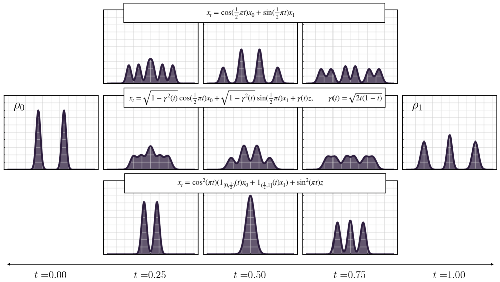
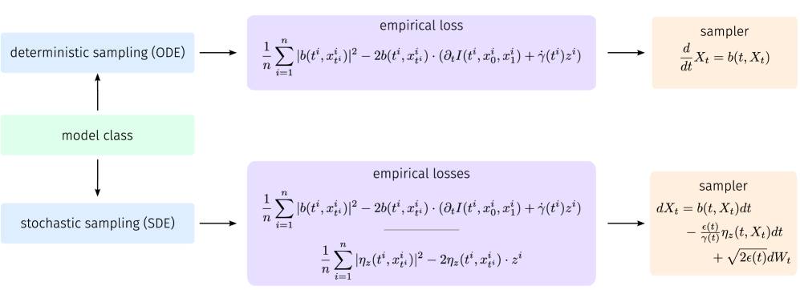
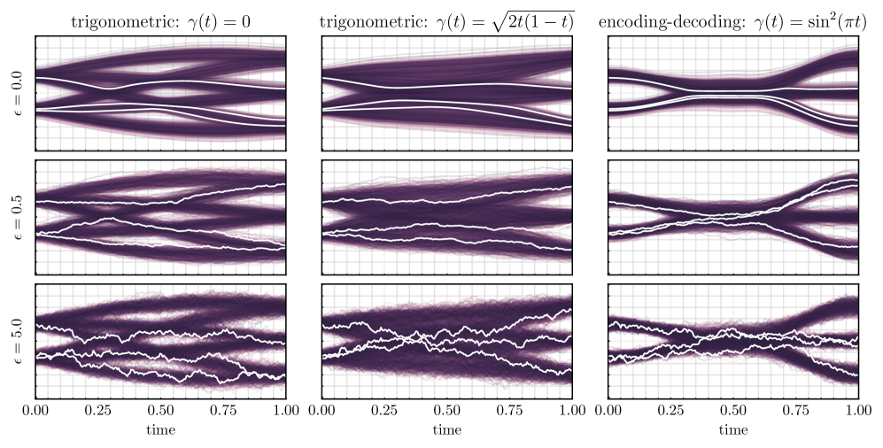
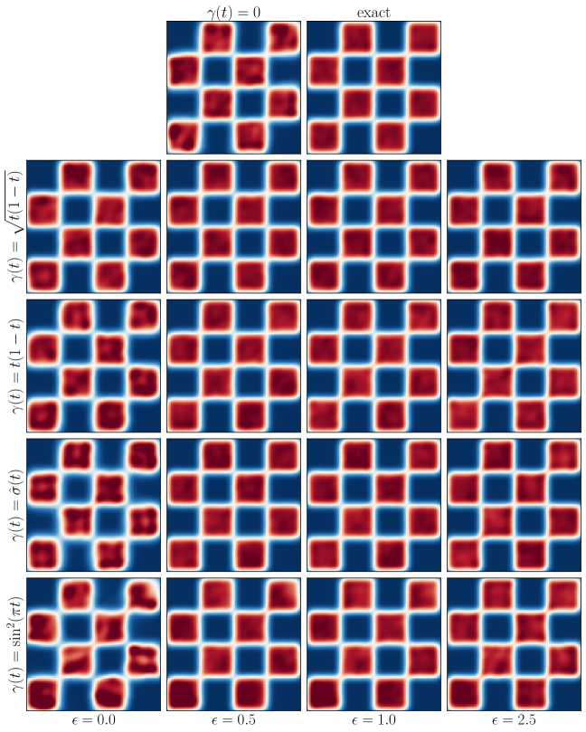
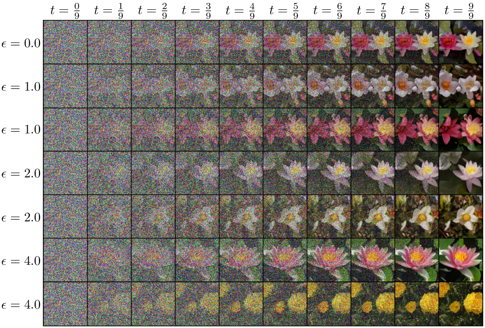

## 从双端点随机插值出发，联系常见生成算法

本文只回答一个主问题：

给定一个容易采样的噪声分布和一个目标数据分布，怎样先设计连接二者的概率路径，直接得到概率流 ODE，再额外构造同边际 SDE，并把它们与 Flow Matching、DDPM 和 DDIM 联系起来？

> ODE 和 SDE 都是描述“一个状态如何随时间变化”的方程，区别在于有没有随机噪声。
ODE：Ordinary Differential Equation，常微分方程。
SDE：Stochastic Differential Equation，随机微分方程。

$$
\boxed{
\text{随机插值、ODE 和 SDE 的单条轨迹通常不同，}
\quad
\text{但它们可以具有相同的单时刻边际分布。}
}
$$

*图 1：先用随机插值规定从 $\rho_0$ 到 $\rho_1$ 的边际路径，再学习速度与 score；ODE 和带 score 修正的 SDE 是实现同一组边际的不同生成动力学。图中的 SDE 不是由单个 latent noise $z$ 直接变成的，而是引入布朗运动后另外构造的。来源：[Albergo, Boffi & Vanden-Eijnden, v4, Figure 1](https://arxiv.org/abs/2303.08797v4)。*

> **备注：什么是单时刻边际？**
>
> 一个随机过程包含整条轨迹 $\{X_t:0\le t\le1\}$。完整的过程规律还包括多个时刻之间的联合分布，例如 $(X_{0.2},X_{0.8})$。
>
> 单时刻边际只固定一个 $t$，看 $X_t$ 的分布：
>

$$
X_t\sim q(t,\cdot).
$$

>
> “边际”来自把联合分布中的其他变量积分掉。例如若 $(X_s,X_t)$ 的联合密度是 $p_{s,t}(x,y)$，那么
>

$$
p_t(y)
\mathrel{=}
\int_{\mathbb R^d}
p_{s,t}(x,y)\,\mathrm dx
$$

>
> 就是 $X_t$ 的边际密度。两个过程可以在每个时刻具有相同边际，却有完全不同的 $p_{s,t}$，因而轨迹形状和多时刻联合分布都可以不同。

---

# 第一部分：先设计一条概率路径

## 1. 三类对象必须分开

本文会同时出现三类随机对象。

| 对象 | 记号 | 密度 | 作用 |
|---|---|---|---|
| 训练时设计的随机插值 | $x_t$ | $\rho(t,x)$ | 规定希望模型复现的概率路径 |
| 生成 ODE | $X_t$ | $q(t,x)$ | 确定性地生成样本 |
| 生成 SDE | $Z_t$ | $p(t,x)$ | 随机地生成样本 |

还要区分两类速度：

| 记号 | 含义 |
|---|---|
| $Y_t=\dot x_t$ | 某一条随机插值轨迹的随机速度 |
| $b(t,x)=\mathbb E[Y_t\mid x_t=x]$ | 给定时间和位置后的条件平均速度 |

其中 $Y_t$ 依赖隐藏的端点和高斯变量；$b(t,x)$ 只依赖当前的 $(t,x)$，因此可以放进 ODE 或 SDE。

---

## 2. 双端点随机插值

### 2.1 端点分布与耦合

本文先使用生成时间

$$
t:0\longrightarrow1,
$$

并约定

$$
\rho_0=\text{容易采样的基分布，通常是高斯噪声},
$$

$$
\rho_1=\text{目标数据分布}.
$$

采样一对端点

$$
(x_0,x_1)\sim\nu,
$$

其中 $\nu$ 的两个边际分别是 $\rho_0$ 和 $\rho_1$。

最简单的选择是独立耦合

$$
\nu=\rho_0\otimes\rho_1.
$$

这表示随机选择一个噪声样本，再独立选择一个数据样本，把它们临时配成一对。

耦合 $\nu$ 不改变端点分布，但会改变中间路径和学习难度。

### 2.2 一般双端点公式

选择一个满足

$$
I(0,x_0,x_1)=x_0,
\qquad
I(1,x_0,x_1)=x_1
$$

的确定性插值函数。

再独立采样

$$
z\sim\mathcal N(0,\mathrm{Id}),
\qquad
z\perp(x_0,x_1),
$$

定义

$$
\boxed{
x_t
\mathrel{=}
I(t,x_0,x_1)+\gamma(t)z.
}
\tag{2.1}
$$

对一般 stochastic interpolant，取

$$
\gamma(0)=\gamma(1)=0,
$$

并通常要求

$$
\gamma(t)>0,
\qquad 0<t<1.
$$

于是

$$
x_{t=0}=x_0\sim\rho_0,
\qquad
x_{t=1}=x_1\sim\rho_1.
$$

定义 $x_t$ 的单时刻边际密度

$$
\boxed{
x_t\sim\rho(t,\cdot).
}
\tag{2.2}
$$

式 (2.1) 的首要作用不是直接生成数据，而是规定一条连接 $\rho_0$ 和 $\rho_1$ 的概率路径。

> **备注：为什么式 (2.1) 通常不能直接用于生成？**
>
> 训练时可以同时取得噪声端点 $x_0$ 和数据端点 $x_1$，所以能够直接计算 $x_t$。
>
> 生成时只有新的 $x_0\sim\rho_0$，并不知道它应该对应哪个真实数据 $x_1$。因此需要学习一个只依赖 $(t,x)$ 的速度场，再从 $x_0$ 出发运行 ODE 或 SDE。

### 2.3 本文使用的正则性约定

为了集中讨论主线，后文假设：

- $I$ 和 $\gamma$ 对时间足够光滑；
- 所需期望有限；
- 可以交换时间求导、期望和积分；
- 相关密度和速度场足够光滑；
- 在使用 score 时，内部时刻的密度为正。

这些假设保证后面的链式法则、分部积分、Fokker--Planck 方程和 PDE 唯一性可以正常使用。

当 $\gamma(t)>0$ 时，中间分布包含高斯卷积（把原来的概率分布用高斯噪声轻轻模糊、摊开），通常会比 $\gamma=0$ 的路径更平滑。

*每一行使用不同的 $\gamma(t)$。额外高斯变量越能平滑中间密度，端点模态在中间时刻产生的重叠和伪结构通常越少；但这只是路径设计的效果，并不等于生成 SDE 的布朗噪声。来源：[论文 v4, Figure 4](https://arxiv.org/abs/2303.08797v4)。*

---

## 3. 两种不同的“噪声旋钮”

后文会出现两种噪声，它们不能混为一谈。

| 噪声 | 出现在哪里 | 主要作用 | 是否直接使生成轨迹随机 |
|---|---|---|---|
| $\gamma(t)z$ | 训练时的随机插值 | 设计和平滑中间边际，改变监督信号 | 否 |
| $\sqrt{2\epsilon(t)}\,\mathrm dW_t$ | 生成 SDE | 改变生成动力学和轨迹随机性 | 是 |

$\gamma$ 决定“训练时希望学习哪条边际路径”；$\epsilon$ 决定“生成时用多随机的 SDE 实现这条边际路径”。

这正是统一框架的重要自由度：

$$
\boxed{
\text{先选概率路径，再选实现这条路径的动力学。}
}
$$

---

# 第二部分：从随机插值得到可学习的场

## 4. 从随机轨迹速度得到确定速度场

对式 (2.1) 关于时间求导：

$$
\boxed{
Y_t:=\dot x_t
\mathrel{=}
\partial_tI(t,x_0,x_1)+\dot\gamma(t)z.
}
\tag{4.1}
$$

$Y_t$ 是随机的。即使给定 $x_t=x$，也可能有很多不同的 $(x_0,x_1,z)$ 经过同一个位置，并给出不同的速度。

ODE 在同一个 $(t,x)$ 处只能使用一个确定速度。因此定义

$$
\boxed{
b(t,x)
:=
\mathbb E[Y_t\mid x_t=x].
}
\tag{4.2}
$$

也就是

$$
b(t,x)
\mathrel{=}
\mathbb E[
\partial_tI(t,x_0,x_1)+\dot\gamma(t)z
\mid x_t=x
].
$$

一般并没有逐样本等式

$$
Y_t=b(t,x_t).
$$

正确的是

$$
\boxed{
\mathbb E[Y_t\mid x_t]=b(t,x_t).
}
\tag{4.3}
$$

> **备注：怎样理解条件期望？**
>
> 可以把所有训练样本按照当前的 $(t,x_t)$ 分组。在同一组中，隐藏端点和随机速度可以不同。$b(t,x)$ 就是这一组随机速度的平均值。
>
> 因而，$b$ 是从“许多微观随机速度”提取出的“宏观概率输运速度”。

---

## 5. 为什么 $\rho$ 满足连续性方程

取任意光滑且只在有限区域内非零的测试函数

$$
\varphi\in C_c^\infty(\mathbb R^d).
$$

> **备注：测试函数是什么，为什么要引入它？**
>
> $C^\infty$ 表示函数可以无限次求导；下标 $c$ 表示 compact support，即它只在某个有限区域内非零。可以把 $\varphi$ 看成一个“光滑探测器”：如果它在区域 $A$ 内接近 $1$、区域外接近 $0$，那么
>

$$
\mathbb E[\varphi(x_t)]
$$

>
> 就近似表示 $x_t$ 落入区域 $A$ 的概率。选取紧支撑函数还有一个技术好处：做分部积分时，无穷远处的边界项自动消失。

> **备注：三个空间微分算子的含义**
>
> 对标量函数 $f:\mathbb R^d\to\mathbb R$，梯度是向量
>

$$
\boxed{
\nabla f
\mathrel{=}
\left(
\partial_{x_1}f,\ldots,\partial_{x_d}f
\right).
}
$$

>
> 它指向函数上升最快的方向。对向量场 $F=(F_1,\ldots,F_d)$，散度是标量
>

$$
\boxed{
\nabla\cdot F
\mathrel{=}
\sum_{i=1}^d\partial_{x_i}F_i.
}
$$

>
> 散度衡量当前位置附近的“净流出”：$\nabla\cdot F>0$ 表示流出多于流入。Laplace 算子是
>

$$
\boxed{
\Delta f
\mathrel{=}
\sum_{i=1}^d\partial_{x_i}^2f
\mathrel{=}
\nabla\cdot(\nabla f).
}
$$

>
> 因此可以记成
>

$$
\nabla:\text{标量}\to\text{向量},
\qquad
\nabla\cdot:\text{向量}\to\text{标量},
\qquad
\Delta=\nabla\cdot\nabla.
$$

沿一条随机插值轨迹使用链式法则：

$$
\frac{\mathrm d}{\mathrm dt}\varphi(x_t)
\mathrel{=}
\nabla\varphi(x_t)\cdot Y_t.
$$

> **备注：为什么多变量链式法则得到这个点积？**
>
> 写成坐标形式，$x_t=(x_t^{(1)},\ldots,x_t^{(d)})$。普通多变量链式法则给出
>

$$
\frac{\mathrm d}{\mathrm dt}\varphi(x_t)
\mathrel{=}
\sum_{i=1}^d
\frac{\partial\varphi}{\partial x_i}(x_t)
\frac{\mathrm dx_t^{(i)}}{\mathrm dt}.
$$

>
> 第一组分量组成 $\nabla\varphi(x_t)$，第二组分量组成 $\dot x_t=Y_t$，所以求和就是点积。虽然 $x_t$ 是随机的，但固定一次 $(x_0,x_1,z)$ 后，它就是一条普通的可微曲线，因此可以逐条轨迹使用链式法则。

取期望：

$$
\frac{\mathrm d}{\mathrm dt}
\mathbb E[\varphi(x_t)]
\mathrel{=}
\mathbb E[
\nabla\varphi(x_t)\cdot Y_t
].
\tag{5.1}
$$

> **备注：为什么时间导数可以移到期望里面？**
>
> 这里使用
>

$$
\frac{\mathrm d}{\mathrm dt}\mathbb E[\varphi(x_t)]
\mathrel{=}
\mathbb E\!\left[
\frac{\mathrm d}{\mathrm dt}\varphi(x_t)
\right].
$$

>
> 直观上是“许多轨迹观测值的平均变化速度”等于“每条轨迹观测值变化速度的平均”。严格成立需要可微性、可积性以及一个可积函数控制导数；本文第 2.3 节的正则性约定正是为了允许这一步。没有这些条件时，求导与期望不能随意交换。

对 $x_t$ 做条件平均：

$$
\begin{aligned}
\mathbb E[
\nabla\varphi(x_t)\cdot Y_t
]
&=
\mathbb E[
\nabla\varphi(x_t)\cdot
\mathbb E[Y_t\mid x_t]
]
\\
&=
\mathbb E[
\nabla\varphi(x_t)\cdot b(t,x_t)
]
\\
&=
\int_{\mathbb R^d}
\nabla\varphi(x)\cdot b(t,x)\rho(t,x)\,\mathrm dx.
\end{aligned}
\tag{5.2}
$$

> **备注：式 (5.2) 的前两个等号用了什么？**
>
> 条件期望 $\mathbb E[Y_t\mid x_t]$ 可以理解为：按照 $x_t$ 的取值把样本分组，再在每组内部平均 $Y_t$。首先使用塔式法则
>

$$
\mathbb E[Z]
\mathrel{=}
\mathbb E\!\left[\mathbb E[Z\mid x_t]\right].
$$

>
> 然后注意：给定 $x_t$ 后，$\nabla\varphi(x_t)$ 已经是已知量，可以从条件期望中提出：
>

$$
\mathbb E[
\nabla\varphi(x_t)\cdot Y_t
\mid x_t]
\mathrel{=}
\nabla\varphi(x_t)\cdot
\mathbb E[Y_t\mid x_t].
$$

>
> 最后代入 $b(t,x)=\mathbb E[Y_t\mid x_t=x]$。这一步解释了为什么随机的微观速度 $Y_t$ 最终变成只依赖 $(t,x)$ 的确定速度场 $b$。

分部积分得到

$$
\frac{\mathrm d}{\mathrm dt}
\mathbb E[\varphi(x_t)]
\mathrel{=}
-\int_{\mathbb R^d}
\varphi(x)\nabla\cdot(\rho b)(t,x)\,\mathrm dx.
\tag{5.3}
$$

> **备注：分部积分为什么会产生负号？**
>
> 分部积分把作用在测试函数 $\varphi$ 上的空间导数转移到概率流量 $\rho b$ 上。先看一维。由乘积求导公式
>

$$
(\varphi F)'=\varphi'F+\varphi F',
$$

>
> 在整个实数轴上积分可得
>

$$
\int_{\mathbb R}\varphi'(x)F(x)\,\mathrm dx
\mathrel{=}
[\varphi(x)F(x)]_{-\infty}^{+\infty}
\mathbin{-}
\int_{\mathbb R}\varphi(x)F'(x)\,\mathrm dx.
$$

>
> 这里的负号来自把含 $F'$ 的积分移到等号右边。由于测试函数 $\varphi\in C_c^\infty$ 具有紧支撑，它在足够远处为零，边界项也随之消失，因此
>

$$
\int_{\mathbb R}\varphi'(x)F(x)\,\mathrm dx
\mathrel{=}
-\int_{\mathbb R}\varphi(x)F'(x)\,\mathrm dx.
$$

>
> 在 $d$ 维中，对每个坐标分别使用这个公式并求和，普通导数就变成散度。令向量场 $F=\rho b$，得到
>

$$
\boxed{
\int_{\mathbb R^d}
\nabla\varphi\cdot(\rho b)\,\mathrm dx
\mathrel{=}
-\int_{\mathbb R^d}
\varphi\,\nabla\cdot(\rho b)\,\mathrm dx.
}
$$

>
> 直观上，$\rho b$ 是概率流量；$\nabla\cdot(\rho b)>0$ 表示某处流出多于流入，所以该处密度应当下降。这与式 (5.3) 中的负号一致。

另一方面，

$$
\mathbb E[\varphi(x_t)]
\mathrel{=}
\int_{\mathbb R^d}\varphi(x)\rho(t,x)\,\mathrm dx,
$$

所以

$$
\frac{\mathrm d}{\mathrm dt}
\mathbb E[\varphi(x_t)]
\mathrel{=}
\int_{\mathbb R^d}
\varphi(x)\partial_t\rho(t,x)\,\mathrm dx.
\tag{5.4}
$$

> **备注：为什么式 (5.4) 成立？**
>
> 因为 $x_t$ 的密度是 $\rho(t,x)$，任意函数的期望都可以按密度积分：
>

$$
\mathbb E[\varphi(x_t)]
\mathrel{=}
\int_{\mathbb R^d}
\varphi(x)\rho(t,x)\,\mathrm dx.
$$

>
> 这里 $x$ 只是积分变量，而 $\varphi(x)$ 本身不依赖时间。因此
>

$$
\begin{aligned}
\frac{\mathrm d}{\mathrm dt}
\mathbb E[\varphi(x_t)]
&=
\frac{\mathrm d}{\mathrm dt}
\int\varphi(x)\rho(t,x)\,\mathrm dx
\\
&=
\int\varphi(x)\partial_t\rho(t,x)\,\mathrm dx.
\end{aligned}
$$

>
> 如果测试函数也写成 $\varphi(t,x)$，还会额外出现 $\int(\partial_t\varphi)\rho\,\mathrm dx$；本文选择与时间无关的 $\varphi$，所以没有这一项。

比较式 (5.3) 与式 (5.4)，得到

$$
\int_{\mathbb R^d}
\varphi(x)
\left[
\partial_t\rho+\nabla\cdot(\rho b)
\right](t,x)\,\mathrm dx
=0.
$$

由于测试函数可以任意选择，

$$
\boxed{
\partial_t\rho(t,x)
\mathbin{+}
\nabla\cdot\bigl(\rho(t,x)b(t,x)\bigr)
=0.
}
\tag{5.5}
$$

这就是连续性方程。

> **备注：为什么“对任意测试函数积分为零”能推出括号里的函数为零？**
>
> 令
>

$$
h(t,x)
\mathrel{=}
\partial_t\rho(t,x)+\nabla\cdot(\rho b)(t,x).
$$

>
> 如果某个区域内 $h$ 明显为正，就可以选择一个在该区域内为正、其他地方为零的光滑测试函数 $\varphi$，此时 $\int\varphi h\,\mathrm dx$ 会大于零，与“对所有 $\varphi$ 都等于零”矛盾。$h$ 为负的情况同理。因此 $h=0$，至少在几乎处处或分布意义下成立。这种先与任意测试函数积分的证明叫作弱形式证明。

> **备注：连续性方程在说什么？**
>
> $\rho b$ 是概率流量。某个区域的概率密度下降，是因为从该区域流出的概率多于流入的概率。
>
> 因此
>

$$
\text{局部密度变化}
\mathbin{+}
\text{局部净流出}
=0.
$$

---

## 6. score 从哪里来

定义中间密度的 score：

$$
\boxed{
s(t,x)
:=
\nabla_x\log\rho(t,x).
}
\tag{6.1}
$$

对于

$$
x_t=I(t,x_0,x_1)+\gamma(t)z,
$$

固定 $(x_0,x_1)$ 后，$x_t$ 是一个高斯随机变量：

$$
x_t\mid(x_0,x_1)
\sim
\mathcal N\left(
I(t,x_0,x_1),
\gamma^2(t)\mathrm{Id}
\right).
$$

该条件高斯的 score 是

$$
-\frac{x-I(t,x_0,x_1)}{\gamma^2(t)}.
$$

> **备注：高斯分布的 score 为什么是这个形式？**
>
> 对一般各向同性高斯
>

$$
p(x)
\mathrel{=}
\frac{1}{(2\pi\alpha^2)^{d/2}}
\exp\!\left(
-\frac{\|x-\mu\|^2}{2\alpha^2}
\right),
$$

>
> 先取对数：
>

$$
\log p(x)
\mathrel{=}
\text{与 }x\text{ 无关的常数}
\mathbin{-}
\frac{\|x-\mu\|^2}{2\alpha^2}.
$$

>
> 再对 $x$ 求梯度：
>

$$
\nabla_x\log p(x)
\mathrel{=}
-\frac{x-\mu}{\alpha^2}
\mathrel{=}
\frac{\mu-x}{\alpha^2}.
$$

>
> 所以高斯 score 总是指向均值 $\mu$，并且离均值越远，向中心的指向越强。这里令 $\mu=I(t,x_0,x_1)$、$\alpha=\gamma(t)$，就得到上式。

在随机样本 $x=x_t$ 上，

$$
x_t-I(t,x_0,x_1)=\gamma(t)z,
$$

所以条件 score 标签可以写成

$$
-\frac{z}{\gamma(t)}.
$$

对隐藏端点和高斯变量做条件平均，得到边际 score：

$$
\boxed{
s(t,x)
\mathrel{=}
-\frac1{\gamma(t)}
\mathbb E[z\mid x_t=x],
\qquad 0<t<1.
}
\tag{6.2}
$$

> **备注：score 的物理意义是什么？**
>
> 固定时刻 $t$，可以把 $\rho(t,x)$ 看成空间中的一张概率密度地形。由
>

$$
s(t,x)
\mathrel{=}
\nabla_x\log\rho(t,x)
\mathrel{=}
\frac{\nabla_x\rho(t,x)}{\rho(t,x)},
$$

>
> score 的方向是当前位置上对数密度增长最快的方向，也就是局部指向“更可能出现样本”的区域。因此，沿着 $s$ 移动会使密度在一阶近似下增加得最快；

定义 denoiser

$$
\boxed{
\eta_z(t,x)
:=
\mathbb E[z\mid x_t=x].
}
\tag{6.3}
$$

则

$$
\boxed{
s(t,x)=-\frac{\eta_z(t,x)}{\gamma(t)}.
}
\tag{6.4}
$$

> **备注：为什么叫 denoiser？**
>
> 网络看到被高斯变量扰动后的 $x_t$，并预测产生该样本的平均高斯变量。知道平均噪声后，就能反推出更干净的中心位置或数据端点估计。

---

## 7. 论文中的关键速度分解

除了总速度 $b$，再定义只对确定性插值部分求条件平均的速度

$$
\boxed{
v(t,x)
:=
\mathbb E[
\partial_tI(t,x_0,x_1)
\mid x_t=x
].
}
\tag{7.1}
$$

由式 (4.1)，

$$
b(t,x)
\mathrel{=}
v(t,x)
\mathbin{+}
\dot\gamma(t)\mathbb E[z\mid x_t=x].
$$

再使用

$$
\mathbb E[z\mid x_t=x]
\mathrel{=}
-\gamma(t)s(t,x),
$$

得到

$$
\boxed{
b(t,x)
\mathrel{=}
v(t,x)
\mathbin{-}
\gamma(t)\dot\gamma(t)s(t,x).
}
\tag{7.2}
$$

这是连接 velocity、score 和 latent noise 的关键公式。

它说明：

- $v$ 描述确定性插值中心的平均移动；
- $-\gamma\dot\gamma s$ 描述插值噪声尺度变化对概率流的贡献；
- 真正放进概率流 ODE 的速度是二者之和 $b$。

> **备注：为什么要区分 $b$ 和 $v$？**
>
> 当 $\gamma$ 随时间变化时，只学习 $\partial_tI$ 的条件平均并不能得到完整边际速度。高斯扰动本身的收缩或扩张也会推动密度变化，因此还需要 score 修正项。
>
> 当 $\gamma=0$ 时，式 (7.2) 退化为 $b=v$，这正是后面的 endpoint Flow Matching。

---

## 8. 为什么平方回归能够学习这些场

### 8.1 学习总速度 $b$

训练网络 $b_\theta(t,x)$，使用

$$
\boxed{
\mathcal L_b(\theta)
\mathrel{=}
\mathbb E
\left\|
b_\theta(t,x_t)
\mathbin{-}
\left[
\partial_tI(t,x_0,x_1)+\dot\gamma(t)z
\right]
\right\|^2.
}
\tag{8.1}
$$

平方损失的最优预测是条件期望，因此在理想函数类中，

$$
b_\theta^*(t,x)
\mathrel{=}
\mathbb E[Y_t\mid x_t=x]
\mathrel{=}
b(t,x).
$$

> **备注：为什么平方损失的最优解一定是条件平均？**
>
> 关键是网络只看到 $(t,x_t)$，看不到产生该样本的隐藏端点 $(x_0,x_1)$ 和高斯变量 $z$。固定时间 $t$ 和位置 $x_t=x$ 后，网络只能输出一个确定向量。把这个待选择的输出记为 $a$。
>
> 在所有满足 $x_t=x$ 的训练样本中，随机速度标签
>

$$
Y_t
\mathrel{=}
\partial_tI(t,x_0,x_1)+\dot\gamma(t)z
$$

>
> 可能各不相同。对于当前位置，网络要选择 $a$，使这些标签到 $a$ 的条件平均平方距离
>

$$
\ell(a)
:=
\mathbb E\!\left[
\|a-Y_t\|^2
\mid x_t=x
\right]
$$

>
> 尽可能小。对向量 $a$ 求梯度：
>

$$
\begin{aligned}
\nabla_a\ell(a)
&=
\mathbb E\!\left[
2(a-Y_t)
\mid x_t=x
\right]
\\
&=
2\left(
a-\mathbb E[Y_t\mid x_t=x]
\right).
\end{aligned}
$$

>
> 令梯度等于零，得到
>

$$
\boxed{
a^*
\mathrel{=}
\mathbb E[Y_t\mid x_t=x]
\mathrel{=}
b(t,x).
}
$$

>
> 这是最小值，因为平方距离关于 $a$ 是开口向上的凸二次函数。因此，令 $a=b_\theta(t,x)$ 并对所有时间和位置共同训练，平方回归就会把同一 $(t,x)$ 对应的随机速度标签取条件平均，最终得到确定速度场 $b(t,x)$。
>
> 一维直观例子：假设同一个 $(t,x)$ 对应的三个速度标签分别是 $8,10,12$。网络面对相同输入只能输出同一个数。输出它们的平均值 $10$，会使平方距离之和
>

$$
(a-8)^2+(a-10)^2+(a-12)^2,
$$

>
> 达到最小。条件期望 $\mathbb E[Y_t\mid x_t=x]$ 就是连续随机情形下的这种“分组后取平均”。

### 8.2 学习 denoiser 和 score

数值上更稳定的做法通常是学习

$$
\boxed{
\mathcal L_\eta(\theta)
\mathrel{=}
\mathbb E
\left\|
\eta_\theta(t,x_t)-z
\right\|^2.
}
\tag{8.2}
$$

其理想最优解是

$$
\eta_\theta^*(t,x)
\mathrel{=}
\mathbb E[z\mid x_t=x]
\mathrel{=}
\eta_z(t,x).
$$

同样的平方损失分解说明：噪声网络学到的不是某一次采样中的具体 $z$，而是在观察到 $(t,x_t=x)$ 后最合理的平均噪声。单个 $x_t$ 可能由多个数据端点和多个噪声组合产生，网络只能对这些可能性做条件平均。

再换算

$$
s_\theta(t,x)
\mathrel{=}
-\frac{\eta_\theta(t,x)}{\gamma(t)}.
$$

也可以直接回归 score 标签：

$$
\mathbb E
\left\|
s_\theta(t,x_t)+\frac{z}{\gamma(t)}
\right\|^2.
$$

但当 $t$ 接近端点时，$\gamma(t)\to0$，标签 $z/\gamma(t)$ 可能很大。

> **备注：实际训练怎样处理端点不稳定？**
>
> 常用方法包括：
>
> 1. 直接预测有界得多的 denoiser 或 noise；
> 2. 不在精确端点采样时间；
> 3. 对不同时间使用合适的 loss weighting；
> 4. 对极端时间或极端系数进行截断。
>
> 本文只需要知道：理论上的 score 与实际网络参数化可以不同，但它们包含等价信息。

### 8.3 一次基本训练迭代

1. 采样时间 $t$；
2. 采样端点 $(x_0,x_1)\sim\nu$；
3. 采样 $z\sim\mathcal N(0,\mathrm{Id})$；
4. 构造 $x_t=I(t,x_0,x_1)+\gamma(t)z$；
5. 构造速度标签 $\partial_tI+\dot\gamma z$；
6. 回归速度，或同时回归 denoiser。

训练不需要显式计算中间密度 $\rho(t,x)$，也不需要手工计算条件期望。

*训练阶段可以同时看到端点和 latent noise，因此能构造监督标签；生成阶段只保留网络学到的时空场，从基分布出发求解 ODE 或另外构造的 SDE。来源：[论文 v4, Figure 3](https://arxiv.org/abs/2303.08797v4)。*

---

# 第三部分：从可学习的场得到生成动力学

## 9. 概率流 ODE

构造 ODE

$$
\boxed{
\frac{\mathrm dX_t}{\mathrm dt}
\mathrel{=}
b(t,X_t),
\qquad
X_0\sim\rho_0.
}
\tag{9.1}
$$

记 $X_t$ 的密度为

$$
X_t\sim q(t,\cdot).
$$

与第 5 节相同，对测试函数使用链式法则可得

$$
\boxed{
\partial_tq+\nabla\cdot(qb)=0.
}
\tag{9.2}
$$

随机插值密度满足

$$
\partial_t\rho+\nabla\cdot(\rho b)=0,
\qquad
\rho(0)=\rho_0,
$$

ODE 密度满足

$$
\partial_tq+\nabla\cdot(qb)=0,
\qquad
q(0)=\rho_0.
$$

在连续性方程初值问题具有唯一解时，

$$
\boxed{
q(t,x)=\rho(t,x).
}
\tag{9.3}
$$

特别地，

$$
X_1\sim\rho_1.
$$

因此，训练时虽然借助了数据端点 $x_1$，生成时只需要从 $X_0\sim\rho_0$ 出发运行学习到的 ODE。

---

## 10. 同一条边际路径的 SDE

这里必须先加一条逻辑限定：双端点插值直接给出的是 $\rho(t)$、$b(t,x)$ 和概率流 ODE，并没有产生每个小时间步的布朗增量。下面的 SDE 是在已知 $\rho,b,s$ 后，通过额外选择扩散强度 $\epsilon(t)$ 和布朗运动 $W_t$ 构造出来的另一种同边际动力学。

如果对整条双端点插值轨迹固定同一个 $z$，它通常是可微曲线；而SDE轨迹几乎处处不可微。因此二者不可能是同一个路径过程，只可能在每个固定时刻拥有相同边际。

### 10.1 Fokker--Planck 方程

考虑

$$
\mathrm dZ_t
\mathrel{=}
a(t,Z_t)\,\mathrm dt
\mathbin{+}
g(t)\,\mathrm dW_t,
$$

其中 $W_t$ 是标准布朗运动，$g(t)$ 是瞬时噪声幅度。

> **备注：SDE 中的 $\mathrm dW_t$ 应该怎样理解？**
>
> $\mathrm dW_t$ 不是普通可微函数的微分。把时间离散成一个很小的步长 $\Delta t$，布朗增量满足
>

$$
\Delta W_t
\mathrel{=}
W_{t+\Delta t}-W_t
\sim
\mathcal N(0,\Delta t\,\mathrm{Id}).
$$

>
> 若 $\xi\sim\mathcal N(0,\mathrm{Id})$，那么
>

$$
\sqrt{\Delta t}\,\xi
\sim
\mathcal N(0,\Delta t\,\mathrm{Id}),
$$

>
> 所以在分布意义下
>

$$
\boxed{
\Delta W_t
\overset{\mathrm d}{=}
\sqrt{\Delta t}\,\xi.
}
$$

>
> 因而 SDE 的一个 Euler 小步可以读成
>

$$
Z_{t+\Delta t}
\approx
Z_t
\mathbin{+}
a(t,Z_t)\Delta t
\mathbin{+}
g(t)\sqrt{\Delta t}\,\xi.
$$

>
> 漂移位移是 $\Delta t$ 量级，随机位移是 $\sqrt{\Delta t}$ 量级；并且每一步都要重新采样独立的 $\xi$。这正是它与整条插值共用同一个 $z$ 的根本区别。

若 $Z_t$ 的密度为 $p(t,x)$，则

$$
\boxed{
\partial_tp
\mathrel{=}
-\nabla\cdot(ap)
\mathbin{+}
\frac12g^2(t)\Delta p.
}
\tag{10.1}
$$

> **备注：Fokker--Planck 方程怎样从一个 SDE 小步得到？**
>
> 先看一维，并暂时把 $a=a(t,Z_t)$、$g=g(t)$ 写短。小步增量为
>

$$
\Delta Z
\mathrel{=}
a\,\Delta t+g\sqrt{\Delta t}\,\xi,
\qquad
\mathbb E[\xi]=0,\quad
\mathbb E[\xi^2]=1.
$$

>
> 对光滑测试函数 $\varphi$ 做二阶 Taylor 展开：
>

$$
\varphi(Z_t+\Delta Z)
\mathrel{=}
\varphi(Z_t)
\mathbin{+}
\varphi'(Z_t)\Delta Z
\mathbin{+}
\frac12\varphi''(Z_t)(\Delta Z)^2
\mathbin{+}
\text{更高阶项}.
$$

>
> 条件于当前 $Z_t$ 取平均，有
>

$$
\mathbb E[\Delta Z\mid Z_t]
\mathrel{=}
a\,\Delta t,
$$

>
> 而
>

$$
\mathbb E[(\Delta Z)^2\mid Z_t]
\mathrel{=}
g^2\Delta t+O((\Delta t)^2).
$$

>
> 注意：随机增量本身是 $\sqrt{\Delta t}$ 量级，但平方后正好是 $\Delta t$ 量级，所以二阶项在连续极限中不会消失。除以 $\Delta t$ 并令 $\Delta t\to0$，得到
>

$$
\frac{\mathrm d}{\mathrm dt}\mathbb E[\varphi(Z_t)]
\mathrel{=}
\mathbb E\!\left[
a\,\varphi'(Z_t)
\mathbin{+}
\frac12g^2\varphi''(Z_t)
\right].
$$

>
> 再用密度 $p$ 写成积分，并分别做一次和两次分部积分：
>

$$
\begin{aligned}
\int a\varphi' p\,\mathrm dx
&=
-\int\varphi\,\partial_x(ap)\,\mathrm dx,
\\
\frac12g^2\int\varphi''p\,\mathrm dx
&=
\frac12g^2\int\varphi\,\partial_x^2p\,\mathrm dx.
\end{aligned}
$$

>
> 因为 $\varphi$ 任意，
>

$$
\partial_tp
\mathrel{=}
-\partial_x(ap)
\mathbin{+}
\frac12g^2\partial_x^2p.
$$

>
> 推广到 $d$ 维后，一阶空间导数变成散度，二阶导数之和变成 $\Delta$，于是得到式 (10.1)。

令

$$
\epsilon(t):=\frac12g^2(t),
\qquad
g(t)=\sqrt{2\epsilon(t)}.
$$

则

$$
\partial_tp
\mathrel{=}
-\nabla\cdot(ap)
\mathbin{+}
\epsilon(t)\Delta p.
$$

这里定义 $\epsilon=g^2/2$ 只是为了把 Fokker--Planck 中的扩散系数写得更简洁。相应地，SDE 的噪声幅度必须写成 $g=\sqrt{2\epsilon}$；若误写成 $\sqrt{\epsilon}$，Fokker--Planck 中只会得到 $\tfrac12\epsilon\Delta p$。

> **备注：为什么会出现 Laplace 项？**
>
> 在很小时间步 $\Delta t$ 内，布朗增量的标准差是 $\sqrt{\Delta t}$。二阶 Taylor 展开中的平方项因此是 $\Delta t$ 量级，极限中不会消失，最终产生 $\Delta p$。

### 10.2 只给 ODE 加噪声为什么不行

概率流 ODE 的目标边际密度已经满足连续性方程

$$
\partial_t\rho
\mathrel{=}
-\nabla\cdot(b\rho).
$$

现在保留原速度场 $b$ 作为漂移，并直接加入布朗噪声：

$$
\mathrm dZ_t
\mathrel{=}
b(t,Z_t)\,\mathrm dt
\mathbin{+}
\sqrt{2\epsilon(t)}\,\mathrm dW_t,
$$

记这个 SDE 的实际密度为 $p(t,x)$。它满足 Fokker--Planck 方程

$$
\partial_t p
\mathrel{=}
-\nabla\cdot(bp)
\mathbin{+}
\epsilon(t)\Delta p.
$$

如果希望它仍然沿着目标边际 $\rho(t,x)$ 演化，就应当能令 $p=\rho$。但把候选密度 $\rho$ 代入上式得到

$$
\partial_t\rho
\mathrel{=}
-\nabla\cdot(b\rho)
\mathbin{+}
\epsilon(t)\Delta\rho,
$$

这比 $\rho$ 原本满足的连续性方程多出了

$$
\epsilon(t)\Delta\rho.
$$

它沿密度下降方向把概率从高密度区域摊向低密度区域，因此会改变原来的边际路径。

### 10.3 用 score 补偿扩散

因为

$$
s=\nabla\log\rho
\mathrel{=}
\frac{\nabla\rho}{\rho},
$$

所以

$$
\rho s=\nabla\rho.
$$

选择前向漂移

$$
\boxed{
b_F(t,x)
\mathrel{=}
b(t,x)+\epsilon(t)s(t,x).
}
\tag{10.2}
$$

构造前向 SDE

$$
\boxed{
\mathrm dZ_t
\mathrel{=}
\bigl(b+\epsilon s\bigr)(t,Z_t)\,\mathrm dt
\mathbin{+}
\sqrt{2\epsilon(t)}\,\mathrm dW_t,
\qquad
Z_0\sim\rho_0.
}
\tag{10.3}
$$

把候选密度 $\rho$ 代入 Fokker--Planck 方程：

$$
\begin{aligned}
\partial_t\rho
&=
-\nabla\cdot\bigl((b+\epsilon s)\rho\bigr)
\mathbin{+}
\epsilon\Delta\rho
\\
&=
-\nabla\cdot(b\rho)
-\epsilon\nabla\cdot(\rho s)
\mathbin{+}
\epsilon\Delta\rho
\\
&=
-\nabla\cdot(b\rho)
-\epsilon\Delta\rho
\mathbin{+}
\epsilon\Delta\rho
\\
&=
-\nabla\cdot(b\rho).
\end{aligned}
$$

> **备注：怎样直观理解这两个 $\Delta\rho$ 的抵消？**
>
> 布朗扩散产生
>

$$
+\epsilon\Delta\rho,
$$

>
> 它把概率从高密度区域向周围摊开。新增的 score 漂移具有概率流量
>

$$
\rho(\epsilon s)
\mathrel{=}
\epsilon\rho\nabla\log\rho
\mathrel{=}
\epsilon\nabla\rho.
$$

>
> 把它放入连续性方程，会贡献
>

$$
-\nabla\cdot(\epsilon\nabla\rho)
\mathrel{=}
-\epsilon\Delta\rho.
$$

>
> 因此 score 漂移恰好补偿布朗扩散对单时刻密度的摊平作用。注意，它们抵消的是密度方程中的净效应，不是逐条样本轨迹上的随机波动；SDE 轨迹仍然是随机的。

因此它与目标连续性方程一致。

在相应 PDE 解唯一时，

$$
\boxed{
p(t,x)=\rho(t,x).
}
\tag{10.4}
$$

### 10.4 前向、反向与确定性动力学

同一条边际路径对应三种常用动力学：

$$
\boxed{
\begin{aligned}
\text{概率流 ODE：}\quad
&\dot X_t=b(t,X_t),
\\
\text{前向 SDE：}\quad
&\mathrm dZ_t=(b+\epsilon s)\,\mathrm dt
+\sqrt{2\epsilon}\,\mathrm dW_t,
\\
\text{反向 SDE：}\quad
&\mathrm dZ_t=(b-\epsilon s)\,\mathrm dt
+\sqrt{2\epsilon}\,\mathrm d\overline W_t,
\quad t:1\to0.
\end{aligned}}
\tag{10.5}
$$

> **备注：为什么反向 SDE 的漂移是 $b-\epsilon s$？**
>
> 反向 SDE 沿 $t$ 递减运行。设实际走了一小段长度 $h>0$：
>

$$
t\longrightarrow t-h,
\qquad
\Delta t=-h.
$$

>
> SDE 的一步更新是
>

$$
Z_{t-h}
\mathrel{=}
Z_t
-u_R(t,Z_t)h
+\sqrt{2\epsilon h}\,\xi,
\qquad
\xi\sim\mathcal N(0,\mathrm{Id}),
$$

>
> 其中在这一小步内记 $\epsilon=\epsilon(t)$。注意：由于 $\Delta t=-h$，漂移造成的实际位移是 $-u_Rh$；布朗增量的方差仍为 $2\epsilon h$，不会因为时间反向而变成负数。
>
> 下面只比较这一小步造成的密度变化。
>
> 如果概率质量沿速度 $c$ 正向移动长度 $h$，连续性方程告诉我们，密度变化为
>

$$
-h\,\nabla\cdot(\rho c).
$$

>
> 当前反向一步的实际漂移速度是 $-u_R$，所以漂移造成的密度变化为
>

$$
+h\,\nabla\cdot(\rho u_R).
$$

>
> 同时，布朗噪声会把密度摊开。由 10.2 节，它在长度 $h$ 内额外产生
>

$$
+\epsilon h\,\Delta\rho
\mathrel{=}
+h\,\nabla\cdot(\epsilon\nabla\rho).
$$

>
> 因此，反向 SDE 的一步总密度变化是
>

$$
h\,\nabla\cdot
\bigl(\rho u_R+\epsilon\nabla\rho\bigr).
$$

>
> 现在取
>

$$
\boxed{u_R=b-\epsilon s},
$$

>
> 并把它代入上面的一步总密度变化：
>

$$
\begin{aligned}
h\,\nabla\cdot
\bigl(\rho u_R+\epsilon\nabla\rho\bigr)
&=
h\,\nabla\cdot
\bigl(\rho(b-\epsilon s)+\epsilon\nabla\rho\bigr)
\\
&=
h\,\nabla\cdot
\bigl(\rho b-\epsilon\rho s+\epsilon\nabla\rho\bigr)
\\
&=
h\,\nabla\cdot
\bigl(\rho b-\epsilon\nabla\rho+\epsilon\nabla\rho\bigr)
\\
&=
h\,\nabla\cdot(\rho b).
\end{aligned}
$$

>
> 这里使用了 $\rho s=\nabla\rho$。最后得到的 $h\,\nabla\cdot(\rho b)$，正是目标 ODE 从 $t$ 倒走到 $t-h$ 时应有的密度变化。因此，反向 SDE 与目标 ODE 沿着同一条边际路径反向演化。
>
> 最后要区分“公式中的漂移”与“实际一步的位移”。虽然反向 SDE 写的是 $u_R=b-\epsilon s$，但因为 $\Delta t=-h$，其确定性位移实际为
>

$$
-u_Rh
\mathrel{=}
-bh+\epsilon s\,h.
$$

>
> 其中 $-bh$ 反转原来的概率输运，$+\epsilon s\,h$ 沿密度升高方向拉回样本，恰好补偿这一步中新加入的布朗噪声所造成的摊平。

> **备注：为什么 ODE 可以直接倒着积分，而 SDE 需要 score 修正？**
>
> ODE 的轨迹由速度场唯一决定，把时间步改成负数就会沿原轨迹返回。
>
> SDE 每一小步都加入新噪声。反向过程不仅要反转平均移动，还要修正扩散造成的概率摊平；这个修正由 score 提供。

*$\epsilon=0$ 是确定性 ODE；$\epsilon>0$ 后，同一边际路径可以由越来越随机的 SDE 轨迹实现。图中单条轨迹明显不同，但理想场下每个时刻的总体密度不依赖 $\epsilon$。来源：[论文 v4, Figure 5](https://arxiv.org/abs/2303.08797v4)。*

### 10.5 把 $b=v-\gamma\dot\gamma s$ 代入

由式 (7.2)，

$$
b=v-\gamma\dot\gamma s.
$$

因此

$$
\boxed{
b_F
\mathrel{=}
v+\bigl(\epsilon-\gamma\dot\gamma\bigr)s,
}
\tag{10.6}
$$

$$
\boxed{
b_B
\mathrel{=}
v-\bigl(\epsilon+\gamma\dot\gamma\bigr)s.
}
\tag{10.7}
$$

这两个公式同时包含：

- 确定性插值速度 $v$；
- latent noise schedule $\gamma$；
- 生成 SDE diffusion schedule $\epsilon$；
- 边际 score $s$。

---

## 11. 理想选择模型

选择 ODE 还是 SDE，取决于目标：

| 目标 | 常见选择 |
|---|---|
| 给定初始噪声后希望结果确定 | ODE |
| 希望保留随机采样轨迹 | SDE |
| 希望使用成熟的 ODE 求解器 | ODE |
| 更重视扩散带来的误差鲁棒性 | SDE |

---

# 第四部分：从统一框架推出常见算法

这一部分不再引入新的统一原理，只把前面已经得到的公式具体化。

主线是

$$
\boxed{
\text{选择特殊的 }I,\gamma,\rho_0
\quad\Longrightarrow\quad
\text{得到 Flow Matching 或 diffusion 的常用公式。}
}
$$

---

## 12. Endpoint Flow Matching：令 $\gamma=0$

取

$$
\gamma(t)=0,
$$

于是

$$
x_t=I(t,x_0,x_1),
$$

随机速度标签变为

$$
Y_t=\partial_tI(t,x_0,x_1).
$$

条件平均速度是

$$
\boxed{
b(t,x)
\mathrel{=}
\mathbb E[
\partial_tI(t,x_0,x_1)
\mid
I(t,x_0,x_1)=x
].
}
\tag{12.1}
$$

训练目标是

$$
\boxed{
\mathcal L_{\mathrm{FM}}(\theta)
\mathrel{=}
\mathbb E
\left\|
b_\theta\bigl(t,I(t,x_0,x_1)\bigr)
\mathbin{-}
\partial_tI(t,x_0,x_1)
\right\|^2.
}
\tag{12.2}
$$

训练完成后运行

$$
\frac{\mathrm dX_t}{\mathrm dt}
\mathrel{=}
b_\theta(t,X_t),
\qquad
X_0\sim\rho_0.
$$

这就是本文所说的 endpoint Flow Matching。

> **备注：Flow Matching 与 ODE 不是同一个概念。**
>
> Flow Matching 是学习速度场的方法；ODE 是训练完成后使用该速度场生成样本的动力学。

---

## 13. Linear Flow Matching 与 Rectified Flow

### 13.1 线性端点插值

取

$$
I(t,x_0,x_1)
\mathrel{=}
(1-t)x_0+tx_1.
$$

则

$$
\partial_tI=x_1-x_0.
$$

因此

$$
\boxed{
\mathcal L_{\mathrm{linear\text{-}FM}}(\theta)
\mathrel{=}
\mathbb E
\left\|
b_\theta\bigl(t,(1-t)x_0+tx_1\bigr)
\mathbin{-}
(x_1-x_0)
\right\|^2.
}
\tag{13.1}
$$

这也是 Rectified Flow 的首轮基础训练形式。

虽然训练样本的插值线是直线，但生成 ODE 的轨迹不一定是直线。原因是网络学到的是所有经过同一 $(t,x)$ 的随机标签的条件平均。

### 13.2 reflow 的基本思想

Rectified Flow 的特色不只是使用线性插值，还包括重新配对：

1. 先用独立端点对训练一个速度场；
2. 从 $x_0\sim\rho_0$ 出发运行当前 ODE，得到生成终点 $\widehat x_1$；
3. 把同一条生成轨迹的 $(x_0,\widehat x_1)$ 重新配成端点对；
4. 在这些新端点对之间再次使用线性插值训练。

新耦合比完全独立的噪声—数据配对更接近当前生成映射，因此重新训练后的轨迹往往更直、更容易用少量 ODE 步数逼近。

> **备注：直线是否等于最优传输？**
>
> 不一定。轨迹是直线只是一个几何性质，并不能单独保证终点映射就是最优传输映射。
>
> 在有限模型误差下，reflow 也可能改变实际生成映射，因此它是算法步骤，不是无条件恒等变换。

---

## 14. One-sided Gaussian 随机插值

当基分布是标准高斯时，可以直接写成

$$
\boxed{
x_t
\mathrel{=}
\alpha(t)z+\beta(t)x_1,
\qquad
z\sim\mathcal N(0,\mathrm{Id}),
\quad
x_1\sim\rho_1.
}
\tag{14.1}
$$

要求

$$
\alpha(0)=1,
\qquad
\beta(0)=0,
$$

$$
\alpha(1)=0,
\qquad
\beta(1)=1.
$$

于是

$$
x_0=z\sim\mathcal N(0,\mathrm{Id}),
\qquad
x_1\sim\rho_1.
$$

它是一般双端点框架的线性特例：

$$
I(t,x_0,x_1)
\mathrel{=}
\alpha(t)x_0+\beta(t)x_1,
\qquad
\gamma(t)=0,
$$

其中 $x_0=z$。

随机速度标签为

$$
Y_t
\mathrel{=}
\dot\alpha(t)z+\dot\beta(t)x_1.
$$

因此

$$
\boxed{
b(t,x)
\mathrel{=}
\dot\alpha(t)\mathbb E[z\mid x_t=x]
\mathbin{+}
\dot\beta(t)\mathbb E[x_1\mid x_t=x].
}
\tag{14.2}
$$

由于 $z$ 是高斯变量，

$$
\boxed{
s(t,x)
\mathrel{=}
-\frac1{\alpha(t)}
\mathbb E[z\mid x_t=x].
}
\tag{14.3}
$$

还存在恒等式

$$
x
\mathrel{=}
\alpha(t)\mathbb E[z\mid x_t=x]
\mathbin{+}
\beta(t)\mathbb E[x_1\mid x_t=x].
\tag{14.4}
$$

因此平均噪声、平均数据端点、score 和速度可以相互转换。

这正是从统一随机插值走向常见 diffusion 参数化的桥梁。

---

## 15. 切换到 diffusion 的前向加噪时间

前面一直使用生成时间

$$
t: \text{噪声}\to\text{数据}.
$$

扩散模型文献更常使用加噪时间

$$
\tau: \text{数据}\to\text{噪声}.
$$

二者方向相反。为避免混淆，本节改用 $y_\tau$：

若把两个时间区间都归一化为 $[0,1]$，可以直接记成

$$
\tau=1-t.
$$

因此，生成时间中的“起点噪声”对应加噪时间中的“终点噪声”。

$$
\boxed{
y_\tau
\mathrel{=}
a(\tau)y_0+\sigma(\tau)\varepsilon,
}
\tag{15.1}
$$

其中

$$
y_0\sim p_{\mathrm{data}},
\qquad
\varepsilon\sim\mathcal N(0,\mathrm{Id}).
$$

端点条件是

$$
a(0)=1,\qquad \sigma(0)=0,
$$

$$
a(T)\approx0,\qquad \sigma(T)\approx1.
$$

这就是第 14 节 one-sided Gaussian 插值沿相反时间方向的写法。

> **备注：为什么终点通常写“近似高斯”？**
>
> 连续 VP 扩散在有限 $T$ 时一般只有 $a(T)\approx0$，而不是严格等于零。因此 $y_T$ 只是接近标准高斯。
>
> 理论推导常使用理想端点；实际算法会选择足够强的末端噪声。

---

## 16. noise、score 与 velocity 参数化

令 $\rho(\tau,y)$ 表示 $y_\tau$ 的边际密度，并定义

$$
s_\tau(y)=\nabla_y\log\rho(\tau,y).
$$

### 16.1 noise 与 score

由高斯条件密度，

$$
\boxed{
s_\tau(y)
\mathrel{=}
-\frac1{\sigma(\tau)}
\mathbb E[\varepsilon\mid y_\tau=y].
}
\tag{16.1}
$$

若噪声网络学习

$$
\varepsilon_\theta(y,\tau)
\approx
\mathbb E[\varepsilon\mid y_\tau=y],
$$

则

$$
\boxed{
s_\theta(y,\tau)
\mathrel{=}
-\frac{\varepsilon_\theta(y,\tau)}{\sigma(\tau)}.
}
\tag{16.2}
$$

### 16.2 noise 与 velocity

对式 (15.1) 求导：

$$
Y_\tau
\mathrel{=}
\dot a(\tau)y_0+\dot\sigma(\tau)\varepsilon.
$$

由

$$
y_0
\mathrel{=}
\frac{y-\sigma(\tau)\varepsilon}{a(\tau)},
$$

得到

$$
Y_\tau
\mathrel{=}
\frac{\dot a}{a}y
\mathbin{+}
\left(
\dot\sigma-\frac{\dot a}{a}\sigma
\right)\varepsilon.
$$

定义

$$
A(\tau):=\frac{\dot a(\tau)}{a(\tau)},
$$

$$
B(\tau):=
\dot\sigma(\tau)-A(\tau)\sigma(\tau).
$$

取条件期望：

$$
\boxed{
u(\tau,y)
\mathrel{=}
A(\tau)y
\mathbin{+}
B(\tau)
\mathbb E[\varepsilon\mid y_\tau=y].
}
\tag{16.3}
$$

因此理想模型下

$$
\boxed{
\begin{aligned}
s_\theta
&=-\frac{\varepsilon_\theta}{\sigma},
\\
u_\theta
&=Ay+B\varepsilon_\theta,
\\
\varepsilon_\theta
&=\frac{u_\theta-Ay}{B}.
\end{aligned}}
\tag{16.4}
$$

> **例子：一维线性加噪中三种参数化如何换算？**
>
> 取
>

$$
a(\tau)=1-\tau,
\qquad
\sigma(\tau)=\tau,
$$

>
> 则
>

$$
y_\tau=(1-\tau)y_0+\tau\varepsilon,
\qquad
Y_\tau=\varepsilon-y_0.
$$

>
> 令 $\tau=\tfrac12$，观察到 $y_\tau=1$，并假设网络给出的条件平均噪声为
>

$$
\mathbb E[\varepsilon\mid y_{1/2}=1]=0.2.
$$

>
> 由 $1=\tfrac12y_0+\tfrac12\varepsilon$，
>

$$
\mathbb E[y_0\mid y_{1/2}=1]
\mathrel{=}
\frac{1-\frac12\times0.2}{1/2}
\mathrel{=}
1.8.
$$

>
> 所以条件平均速度为
>

$$
u\!\left(\tfrac12,1\right)
\mathrel{=}
0.2-1.8
\mathrel{=}
-1.6,
$$

>
> score 为
>

$$
s_{1/2}(1)
\mathrel{=}
-\frac{0.2}{1/2}
\mathrel{=}
-0.4.
$$

>
> 同一个噪声预测 $0.2$ 同时确定了速度预测 $-1.6$ 和 score 预测 $-0.4$。这就是三种参数化“信息等价”的具体含义。

所以三种参数化包含相同的条件期望信息：

$$
\boxed{
\text{noise prediction}
\Longleftrightarrow
\text{score prediction}
\Longleftrightarrow
\text{velocity prediction}.
}
$$

> **备注：转换为什么需要条件？**
>
> 上式要求对应分母不为零，例如 $\sigma(\tau)>0$、$a(\tau)>0$、$B(\tau)\neq0$。端点附近通常要使用更稳定的参数化或单独处理。

---

## 17. VP 路径与前向 VP SDE

Variance Preserving 路径要求

$$
a^2(\tau)+\sigma^2(\tau)=1.
$$

选择加噪速率 $\beta(\tau)\ge0$，定义

$$
\boxed{
a(\tau)
\mathrel{=}
\exp\left(
-\frac12\int_0^\tau\beta(r)\,\mathrm dr
\right),
}
\tag{17.1}
$$

$$
\boxed{
\sigma^2(\tau)=1-a^2(\tau).
}
\tag{17.2}
$$

对应的前向 VP SDE 是

$$
\boxed{
\mathrm dy_\tau
\mathrel{=}
-\frac12\beta(\tau)y_\tau\,\mathrm d\tau
\mathbin{+}
\sqrt{\beta(\tau)}\,\mathrm dW_\tau.
}
\tag{17.3}
$$

给定初始数据 $y_0$，它在固定时刻的条件边际满足

$$
\boxed{
y_\tau\mid y_0
\overset{\mathrm d}{=}
a(\tau)y_0+\sigma(\tau)\varepsilon.
}
\tag{17.4}
$$

式 (15.1) 使用同一个 $\varepsilon$ 表示所有时刻时，是一条可微随机插值轨迹；VP SDE 的整条轨迹由布朗运动驱动，不可微。

二者相同的是每个固定时刻的条件边际，不是整条路径律。

---

## 18. 从 VP SDE 到 DDPM 前向链

取离散时刻 $k=0,1,\ldots,K$。定义

$$
\alpha_k:=1-\beta_k,
\qquad
0<\beta_k<1.
$$

DDPM 前向一步是

$$
\boxed{
y_k
\mathrel{=}
\sqrt{\alpha_k}y_{k-1}
\mathbin{+}
\sqrt{\beta_k}\varepsilon_k,
\qquad
\varepsilon_k\sim\mathcal N(0,\mathrm{Id}).
}
\tag{18.1}
$$

各步 $\varepsilon_k$ 相互独立。

定义累计信号保留比例

$$
\boxed{
\bar\alpha_k
:=
\prod_{j=1}^k\alpha_j.
}
\tag{18.2}
$$

则可以直接从 $y_0$ 采样任意时刻：

$$
\boxed{
y_k
\overset{\mathrm d}{=}
\sqrt{\bar\alpha_k}y_0
\mathbin{+}
\sqrt{1-\bar\alpha_k}\varepsilon.
}
\tag{18.3}
$$

> **备注：式 (17.1) 如何近似得到式 (18.2)？**
>
> 将式 (17.1) 平方，并把连续积分近似成离散小区间之和：
>

$$
a^2(\tau_k)
\mathrel{=}
\exp\left(-\int_0^{\tau_k}\beta(r)\,\mathrm dr\right)
\approx
\exp\left(-\sum_{j=1}^k\beta_j\right)
\mathrel{=}
\prod_{j=1}^k e^{-\beta_j}.
$$

>
> 当每一步的 $\beta_j$ 很小时，利用 $e^{-x}\approx1-x$，得到
>

$$
a^2(\tau_k)
\approx
\prod_{j=1}^k(1-\beta_j)
\mathrel{=}
\prod_{j=1}^k\alpha_j
\mathrel{=}
\bar\alpha_k.
$$

>
> 因而
>

$$
\boxed{a(\tau_k)\approx\sqrt{\bar\alpha_k}}.
$$

>
> 这里离散的 $\beta_j$ 已包含时间步长，即大致对应连续噪声率 $\beta(\tau_j)\Delta\tau$。

训练常用

$$
\boxed{
\mathcal L_{\mathrm{DDPM}}(\theta)
\mathrel{=}
\mathbb E
\left\|
\varepsilon_\theta(y_k,k)-\varepsilon
\right\|^2.
}
\tag{18.4}
$$

网络同时给出

$$
s_\theta(y_k,k)
\mathrel{=}
-\frac{\varepsilon_\theta(y_k,k)}
{\sqrt{1-\bar\alpha_k}},
$$

以及干净数据估计

$$
\boxed{
\widehat y_0
\mathrel{=}
\frac{
y_k-\sqrt{1-\bar\alpha_k}\varepsilon_\theta(y_k,k)
}{
\sqrt{\bar\alpha_k}
}.
}
\tag{18.5}
$$

> **备注：$\widehat y_0$ 的公式从哪里来？**
>
> 式 (18.3) 在一次训练样本上写成
>

$$
y_k
\mathrel{=}
\sqrt{\bar\alpha_k}y_0
\mathbin{+}
\sqrt{1-\bar\alpha_k}\varepsilon.
$$

>
> 如果网络预测了噪声 $\widehat\varepsilon=\varepsilon_\theta(y_k,k)$，就把该式当作关于 $y_0$ 的一次方程：
>

$$
\sqrt{\bar\alpha_k}\,\widehat y_0
\mathrel{=}
y_k
\mathbin{-}
\sqrt{1-\bar\alpha_k}\,\widehat\varepsilon.
$$

>
> 两边除以 $\sqrt{\bar\alpha_k}$ 就得到式 (18.5)。因此 $\widehat y_0$ 不是网络必须单独输出的第二个量；它可以由当前带噪样本和噪声预测代数换算得到。

---

## 19. DDPM 的反向高斯模型

DDPM 将每一步反向条件分布建模为高斯：

$$
p_\theta(y_{k-1}\mid y_k)
\mathrel{=}
\mathcal N\!\left(
\mu_\theta(y_k,k),
\widetilde\beta_k\mathrm{Id}
\right).
$$

其中方差常取前向一步后验的方差

$$
\widetilde\beta_k
\mathrel{=}
\frac{1-\bar\alpha_{k-1}}
{1-\bar\alpha_k}\beta_k.
\tag{19.1}
$$

网络通过预测噪声来参数化反向均值：

$$
\boxed{
\mu_\theta(y_k,k)
\mathrel{=}
\frac1{\sqrt{\alpha_k}}
\left(
y_k
\mathbin{-}
\frac{\beta_k}{\sqrt{1-\bar\alpha_k}}
\varepsilon_\theta(y_k,k)
\right).
}
\tag{19.2}
$$

> **备注：式 (19.2) 如何由反向 VP SDE 简单离散得到？**
>
> 由式 (17.3)，前向 VP SDE 的漂移和扩散满足
>

$$
f(\tau,y)=-\frac12\beta(\tau)y,
\qquad
g^2(\tau)=\beta(\tau).
$$

>
> 由式 (10.5)，一般反向 SDE 的漂移可以写成 $f-g^2s$，所以 VP 的反向 SDE 为
>

$$
\mathrm dy_\tau
\mathrel{=}
\left[
-\frac12\beta(\tau)y_\tau
-\beta(\tau)s_\theta(\tau,y_\tau)
\right]\mathrm d\tau
\mathbin{+}
\sqrt{\beta(\tau)}\,\mathrm d\overline W_\tau,
\qquad \tau:1\to0.
$$

>
> 令一步的离散噪声量为 $\beta_k\approx\beta(\tau_k)\Delta\tau$。从 $\tau_k$ 反向走到 $\tau_{k-1}$，做一步 Euler 离散，其均值为
>

$$
\mu_\theta(y_k,k)
\approx
y_k+\frac{\beta_k}{2}y_k+\beta_k s_\theta(y_k,k).
$$

>
> 利用第 18 节中的关系
>

$$
s_\theta(y_k,k)
\mathrel{=}
-\frac{\varepsilon_\theta(y_k,k)}
{\sqrt{1-\bar\alpha_k}},
$$

>
> 得到
>

$$
\mu_\theta(y_k,k)
\approx
\left(1+\frac{\beta_k}{2}\right)y_k
\mathbin{-}
\frac{\beta_k}{\sqrt{1-\bar\alpha_k}}
\varepsilon_\theta(y_k,k).
$$

>
> 又因为 $\alpha_k=1-\beta_k$，所以当 $\beta_k$ 很小时，
>

$$
\frac1{\sqrt{\alpha_k}}
\mathrel{=}
\frac1{\sqrt{1-\beta_k}}
\approx
1+\frac{\beta_k}{2}.
$$

>
> 忽略 $O(\beta_k^2)$ 高阶项，就得到式 (19.2)。因此，从连续反向 SDE 的角度看，式 (19.2) 是它的一阶离散形式。

从

$$
y_K\sim\mathcal N(0,\mathrm{Id})
$$

出发，反向更新

$$
\boxed{
y_{k-1}
\mathrel{=}
\mu_\theta(y_k,k)
\mathbin{+}
\sqrt{\widetilde\beta_k}\xi_k,
\qquad
\xi_k\sim\mathcal N(0,\mathrm{Id}).
}
\tag{19.3}
$$

每一步都重新采样 $\xi_k$，所以 DDPM 的反向轨迹是随机的。

---

## 20. VP 概率流 ODE

前向 VP SDE 的漂移和扩散幅度是

$$
f(\tau,y)=-\frac12\beta(\tau)y,
\qquad
g^2(\tau)=\beta(\tau).
$$

与它共享边际的概率流 ODE 为

$$
\boxed{
\frac{\mathrm dy_\tau}{\mathrm d\tau}
\mathrel{=}
-\frac12\beta(\tau)y_\tau
\mathbin{-}
\frac12\beta(\tau)s_\tau(y_\tau).
}
\tag{20.1}
$$

代入

$$
s_\theta
\mathrel{=}
-\frac{\varepsilon_\theta}{\sigma},
$$

得到噪声预测形式

$$
\boxed{
\frac{\mathrm dy_\tau}{\mathrm d\tau}
\mathrel{=}
-\frac12\beta(\tau)y_\tau
\mathbin{+}
\frac12\beta(\tau)
\frac{\varepsilon_\theta(y_\tau,\tau)}
{\sigma(\tau)}.
}
\tag{20.2}
$$

> **备注：式 (20.1) 和式 (20.2) 如何由前文直接得到？**
>
> 由式 (10.5)，把前向 SDE 的漂移记为 $f$，则
>

$$
f=b+\epsilon s,
\qquad
\epsilon=\frac12g^2,
$$

>
> 因而概率流 ODE 的速度为
>

$$
b=f-\frac12g^2s.
$$

>
> 再由式 (17.3)
>

$$
f=-\frac12\beta(\tau)y,
\qquad
g^2=\beta(\tau),
$$

>
> 直接得到式 (20.1)。最后代入式 (16.2)
>

$$
s_\theta=-\frac{\varepsilon_\theta}{\sigma},
$$

>
> 即得到式 (20.2)。

生成时从噪声端 $y_T$ 出发，沿 $\tau:T\to0$ 反向积分。

概率流 ODE 不注入新的布朗噪声，因此给定同一个 $y_T$ 后，连续轨迹是确定的。

---

## 21. 从概率流 ODE 到确定性 DDIM

在离散时刻，沿用第 18 节的定义

$$
\alpha_k=1-\beta_k,
\qquad
\bar\alpha_k=\prod_{j=1}^k\alpha_j,
$$

令

$$
a_k
\mathrel{=}
\sqrt{\bar\alpha_k}
\mathrel{=}
\sqrt{\prod_{j=1}^k(1-\beta_j)},
\qquad
\sigma_k=\sqrt{1-\bar\alpha_k}.
$$

因此相邻时刻满足

$$
\boxed{
a_k=a_{k-1}\sqrt{1-\beta_k},
\qquad
\beta_k=1-\frac{a_k^2}{a_{k-1}^2}.
}
$$

当它来自第 20 节连续 VP schedule 的离散化时，

$$
\beta_k\approx\beta(\tau_k)\Delta\tau,
\qquad
a_k\approx a(\tau_k).
$$

给定 $y_k$，先预测

$$
\widehat\varepsilon_k
\mathrel{=}
\varepsilon_\theta(y_k,k),
$$

再计算

$$
\widehat y_0
\mathrel{=}
\frac{
y_k-\sqrt{1-\bar\alpha_k}\widehat\varepsilon_k
}{
\sqrt{\bar\alpha_k}
}.
$$

确定性 DDIM 更新为

$$
\boxed{
y_{k-1}
\mathrel{=}
\sqrt{\bar\alpha_{k-1}}\widehat y_0
\mathbin{+}
\sqrt{1-\bar\alpha_{k-1}}
\widehat\varepsilon_k.
}
\tag{21.1}
$$

它没有加入新的随机变量 $\xi_k$。因此给定同一个 $y_K$ 后，整条离散轨迹是确定的。

> **备注：DDIM 不是把 DDPM 中的 $\xi_k$ 直接设成零**
>
> 把 DDIM 式 (21.1) 展开，并使用 $\bar\alpha_k=\alpha_k\bar\alpha_{k-1}$，得到
>

$$
\begin{aligned}
y_{k-1}^{\mathrm{DDIM}}
&=
\frac1{\sqrt{\alpha_k}}y_k
\\
&\quad+
\left[
\sqrt{1-\bar\alpha_{k-1}}
\mathbin{-}
\frac{\sqrt{1-\bar\alpha_k}}{\sqrt{\alpha_k}}
\right]
\widehat\varepsilon_k.
\end{aligned}
$$

>
> 而 DDPM 只令 $\xi_k=0$ 时得到的是
>

$$
y_{k-1}^{\mathrm{DDPM\ mean}}
\mathrel{=}
\frac1{\sqrt{\alpha_k}}y_k
\mathbin{-}
\frac{\beta_k}
{\sqrt{\alpha_k}\sqrt{1-\bar\alpha_k}}
\widehat\varepsilon_k.
$$

>
> 两个噪声系数通常不相等。因此 DDIM 不只是删除随机项，它同时更换了确定性漂移：DDPM 均值属于反向 SDE/高斯链，DDIM 更新对应概率流 ODE 的确定性输运。

定义

$$
R_\tau:=\frac{y_\tau}{a(\tau)},
\qquad
\lambda(\tau):=\frac{\sigma(\tau)}{a(\tau)}.
$$

VP 概率流 ODE 可以改写为

$$
\boxed{
\frac{\mathrm dR_\tau}{\mathrm d\lambda}
\mathrel{=}
\varepsilon_\theta(y_\tau,\tau).
}
\tag{21.2}
$$

> **备注：式 (21.2) 怎样一步得到 DDIM 更新？**
>
> 先验证变量变换。因为 $R=y/a$，
>

$$
\frac{\mathrm dR}{\mathrm d\tau}
\mathrel{=}
\frac1a
\left(
\frac{\mathrm dy}{\mathrm d\tau}
\mathbin{-}
\frac{\dot a}{a}y
\right).
$$

>
> 对 VP 路径，$\dot a/a=-\beta/2$。代入式 (20.2) 后，两个与 $y$ 成正比的项抵消：
>

$$
\frac{\mathrm dR}{\mathrm d\tau}
\mathrel{=}
\frac{\beta}{2a\sigma}
\varepsilon_\theta.
$$

>
> 另一方面，$\lambda=\sigma/a$ 且 $\sigma^2=1-a^2$，可以算得
>

$$
\frac{\mathrm d\lambda}{\mathrm d\tau}
\mathrel{=}
\frac{\beta}{2a\sigma}.
$$

>
> 两式相除就得到 $\mathrm dR/\mathrm d\lambda=\varepsilon_\theta$。
>
> 从第 $k$ 个噪声水平反向走到第 $k-1$ 个水平，并在这一小段内暂时把 $\widehat\varepsilon_k$ 看作常数，一阶积分给出
>

$$
R_{k-1}
\approx
R_k
\mathbin{+}
(\lambda_{k-1}-\lambda_k)
\widehat\varepsilon_k.
$$

>
> 代入 $R_k=y_k/a_k$、$\lambda_k=\sigma_k/a_k$，再乘以 $a_{k-1}$：
>

$$
y_{k-1}
\mathrel{=}
a_{k-1}
\frac{y_k-\sigma_k\widehat\varepsilon_k}{a_k}
\mathbin{+}
\sigma_{k-1}\widehat\varepsilon_k.
$$

>
> 第一项括号正是 $\widehat y_0$，于是
>

$$
y_{k-1}
\mathrel{=}
a_{k-1}\widehat y_0
\mathbin{+}
\sigma_{k-1}\widehat\varepsilon_k,
$$

>
> 也就是式 (21.1)。

> **备注：有限步 DDIM 是否等于概率流 ODE 的精确解？**
>
> 一般不等于。更准确的说法是：
>
> - 确定性 DDIM 可以看成特定变量坐标下的一阶离散更新；
> - 当网格逐渐变细时，它与 VP 概率流 ODE 具有相同的连续极限；
> - 有限步时，不同 ODE 求解器和 DDIM 更新会产生不同的数值轨迹。

---

## 21. DDPM 与 DDIM 的关系

| 比较对象 | DDPM | 确定性 DDIM |
|---|---|---|
| 训练时使用的高斯边际 | 相同 | 相同 |
| 常用噪声预测器 | 可以相同 | 可以相同 |
| 连续极限/解释 | 反向 VP SDE | VP 概率流 ODE |
| 每个反向步 | 加入新噪声 | 不加入新噪声 |
| 给定同一个初始 $y_K$ | 轨迹仍随机 | 轨迹确定 |

因此，DDIM 通常可以复用 DDPM 的噪声预测网络，主要改变的是生成动力学和离散更新。

统一框架并不是说 DDPM 和 DDIM 的轨迹相同，而是说：

$$
\boxed{
\text{它们可以围绕同一组前向边际和同一预测器，
采用随机或确定性的不同生成方式。}
}
$$

---

# 第五部分：论文 v4 的实验告诉我们什么

前面的结论主要处于“精确场、精确 score、精确求解”的理想层面。论文 v4 的实验进一步研究：当网络和数值求解都不完美时，路径噪声 $\gamma$、生成扩散强度 $\epsilon$、ODE/SDE 选择以及网络参数化会怎样影响结果。

必须先说明：这些实验是论文特定数据、网络和求解器下的结果，不构成“SDE 永远优于 ODE”或“某个 $\epsilon$ 对所有任务最优”的证明。

## 23. 二维 checkerboard：$\gamma$ 与 $\epsilon$ 的作用不同

论文从

$$
\rho_0=\mathcal N(0,\mathrm{Id})
$$

出发，学习一个边界较尖锐的二维 checkerboard 目标分布。$v$ 和 $s$ 都使用四层、每层 512 个单元的 ReLU 网络。训练后，论文分别用 ODE（$\epsilon=0$）以及

$$
\epsilon\in\{0.5,1.0,2.5\}
$$

的 SDE 生成 300,000 个样本，并用核密度估计比较结果。

*论文图 7：列方向改变插值的 $\gamma(t)$，行方向改变生成动力学的 $\epsilon$。$\epsilon=0$ 是概率流 ODE，$\epsilon>0$ 是同边际 SDE。来源：[论文 v4, Figure 7](https://arxiv.org/abs/2303.08797v4)。*

这张图验证了两个旋钮的分工：

- $\gamma$ 在训练时改变中间边际和需要学习的场；
- $\epsilon$ 在生成时改变 ODE/SDE 的轨迹随机性；
- 对精确场，固定 $\gamma$ 后边际理论上不依赖 $\epsilon$；图中差异来自学习误差和数值误差；
- 在该实验中，SDE 通常优于 ODE，但 $\gamma(t)=\sqrt{t(1-t)}$ 对应的 ODE 已明显更好，ODE 与 SDE 的差距也最小；
- $\epsilon$ 较大时需要更小的数值步长，不能只比较随机强度而忽略计算预算。

> **备注：这里能得出什么结论？**
>
> 能得出的结论是：在有限网络误差下，适量 SDE 随机性可能比纯 ODE 更稳健，而且 $\gamma$ 的路径设计会影响差距。不能得出“$\epsilon$ 越大越好”，因为大扩散需要更多求解步，且过强扩散也可能降低精度。

---

## 24. Oxford Flowers：同一个初始噪声可以继续分叉

论文还在 $128\times128$ Oxford Flowers 数据集上训练 one-sided 线性和三角插值，使用与 DDPM 类似的 U-Net 参数化 $b$、$s$ 或 denoiser。下面各列从相同初始噪声出发：ODE 使用 $\epsilon=0$，SDE 使用逐渐增大的 $\epsilon$。

*论文图 13：ODE 用自适应 dopri5；SDE 在 $\epsilon=1,2,4$ 时分别使用 2,000、2,500、4,000 个 Heun 步。固定初始噪声后，ODE 输出唯一；SDE 因生成途中持续加入布朗增量而能得到不同花朵，且图中多样性随 $\epsilon$ 增加。来源：[论文 v4, Figure 13](https://arxiv.org/abs/2303.08797v4)。*

*论文图 14：顶部是一个生成样本，底部是训练集中按 $\ell_1$ 距离找到的五个近邻。近邻在视觉上不同，作为模型没有直接复制该样本的辅助检查。来源：[论文 v4, Figure 14](https://arxiv.org/abs/2303.08797v4)。*

> **备注：这是不是大规模图像生成性能证明？**
>
> 不是。论文明确把图像实验定位为框架可扩展性的展示，没有报告 ImageNet、FID 等标准基准。最近邻图也是“未发现直接复制”的辅助证据，不是严格的隐私或记忆性证明。

---

## 25. 从实验得到的实际选择建议

| 实际目标 | 更合适的起点 | 原因 |
|---|---|---|
| 少步、快速、固定 latent 可复现 | ODE / DDIM 类求解 | 无新增随机性，容易使用高阶求解器 |
| 同一条件下产生多个合理结果 | SDE | 固定初始状态后仍可随机分叉 |
| 有限模型误差下追求稳健质量 | 调过 $\epsilon$ 的 SDE | 论文实验显示适量扩散可能减轻过度集中 |
| 同时要速度与稳健性 | 混合采样 | 高噪声阶段保留随机性，接近数据端逐渐令 $\epsilon\to0$ |

最稳妥的工程方式是让同一个模型支持 ODE 与 SDE 两种采样器，再在验证集上联合选择：

$$
\boxed{
\gamma(t)\text{（训练边际路径）},
\quad
\epsilon(t)\text{（生成随机性）},
\quad
\text{求解步数与求解器}.
}
$$

论文实验支持“合适的非零 $\epsilon$ 可能优于 $\epsilon=0$”，但同时表明扩散强度过大或步数不足都会损害结果。因此不存在脱离模型误差和计算预算的统一最优 ODE/SDE 选择。

---

# 第六部分：最终统一视角

## 27. 从双端点公式到常见方法

### 27.1 Flow Matching 分支

从

$$
x_t=I(t,x_0,x_1)+\gamma(t)z
$$

令

$$
\gamma(t)=0,
$$

得到

$$
x_t=I(t,x_0,x_1),
\qquad
Y_t=\partial_tI.
$$

再选择线性 $I$：

$$
I=(1-t)x_0+tx_1,
$$

得到

$$
Y_t=x_1-x_0,
$$

也就是 linear Flow Matching / Rectified Flow 的基础训练形式。

### 27.2 Diffusion 分支

从高斯基分布出发，取 one-sided 线性插值

$$
x_t=\alpha(t)z+\beta(t)x_1.
$$

反转为数据到噪声时间：

$$
y_\tau=a(\tau)y_0+\sigma(\tau)\varepsilon.
$$

选择 VP schedule：

$$
a^2+\sigma^2=1,
$$

先得到 VP diffusion 使用的固定时刻高斯边际；再额外选择与这些边际一致的 VP Markov 动力学，才得到：

$$
\boxed{
\begin{array}{c}
\text{另行选择前向 VP SDE}
\longrightarrow
\text{DDPM 前向链}
\\[1mm]
\text{score/noise 网络}
\longrightarrow
\begin{cases}
\text{反向 SDE / DDPM},\\
\text{概率流 ODE / DDIM}.
\end{cases}
\end{array}}
$$

---

## 28. 方法对照表

| 方法 | 在统一框架中选择什么 | 学习什么 | 怎样生成 |
|---|---|---|---|
| Stochastic Interpolant | 一般 $I,\nu,\gamma$ | 总速度 $b$，可选 score/denoiser | ODE 或同边际 SDE |
| Endpoint Flow Matching | $\gamma=0$ | $\partial_tI$ 的条件平均 | ODE |
| Linear Flow Matching | $I=(1-t)x_0+tx_1$ | $x_1-x_0$ 的条件平均 | ODE |
| Rectified Flow | 线性 FM 加重新配对/reflow | 更接近当前生成耦合的线性速度 | ODE |
| VP diffusion | one-sided Gaussian 路径与 VP schedule | noise、score 或等价 velocity | 反向 SDE或概率流 ODE |
| DDPM | 离散 VP 前向链 | 常用 noise prediction | 随机反向高斯链 |
| DDIM | 与 DDPM 共享训练边际和预测器 | 通常不重新训练 | 确定性离散更新 |

---

## 29. 两条最关键的证明链

### 29.1 ODE

$$
\boxed{
\begin{aligned}
x_t\sim\rho
&\Longrightarrow
b=\mathbb E[\dot x_t\mid x_t=x],
\\
&\Longrightarrow
\partial_t\rho+\nabla\cdot(\rho b)=0,
\\
\dot X_t=b(t,X_t),\quad X_t\sim q
&\Longrightarrow
\partial_tq+\nabla\cdot(qb)=0,
\\
\text{同一 PDE、同一初值、唯一性}
&\Longrightarrow
q=\rho.
\end{aligned}}
$$

### 29.2 SDE

$$
\boxed{
\begin{aligned}
s&=\nabla\log\rho,
\\
\mathrm dZ_t
&=(b+\epsilon s)\,\mathrm dt
+\sqrt{2\epsilon}\,\mathrm dW_t,
\\
\rho s&=\nabla\rho
\\
&\Longrightarrow
\text{score 漂移流量与扩散流量抵消}
\\
&\Longrightarrow
p=\rho.
\end{aligned}}
$$

---

## 30. 一句话总结

$$
\boxed{
\begin{gathered}
\text{双端点随机插值负责设计一条概率路径；}
\\
\text{条件期望回归负责学习实现该路径的速度或 score；}
\\
\text{ODE 与适当 SDE 可以在理想条件下复现同一组边际；}
\\
\text{Flow Matching 是无额外 latent noise 的端点速度回归；}
\\
\text{one-sided Gaussian 路径给出固定时刻边际，}
\\
\text{VP SDE 与 DDPM 还需要额外选择 Markov 加噪动力学；}
\\
\text{DDPM 与 DDIM 复用相同的前向边际和预测器，
但采用随机或确定性的不同反向动力学。}
\end{gathered}}
$$

---

## 参考文献

1. Michael S. Albergo, Nicholas M. Boffi, Eric Vanden-Eijnden, [Stochastic Interpolants: A Unifying Framework for Flows and Diffusions](https://arxiv.org/abs/2303.08797), arXiv:2303.08797v4.
2. Yaron Lipman, Ricky T. Q. Chen, Heli Ben-Hamu, Maximilian Nickel, Matt Le, [Flow Matching for Generative Modeling](https://arxiv.org/abs/2210.02747), ICLR 2023.
3. Xingchao Liu, Chengyue Gong, Qiang Liu, [Flow Straight and Fast: Learning to Generate and Transfer Data with Rectified Flow](https://arxiv.org/abs/2209.03003), ICLR 2023.
4. Jonathan Ho, Ajay Jain, Pieter Abbeel, [Denoising Diffusion Probabilistic Models](https://arxiv.org/abs/2006.11239), NeurIPS 2020.
5. Jiaming Song, Chenlin Meng, Stefano Ermon, [Denoising Diffusion Implicit Models](https://arxiv.org/abs/2010.02502), ICLR 2021.
6. Yang Song, Jascha Sohl-Dickstein, Diederik P. Kingma, Abhishek Kumar, Stefano Ermon, Ben Poole, [Score-Based Generative Modeling through Stochastic Differential Equations](https://arxiv.org/abs/2011.13456), ICLR 2021.
