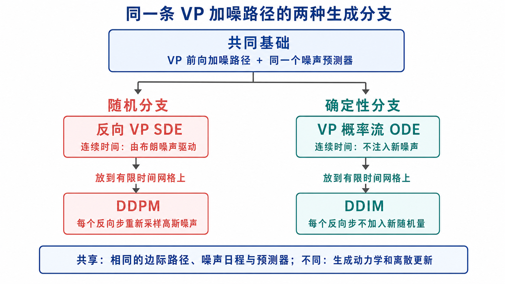

## 从“先设计概率路径”到“再构造生成动力学”

本文希望回答一个核心问题：

> 给定易采样的噪声分布和目标数据分布，怎样先设计一条连接二者的概率路径，再用 ODE 或 SDE 在生成阶段实现这条路径？

全文最重要的逻辑链是

$$
\boxed{
\begin{array}{c}
\text{训练时构造随机插值 }x_t
\\[1mm]
\Downarrow
\\[1mm]
\text{得到目标边际路径 }\rho(t)
\text{ 和随机速度标签 }Y_t
\\[1mm]
\Downarrow
\\[1mm]
u(t,x)=\mathbb E[Y_t\mid x_t=x]
\\[1mm]
\Downarrow
\\[1mm]
\begin{cases}
\text{ODE 产生的密度 }q(t)=\rho(t),\\
\text{适当 SDE 产生的密度 }p(t)=\rho(t).
\end{cases}
\end{array}}
$$

这里的关键不是说 ODE、SDE 和随机插值具有相同的单条轨迹，而是说：

$$
\boxed{
\text{它们可以具有相同的单时刻边际分布。}
}
$$

> **备注：什么是“单时刻边际分布”？**
>
> 一个随机过程不仅包含某个时刻的随机变量，还包含整条随机轨迹：

$$
\{X_t:0\le t\le1\}.
$$

> 它的完整概率规律包括多个时刻之间的联合分布，例如

$$
(X_{0.2},X_{0.5},X_{0.8}).
$$

> 现在只固定一个时刻 $t$，不关心其他时刻，只看 $X_t$ 取不同值的概率，这就是时刻 $t$ 的边际分布：

$$
X_t\sim q(t,\cdot).
$$

> “边际”这个名字来自联合分布。例如已知两个时刻的联合密度 $p_{s,t}(x,y)$，把另一个时刻的变量 $x$ 积分消掉：

$$
p_t(y)=\int_{\mathbb R^d}p_{s,t}(x,y)\,\mathrm dx,
$$

> 得到的 $p_t$ 就是 $X_t$ 的边际密度。

---

## 1. 三个层次必须分开

为了避免混淆，先区分全文中的三类对象。

| 层次 | 随机变量或过程 | 密度 | 作用 |
|---|---|---|---|
| 训练时设计的随机插值 | $x_t$ | $\rho(t,x)$ | 定义希望模型复现的概率路径 |
| 生成 ODE | $X_t$ | $q(t,x)$ | 从噪声出发进行确定性生成 |
| 生成 SDE | $Z_t$ | $p(t,x)$ | 从噪声出发进行随机生成 |

另外还要区分两类速度：

| 符号 | 含义 |
|---|---|
| $Y_t=\dot x_t$ | 一条随机插值轨迹的随机速度 |
| $u(t,x)=\mathbb E[Y_t\mid x_t=x]$ | 给定时间和位置后的条件平均速度场 |

其中：

- $\rho,q,p$ 都是概率密度，不是速度场；
- $Y_t$ 是依赖隐藏变量的随机速度；
- $u(t,x)$ 是只依赖当前时间和位置的确定性速度场；
- 理论中的 $u$ 是精确条件期望，实际模型学习的是近似 $u_\theta$。

---

## 2. 构造双端点随机插值

### 2.1 两个端点与耦合

约定生成时间 $t$ 从 $0$ 增长到 $1$：

$$
\rho_0=\text{易采样的基分布，通常为高斯噪声},
\qquad
\rho_1=\text{目标数据分布}.
$$

采样

$$
(x_0,x_1)\sim\nu,
$$

其中 $\nu$ 的两个边际分别是 $\rho_0$ 和 $\rho_1$。最简单的选择是独立耦合

$$
\nu=\rho_0\otimes\rho_1.
$$

耦合 $\nu$ 决定哪些噪声样本与哪些数据样本配对，但不改变两个端点分布。

### 2.2 双端点随机插值

取满足端点条件的确定性插值函数

$$
I(0,x_0,x_1)=x_0,
\qquad
I(1,x_0,x_1)=x_1.
$$

再采样独立高斯潜变量

$$
z\sim\mathcal N(0,\mathrm{Id}),
\qquad
z\perp(x_0,x_1),
$$

定义

$$
\boxed{
x_t=I(t,x_0,x_1)+\gamma(t)z.
}
\tag{2.1}
$$

对本节的双端点随机插值，要求

$$
\gamma(0)=\gamma(1)=0.
$$

于是

$$
x_0\sim\rho_0,
\qquad
x_1\sim\rho_1.
$$

定义 $x_t$ 的边际密度为

$$
\boxed{
x_t\sim\rho(t,\cdot).
}
\tag{2.2}
$$

因此 $\rho(t)$ 是由随机插值预先设计出来的目标概率路径。此时它还没有被证明是某个生成 ODE 或生成 SDE 的密度。

### 2.3 为什么随机插值本身通常不是生成算法

训练时可以同时取得噪声样本 $x_0$ 和数据样本 $x_1$，所以容易构造 $x_t$。

但生成时只有

$$
x_0\sim\rho_0,
$$

并不知道目标端点 $x_1$。因此不能直接依靠式 (2.1) 生成新数据。

随机插值的主要作用是：

1. 定义希望生成模型复现的中间边际 $\rho(t)$；
2. 提供可以直接采样的监督信号；
3. 帮助构造只依赖 $(t,x)$ 的 ODE 或 SDE。

---

## 3. 从随机轨迹速度得到确定速度场

对式 (2.1) 关于时间求导：

$$
\boxed{
Y_t:=\dot x_t
\mathrel{=}
\partial_tI(t,x_0,x_1)+\dot\gamma(t)z.
}
\tag{3.1}
$$

$Y_t$ 是单条随机插值轨迹的速度。即使给定 $x_t=x$，仍可能有多组不同的 $(x_0,x_1,z)$ 经过该位置，并产生不同的 $Y_t$。

而 ODE 的速度场必须满足：给定 $(t,x)$ 后，速度是一个确定向量。

因此定义

$$
\boxed{
u(t,x)
:=
\mathbb E[Y_t\mid x_t=x].
}
\tag{3.2}
$$

这一步可以理解为从“拉格朗日随机轨迹速度”得到“欧拉确定速度场”。

需要特别注意：

$$
Y_t=u(t,x_t)
$$

一般不会逐样本成立。成立的是条件平均关系

$$
\boxed{
\mathbb E[Y_t\mid x_t]=u(t,x_t).
}
\tag{3.3}
$$

---

## 4. 为什么随机插值密度 $\rho$ 满足连续性方程

### 4.1 测试函数证明

为突出主要逻辑，以下假设 $I$ 和 $\gamma$ 对时间可微、相关期望有限、允许交换时间求导与期望，并假设涉及的密度和速度场足够光滑。

取任意光滑紧支撑测试函数

$$
\varphi\in C_c^\infty(\mathbb R^d).
$$

> **备注：什么是测试函数？**
>
> $\varphi\in C_c^\infty(\mathbb R^d)$ 表示 $\varphi$ 是定义在 $d$ 维空间上的光滑函数：$C^\infty$ 表示可以无限次求导，右下角的 $c$ 表示它只在某个有限区域内非零，称为“紧支撑”。
>
> 可以把 $\varphi$ 看成一个光滑探测器。若它在区域 $A$ 内接近 $1$、区域外接近 $0$，那么 $\mathbb E[\varphi(x_t)]$ 就近似测量 $x_t$ 落在区域 $A$ 内的概率。紧支撑还保证分部积分时无穷远处不会产生边界项。

#### 三个常用的空间微分算子

后文会反复使用梯度 $\nabla$、散度 $\nabla\cdot$ 和 Laplace 算子 $\Delta$。这里统一定义。

设 $f:\mathbb R^d\to\mathbb R$ 是标量函数。它的**梯度**是由所有一阶偏导数组成的向量：

$$
\boxed{
\nabla f(x)
\mathrel{=}
\left(
\partial_{x_1}f(x),
\ldots,
\partial_{x_d}f(x)
\right).
}
$$

$\nabla f$ 指向 $f$ 在当前位置上升最快的方向，$\|\nabla f\|$ 表示上升的陡峭程度。若 $F=(F_1,\ldots,F_d)$ 是向量场，则

$$
\nabla f\cdot F
\mathrel{=}
\sum_{i=1}^d
(\partial_{x_i}f)F_i.
$$

向量场 $F:\mathbb R^d\to\mathbb R^d$ 的**散度**是一个标量：

$$
\boxed{
\nabla\cdot F(x)
\mathrel{=}
\sum_{i=1}^d
\partial_{x_i}F_i(x).
}
$$

$\nabla\cdot F$ 描述一个位置附近的局部净流出程度：大于零表示流出多于流入，小于零表示流入多于流出。

标量函数 $f$ 的 **Laplace 算子**是各坐标方向二阶偏导数之和：

$$
\boxed{
\Delta f(x)
:=
\sum_{i=1}^d
\partial_{x_i}^2f(x)
\mathrel{=}
\nabla\cdot(\nabla f(x)).
}
$$

因此，Laplace 算子就是“先取梯度，再取散度”。它也等于 Hessian 矩阵 $\nabla^2f$ 的迹：

$$
\Delta f
\mathrel{=}
\operatorname{tr}(\nabla^2f).
$$

三者的输入和输出可以概括为

$$
\boxed{
\begin{aligned}
\nabla &: \text{标量函数}\longrightarrow\text{向量场},
\\
\nabla\cdot &: \text{向量场}\longrightarrow\text{标量函数},
\\
\Delta &= \nabla\cdot\nabla:
\text{标量函数}\longrightarrow\text{标量函数}.
\end{aligned}
}
$$

#### 回到测试函数证明

现在回到连续性方程的证明。上面三个算子中，接下来首先用到梯度：取标量函数 $f=\varphi$，并让它沿随机轨迹 $x_t$ 取值，得到 $\varphi(x_t)$。

轨迹 $x_t$ 的瞬时速度是 $Y_t=\dot x_t$。因此，$\varphi(x_t)$ 随时间的变化率由“$\varphi$ 对空间位置的变化”与“轨迹本身的移动速度”共同决定。多变量链式法则给出

$$
\frac{\mathrm d}{\mathrm dt}\varphi(x_t)
\mathrel{=}
\nabla\varphi(x_t)\cdot Y_t.
$$

> **备注：为什么链式法则给出这个等式？**
>
> 写成坐标形式，$x_t=(x_t^{(1)},\ldots,x_t^{(d)})$。多变量链式法则给出：$\displaystyle \frac{\mathrm d}{\mathrm dt}\varphi(x_t)=\sum_{i=1}^d\frac{\partial\varphi}{\partial x_i}(x_t)\frac{\mathrm dx_t^{(i)}}{\mathrm dt}$。
>
> 根据上面对梯度的定义，并使用 $Y_t=\dot x_t$，上面的求和正是点积 $\nabla\varphi(x_t)\cdot Y_t$。虽然 $x_t$ 是随机的，但固定一次随机采样后，它就是一条普通的时间轨迹，因此可以逐轨迹使用链式法则。

取期望：

$$
\frac{\mathrm d}{\mathrm dt}
\mathbb E[\varphi(x_t)]
\mathrel{=}
\mathbb E[
\nabla\varphi(x_t)\cdot Y_t
].
\tag{4.1}
$$

> **备注：为什么可以交换时间求导与期望？**
>
> 直观上就是：**大量轨迹上观测值的平均变化速度，等于每条轨迹观测值变化速度的平均**。但依赖可微性和可积性条件；没有这些条件，求导与期望不一定能交换。

对 $x_t$ 使用条件期望：

$$
\begin{aligned}
\mathbb E[
\nabla\varphi(x_t)\cdot Y_t
]
&=
\mathbb E\!\left[
\mathbb E\!\left[
\nabla\varphi(x_t)\cdot Y_t
\mid x_t
\right]
\right]
\\
&=
\mathbb E\!\left[
\nabla\varphi(x_t)\cdot
\mathbb E[Y_t\mid x_t]
\right]
\\
&=
\mathbb E[
\nabla\varphi(x_t)\cdot u(t,x_t)
]
\\
&=
\int_{\mathbb R^d}
\nabla\varphi(x)\cdot u(t,x)\rho(t,x)\,\mathrm dx.
\end{aligned}
\tag{4.2}
$$

> **备注：第一个等号使用塔式法则，第二个等号使用条件期望的“已知量提出”性质。**
>
> 条件期望 $\mathbb E[Y_t\mid x_t]$ 可以理解为：按照 $x_t$ 的取值把样本分组，然后在每一组内对 $Y_t$ 求平均。
>
> **塔式法则：** 先在每个 $x_t$ 分组内求平均，再对所有分组求总体平均，等于直接求总体平均：$\mathbb E[Z]=\mathbb E\!\left[\mathbb E[Z\mid x_t]\right]$。
>
> **已知量提出：** 给定 $x_t$ 后，任何只依赖 $x_t$ 的量都已经确定。因此对任意函数 $g$，有 $\mathbb E[g(x_t)Y_t\mid x_t]=g(x_t)\mathbb E[Y_t\mid x_t]$。
>
> 这里 $g(x_t)=\nabla\varphi(x_t)$，所以 $\mathbb E[\nabla\varphi(x_t)\cdot Y_t]=\mathbb E[\nabla\varphi(x_t)\cdot\mathbb E[Y_t\mid x_t]]$。
>
> 最后使用 $u(t,x)=\mathbb E[Y_t\mid x_t=x]$，便得到式 (4.2)。

分部积分得到

$$
\frac{\mathrm d}{\mathrm dt}
\mathbb E[\varphi(x_t)]
\mathrel{=}
-\int_{\mathbb R^d}
\varphi(x)\nabla\cdot(\rho u)(t,x)\,\mathrm dx.
\tag{4.3}
$$

> **备注：分部积分 **
>
> 式 (4.2) 的最后一项是

$$
\int_{\mathbb R^d}\nabla\varphi(x)\cdot(\rho u)(t,x)\,\mathrm dx.
$$

> 分部积分的作用，是把原来作用在 $\varphi$ 上的空间导数 $\nabla$ 转移到 $\rho u$ 上；转移后会产生一个负号。
>
> 以一维情形为例。由乘积求导公式，

$$
(\varphi(x)F(x))'
\mathrel{=}
\varphi'(x)F(x)+\varphi(x)F'(x).
$$

> 在区间 $[a,b]$ 上对等式两边积分，得到

$$
\int_a^b(\varphi F)'(x)\,\mathrm dx
\mathrel{=}
\int_a^b\varphi'(x)F(x)\,\mathrm dx
\mathbin{+}
\int_a^b\varphi(x)F'(x)\,\mathrm dx.
$$

> 根据微积分基本定理，左边等于两个端点处函数值之差：

$$
\int_a^b(\varphi F)'(x)\,\mathrm dx
\mathrel{=}
\varphi(b)F(b)-\varphi(a)F(a).
$$

> 因而

$$
\int_a^b\varphi'(x)F(x)\,\mathrm dx
\mathrel{=}
\underbrace{\varphi(b)F(b)-\varphi(a)F(a)}_{\text{边界项}}
\mathbin{-}
\int_a^b\varphi(x)F'(x)\,\mathrm dx.
$$

> 这就是一维分部积分公式。负号来自把 $\int_a^b\varphi(x)F'(x)\,\mathrm dx$ 移到等号右边，并不是额外规定的。
>
> 把区间扩展到整个实数轴，就有

$$
\int_{\mathbb R}\varphi'(x)F(x)\,\mathrm dx
\mathrel{=}
[\varphi(x)F(x)]_{-\infty}^{+\infty}
\mathbin{-}
\int_{\mathbb R}\varphi(x)F'(x)\,\mathrm dx.
$$

> 如果 $\varphi$ 在足够远处为零，或者更一般地，$\varphi(x)F(x)$ 在 $x\to\pm\infty$ 时衰减到零，那么边界项消失，于是

$$
\int_{\mathbb R}\varphi'(x)F(x)\,\mathrm dx
\mathrel{=}
-\int_{\mathbb R}\varphi(x)F'(x)\,\mathrm dx.
$$

>
> 最后代入 $F=\rho u$，便由式 (4.2) 得到式 (4.3)。直观上，$\rho u$ 是概率流量，$\nabla\cdot(\rho u)>0$ 表示某处流出的概率多于流入的概率，因此该处的概率密度应当下降；这也解释了负号的物理意义。

另一方面，

$$
\mathbb E[\varphi(x_t)]
\mathrel{=}
\int_{\mathbb R^d}
\varphi(x)\rho(t,x)\,\mathrm dx,
$$

所以

$$
\frac{\mathrm d}{\mathrm dt}
\mathbb E[\varphi(x_t)]
\mathrel{=}
\int_{\mathbb R^d}
\varphi(x)\partial_t\rho(t,x)\,\mathrm dx.
\tag{4.4}
$$

> **备注：式 (4.4) 为什么成立？**
>
> 对固定时刻 $t$，$x_t$ 的概率密度是 $\rho(t,x)$，所以 $\varphi(x_t)$ 的期望就是按该密度加权积分：

$$
\mathbb E[\varphi(x_t)]
\mathrel{=}
\int_{\mathbb R^d}\varphi(x)\rho(t,x)\,\mathrm dx.
$$

> 这里 $x$ 只是积分变量。测试函数 $\varphi(x)$ 不依赖时间，随时间变化的只有密度 $\rho(t,x)$。在 $\rho$ 足够光滑、可以交换时间求导与积分的条件下，

$$
\begin{aligned}
\frac{\mathrm d}{\mathrm dt}\mathbb E[\varphi(x_t)]
&=
\frac{\mathrm d}{\mathrm dt}
\int_{\mathbb R^d}\varphi(x)\rho(t,x)\,\mathrm dx
\\
&=
\int_{\mathbb R^d}
\frac{\partial}{\partial t}
\bigl[\varphi(x)\rho(t,x)\bigr]\,\mathrm dx
\\
&=
\int_{\mathbb R^d}
\varphi(x)\partial_t\rho(t,x)\,\mathrm dx.
\end{aligned}
$$

> 最后一步使用了 $\partial_t\varphi(x)=0$。若测试函数本身也依赖时间，还会多出 $\int(\partial_t\varphi)\rho\,\mathrm dx$。

比较式 (4.3) 和式 (4.4)：

$$
\int_{\mathbb R^d}
\varphi(x)
\left[
\partial_t\rho+\nabla\cdot(\rho u)
\right](t,x)\,\mathrm dx
=0.
$$

由于测试函数 $\varphi$ 可以任意选择，在上述光滑假设下，只能有

$$
\boxed{
\partial_t\rho(t,x)
\mathbin{+}
\nabla\cdot\bigl(\rho(t,x)u(t,x)\bigr)
=0
}
\tag{4.5}
$$

### 4.2 这一步表达了什么

随机插值的单条轨迹使用随机速度 $Y_t$，但其边际密度只感受到条件平均后的概率流量

$$
\boxed{
J_\rho(t,x)=\rho(t,x)u(t,x).
}
\tag{4.6}
$$

连续性方程就是概率质量守恒：

$$
\text{局部密度变化}
\mathbin{+}
\text{净流出量}
=0.
$$

---

## 5. 构造 ODE，并证明其密度 $q$ 等于 $\rho$

### 5.1 ODE 中的 $u$ 从哪里来

为了避免误解，暂时把式 (3.2) 得到的速度记作

$$
u_{\mathrm{SI}}(t,x)
\mathrel{=}
\mathbb E[Y_t\mid x_t=x].
$$

接下来人为构造 ODE：

$$
\boxed{
\dot X_t=u_{\mathrm{SI}}(t,X_t),
\qquad
X_0\sim\rho_0.
}
\tag{5.1}
$$

逻辑是

$$
\boxed{
\text{先从随机插值得到 }u_{\mathrm{SI}},
\quad
\text{再把同一个 }u_{\mathrm{SI}}\text{ 放入 ODE。}
}
$$

后文重新把 $u_{\mathrm{SI}}$ 简写为 $u$。

定义 ODE 解的密度：

$$
\boxed{
X_t\sim q(t,\cdot).
}
\tag{5.2}
$$

这里 $q$ 是 ODE 粒子群的密度。

### 5.2 为什么 $q$ 也满足连续性方程

因为

$$
\dot X_t=u(t,X_t),
$$

所以对测试函数 $\varphi$，

$$
\begin{aligned}
\frac{\mathrm d}{\mathrm dt}
\mathbb E[\varphi(X_t)]
&=
\mathbb E\!\left[
\frac{\mathrm d}{\mathrm dt}\varphi(X_t)
\right]
\\
&=
\mathbb E[
\nabla\varphi(X_t)\cdot\dot X_t
]
\\
&=
\mathbb E[
\nabla\varphi(X_t)\cdot u(t,X_t)
]
\\
&=
\int_{\mathbb R^d}
\nabla\varphi(x)\cdot u(t,x)q(t,x)\,\mathrm dx
\\
&=
-\int_{\mathbb R^d}
\varphi(x)\nabla\cdot(qu)(t,x)\,\mathrm dx.
\end{aligned}
\tag{5.3}
$$

另一方面，

$$
\frac{\mathrm d}{\mathrm dt}
\mathbb E[\varphi(X_t)]
\mathrel{=}
\int_{\mathbb R^d}
\varphi(x)\partial_tq(t,x)\,\mathrm dx.
\tag{5.4}
$$

> **备注：** 式 (5.4) 使用的步骤与式 (4.4) 完全相同，详见式 (4.4) 下方的备注。

因此

$$
\boxed{
\partial_tq+\nabla\cdot(qu)=0.
}
\tag{5.5}
$$

这个证明与第 4 节的数学骨架相同。区别是：

- 对随机插值，$\dot x_t=Y_t$ 不是 $x_t$ 的确定函数，需要条件平均；
- 对 ODE，$\dot X_t=u(t,X_t)$ 已经是当前位置的确定函数。

#### 两个证明的核心差异

> 下式中，黑色部分是两个证明共有的操作；红色部分才是两者真正不同的地方。

$$
\boxed{
\begin{aligned}
\text{随机插值：}\quad
\frac{\mathrm d}{\mathrm dt}\mathbb E[\varphi(x_t)]
&=
\mathbb E[
\nabla\varphi(x_t)\cdot
Y_t
]
\\
&\mathrel{\overset{
{\color{red}{\text{对 }x_t\text{ 做条件平均}}}
}{=}}
\mathbb E[
\nabla\varphi(x_t)\cdot
\mathbb E[Y_t\mid x_t]
]
\\
&=
\mathbb E[
\nabla\varphi(x_t)\cdot u(t,x_t)
],
\\[3mm]
\text{ODE：}\quad
\frac{\mathrm d}{\mathrm dt}\mathbb E[\varphi(X_t)]
&=
\mathbb E[
\nabla\varphi(X_t)\cdot
\dot X_t
]
\\
&\mathrel{\overset{
{\color{red}{\dot X_t=u(t,X_t)}}
}{=}}
\mathbb E[
\nabla\varphi(X_t)\cdot u(t,X_t)
].
\end{aligned}
}
\tag{5.5a}
$$

**两种方法的物理意义：**

- **随机插值描述微观的随机轨迹。** 即使多条轨迹在同一时刻到达同一位置 $x_t=x$，它们的瞬时速度 $Y_t$ 也可能不同，因为它们可能来自不同的端点或噪声样本。边际密度并不分别追踪这些不同速度，只感受到它们在当前位置的条件平均
  $$
  u(t,x)=\mathbb E[Y_t\mid x_t=x].
  $$
  因而，$u$ 表示位置 $x$ 处概率质量的平均输运方向；速度偏差 $Y_t-u(t,x_t)$ 在同一位置进行条件平均后相互抵消。

- **ODE 描述宏观的确定性概率流。** ODE 直接规定每个位置上的粒子速度为 $u(t,x)$。所有到达同一位置的 ODE 粒子都使用同一个速度场，不再保留随机插值中“同一位置可能具有不同瞬时速度”的微观差异。因此，ODE 可以看成直接实现条件平均后的概率流。

两者的微观轨迹可以不同，但只要使用同一个速度场 $u$，它们对边际密度产生的概率流分别是 $\rho u$ 和 $qu$，并满足相同形式的连续性方程。随机插值负责从随机轨迹中提取平均速度场，ODE 则使用这个平均速度场输运概率质量。

红色文字就是唯一的关键区别：随机插值需要先对随机速度做条件平均；ODE 直接使用定义中的确定速度。完成这一步以后，两边都变成“密度由同一个速度场 $u$ 输运”，后续的分部积分完全相同：

$$
\boxed{
\begin{aligned}
\text{随机插值：}\quad&
\partial_t\rho
\mathbin{+}
\nabla\cdot(\rho u)=0,
\\
\text{ODE：}\quad&
\partial_tq
\mathbin{+}
\nabla\cdot(qu)=0.
\end{aligned}
}
\tag{5.5b}
$$

事实上

$$
\mathbb E[\dot X_t\mid X_t=x]
\mathrel{=}
\mathbb E[u(t,X_t)\mid X_t=x]
\mathrel{=}
u(t,x).
$$

所以 ODE 是一般“条件平均速度定理”的特殊情况。

### 5.3 为什么能推出 $q=\rho$

目前已经分别证明

$$
\partial_t\rho+\nabla\cdot(\rho u)=0,
\qquad
\rho(0)=\rho_0,
\tag{5.6}
$$

以及

$$
\partial_tq+\nabla\cdot(qu)=0,
\qquad
q(0)=\rho_0.
\tag{5.7}
$$

在 $u$ 对空间变量具有足够正则性，例如 Lipschitz，并满足适当增长条件时，连续性方程的初值问题具有唯一解。因此

$$
\boxed{
q(t,x)=\rho(t,x).
}
\tag{5.8}
$$

特别地，

$$
X_1\sim q(1,\cdot)=\rho(1,\cdot)=\rho_1.
$$

这正是生成建模需要的结论：

> 训练时借助已知数据端点设计随机插值；生成时不再使用数据端点，只从噪声出发运行 ODE，仍能在理想条件下到达目标数据分布。

需要注意，$q=\rho$ 只表示单时刻边际相同。随机插值轨迹 $x_t$ 与 ODE 轨迹 $X_t$ 通常不同。

---

## 6. 同一条 $\rho(t)$ 也可以由 SDE 实现

### 6.1 本章要证明什么

第 4 章已经从随机插值得到目标边际密度 $\rho(t,x)$ 和条件平均速度场 $u(t,x)$，并证明它们满足连续性方程

$$
\boxed{
\partial_t\rho(t,x)
\mathbin{+}
\nabla\cdot\bigl(\rho(t,x)u(t,x)\bigr)
\mathrel{=}
0,
\qquad
\rho(0,x)=\rho_0(x).
}
\tag{6.1}
$$

第 5 章进一步说明：由同一个速度场驱动的 ODE

$$
\dot X_t=u(t,X_t)
$$

可以实现这条边际密度路径。

本章要回答一个新的问题：

> 能否在轨迹中加入布朗噪声，同时仍让每个时刻的边际密度保持为 $\rho(t,x)$？

答案是可以，但不能只在 ODE 上直接加噪声。随机扩散会摊平密度，因此还需要在漂移中加入一个由 score 决定的补偿项。

本章将构造 SDE $Z_t$，记它的实际密度为 $p(t,x)$，并证明

$$
\boxed{
p(t,x)=\rho(t,x).
}
$$

全文需要区分三个随机对象：

| 随机对象 | 如何产生 | 时刻 $t$ 的密度 |
|---|---|---|
| $x_t$ | 训练时设计的随机插值 | $\rho(t,x)$ |
| $X_t$ | 速度场 $u$ 驱动的 ODE | $q(t,x)$ |
| $Z_t$ | 本章构造的 SDE | $p(t,x)$ |

证明路线是：

1. 先推导一般 SDE 的 Fokker--Planck 方程；
2. 再要求它在密度为 $\rho$ 时具有与 ODE 相同的概率流量 $\rho u$；
3. 由此反推出合适的漂移；
4. 最后用相同 PDE、相同初值和解的唯一性证明 $p=\rho$。

### 6.2 Itô SDE 的符号与尺度

#### 随机状态、空间位置和密度

- $Z_t\in\mathbb R^d$ 是时刻 $t$ 的随机状态；
- $x\in\mathbb R^d$ 是确定的空间位置，是密度和向量场的自变量；
- $p(t,x)$ 是 $Z_t$ 的实际密度，即 $Z_t\sim p(t,\cdot)$；
- $\rho(t,x)$ 是随机插值预先规定的目标密度。

在证明结束以前，$p$ 和 $\rho$ 必须严格区分：$p$ 是 SDE 实际产生的未知密度，$\rho$ 是希望它实现的候选密度。

#### 布朗运动

令 $W_t\in\mathbb R^d$ 为 $d$ 维标准 Wiener 过程，也称标准布朗运动。对有限的小时间步 $\Delta t>0$，

$$
\Delta W_t
:=
W_{t+\Delta t}-W_t
\sim
\mathcal N(0,\Delta t\,\mathrm{Id}),
$$

其中 $\mathrm{Id}$ 是 $d\times d$ 单位矩阵。等价地，

$$
\Delta W_t
\overset{\mathrm d}{=}
\sqrt{\Delta t}\,\xi,
\qquad
\xi\sim\mathcal N(0,\mathrm{Id}),
$$

这里 $\overset{\mathrm d}{=}$ 表示两边分布相同。

> **备注：为什么这两种写法等价？**
>
> 先看一维情形。根据标准布朗运动的定义，长度为 $\Delta t$ 的时间区间对应的增量满足

$$
\Delta W_t\sim\mathcal N(0,\Delta t).
$$

>
> 另取一个标准高斯随机变量 $\xi\sim\mathcal N(0,1)$，并定义

$$
Y:=\sqrt{\Delta t}\,\xi.
$$

> 高斯随机变量乘以常数后仍是高斯随机变量。$Y$ 的均值和方差分别为

$$
\mathbb E[Y]=\sqrt{\Delta t}\,\mathbb E[\xi]=0,
\qquad
\operatorname{Var}(Y)
=\operatorname{Var}\!\left(\sqrt{\Delta t}\,\xi\right)
=\left(\sqrt{\Delta t}\right)^2\operatorname{Var}(\xi)
=\Delta t\,\operatorname{Var}(\xi)
=\Delta t.
$$

> 因此

$$
\sqrt{\Delta t}\,\xi
\sim
\mathcal N(0,\Delta t).
$$

> 它与 $\Delta W_t$ 的分布完全相同，所以可以写成

$$
\Delta W_t
\overset{\mathrm d}{=}
\sqrt{\Delta t}\,\xi.
$$

> $d$ 维情形就是将这个结论分别用到每个相互独立的坐标分量，因此协方差矩阵为 $\Delta t\,\mathrm{Id}$。
>
> 这也是数值模拟布朗运动的方法：每走一个长度为 $\Delta t$ 的时间步，就重新采样一个独立的标准高斯随机变量，再乘以 $\sqrt{\Delta t}$ 作为该步的布朗增量。
>
> 需要注意，$\overset{\mathrm d}{=}$ 只表示两边的概率分布相同，不表示两个随机变量在每一次采样时都取到相同数值。

因此布朗增量是 $\sqrt{\Delta t}$ 量级，而不是 $\Delta t$ 量级。符号 $\mathrm dW_t$ 是布朗增量的连续时间记号，不能理解成 $\dot W_t\,\mathrm dt$，因为布朗轨迹几乎处处不可微。

#### 漂移和噪声幅度

本章采用 Itô 解释，先把 SDE 写成最直观的形式：

$$
\boxed{
\mathrm dZ_t
\mathrel{=}
b(t,Z_t)\,\mathrm dt
\mathbin{+}
\sigma(t)\,\mathrm dW_t,
\qquad
\sigma(t)\ge0.
}
\tag{6.2}
$$

除非特别说明，本章后面出现的所有 SDE 和随机积分都按 Itô 意义理解。

式中：

- $b(t,x)\in\mathbb R^d$ 是漂移速度，控制随机状态的平均移动方向；
- $\sigma(t)\ge0$ 是直接乘在布朗增量上的**噪声幅度**；
- $\sigma(t)=0$ 表示该时刻不加入新噪声；
- $\sigma(t)$ 越大，单位时间内随机增量的方差越大，单条轨迹越随机。

为了简化推导，本章只考虑 $\sigma$ 依赖时间、且所有空间方向使用相同噪声幅度的情形，因此扩散是各向同性的。

> **备注：什么是 Itô 型 SDE？**
>
> “Itô 型 SDE”指其中的随机积分按照 Itô 规则定义的随机微分方程。更一般的形式为

$$
\mathrm dZ_t
\mathrel{=}
b(t,Z_t)\,\mathrm dt
\mathbin{+}
\sigma(t,Z_t)\,\mathrm dW_t.
$$

> 它严格表示积分方程

$$
Z_t
\mathrel{=}
Z_0
\mathbin{+}
\int_0^t b(r,Z_r)\,\mathrm dr
\mathbin{+}
\int_0^t\sigma(r,Z_r)\,\mathrm dW_r.
$$

> 第一个积分是普通时间积分，最后一项按照 Itô 随机积分解释。
>
> Itô 规则的核心是使用每个小区间的左端点。把 $[0,t]$ 分成小区间 $[t_k,t_{k+1}]$，则随机积分由下列和式的极限定义：

$$
\int_0^t\sigma(r,Z_r)\,\mathrm dW_r
\approx
\sum_k
\sigma(t_k,Z_{t_k})
\bigl(W_{t_{k+1}}-W_{t_k}\bigr).
$$

> 因此，在计算下一步的随机增量时，系数使用当前已经知道的状态 $Z_{t_k}$：

$$
Z_{t_{k+1}}-Z_{t_k}
\approx
b(t_k,Z_{t_k})\Delta t
\mathbin{+}
\sigma(t_k,Z_{t_k})\sqrt{\Delta t}\,\xi_k,
\qquad
\xi_k\sim\mathcal N(0,\mathrm{Id}).
$$

> 当前的系数不依赖尚未发生的未来布朗增量。正因为采用左端点，满足适当可积性条件时，Itô 随机积分具有零均值性质：

$$
\mathbb E\!\left[
\int_0^t\sigma(r,Z_r)\,\mathrm dW_r
\right]
=0.
$$

在一个很小但有限的时间步内，给定 $Z_t=x$，Euler--Maruyama 近似进行数值求解

$$
Z_{t+\Delta t}-Z_t
\approx
b(t,x)\Delta t
\mathbin{+}
\sigma(t)\sqrt{\Delta t}\,\xi,
\qquad
\xi\sim\mathcal N(0,\mathrm{Id}).
\tag{6.3}
$$

所以

$$
\begin{aligned}
\mathbb E[Z_{t+\Delta t}-Z_t\mid Z_t=x]
&\approx
b(t,x)\Delta t,
\\
\operatorname{Cov}(Z_{t+\Delta t}-Z_t\mid Z_t=x)
&\approx
\sigma^2(t)\Delta t\,\mathrm{Id}.
\end{aligned}
\tag{6.4}
$$

这说明 $b$ 控制平均位移，而 $\sigma$ 直接控制随机增量的标准差。

### 6.3 具有各向同性加性噪声的 SDE 的 Fokker--Planck 方程

先给出本节结论。对于式 (6.2)

$$
\mathrm dZ_t
\mathrel{=}
b(t,Z_t)\,\mathrm dt
\mathbin{+}
\sigma(t)\,\mathrm dW_t,
$$

如果 $Z_t$ 的密度为 $p(t,x)$，那么它满足

$$
\boxed{
\partial_t p
\mathrel{=}
-\nabla\cdot(bp)
\mathbin{+}
\frac12\sigma^2(t)\Delta p.
}
$$

这个方程称为 Fokker--Planck 方程。它描述的不是单条随机轨迹，而是大量 SDE 轨迹形成的概率密度如何随时间变化：

- $-\nabla\cdot(bp)$ 是漂移造成的概率输运；
- $\tfrac12\sigma^2\Delta p$ 是噪声造成的概率扩散。

本节中 $\sigma(t)$ 是只依赖时间的标量，因此噪声在各个空间方向上强度相同。下面先在一维中推导，再推广到 $d$ 维。

#### 一维小时间步推导

先考虑一维 SDE

$$
\mathrm dZ_t
\mathrel{=}
b(t,Z_t)\,\mathrm dt
\mathbin{+}
\sigma(t)\,\mathrm dW_t.
$$

取一个很小的时间步 $h>0$。给定 $Z_t=x$，式 (6.3) 给出

$$
\Delta Z
:=
Z_{t+h}-Z_t
\approx
b(t,x)h
\mathbin{+}
\sigma(t)\sqrt h\,\xi,
\qquad
\xi\sim\mathcal N(0,1).
$$

因为 $\mathbb E[\xi]=0$ 且 $\mathbb E[\xi^2]=1$，所以

$$
\mathbb E[\Delta Z\mid Z_t=x]
\mathrel{=}
b(t,x)h,
$$

并且

$$
\begin{aligned}
\mathbb E[(\Delta Z)^2\mid Z_t=x]
&=
\mathbb E\!\left[
\bigl(bh+\sigma\sqrt h\,\xi\bigr)^2
\right]
\\
&=
b^2h^2+\sigma^2h
\\
&=
\sigma^2h+o(h).
\end{aligned}
\tag{6.5}
$$

中间的交叉项期望为零，因为它含有 $\mathbb E[\xi]=0$；$b^2h^2$ 比 $h$ 更小，因此记入 $o(h)$。

取光滑紧支撑测试函数 $\varphi\in C_c^\infty(\mathbb R)$。对 $\varphi(x+\Delta Z)$ 作二阶 Taylor 展开：

$$
\varphi(x+\Delta Z)-\varphi(x)
\mathrel{=}
\varphi'(x)\Delta Z
\mathbin{+}
\frac12\varphi''(x)(\Delta Z)^2
\mathbin{+}
o(h).
$$

给定 $Z_t=x$ 后取期望，并使用式 (6.5)：

$$
\begin{aligned}
&\mathbb E[
\varphi(Z_{t+h})-\varphi(Z_t)
\mid Z_t=x
]
\\
&\quad=
\left[
b(t,x)\varphi'(x)
\mathbin{+}
\frac12\sigma^2(t)\varphi''(x)
\right]h
+o(h).
\end{aligned}
$$

再对 $Z_t$ 取总体期望，除以 $h$ 并令 $h\to0$，得到

$$
\frac{\mathrm d}{\mathrm dt}
\mathbb E[\varphi(Z_t)]
\mathrel{=}
\mathbb E\!\left[
b(t,Z_t)\varphi'(Z_t)
\mathbin{+}
\frac12\sigma^2(t)\varphi''(Z_t)
\right].
\tag{6.6}
$$

现在把式 (6.6) 两边都写成关于密度 $p(t,x)$ 的积分。因为

$$
\mathbb E[\varphi(Z_t)]
\mathrel{=}
\int_{\mathbb R}\varphi(x)p(t,x)\,\mathrm dx,
$$

而 $\varphi(x)$ 不依赖时间，所以在可以交换求导与积分的条件下，

$$
\begin{aligned}
\int_{\mathbb R}\varphi(x)\partial_t p(t,x)\,\mathrm dx
&=
\frac{\mathrm d}{\mathrm dt}\mathbb E[\varphi(Z_t)]
\\
&=
\int_{\mathbb R}
\left[
b(t,x)\varphi'(x)
\mathbin{+}
\frac12\sigma^2(t)\varphi''(x)
\right]
p(t,x)\,\mathrm dx.
\end{aligned}
\tag{6.7}
$$

这就是式 (6.7) 左边的来源：密度 $p(t,x)$ 随时间变化，使测试函数的平均值 $\mathbb E[\varphi(Z_t)]$ 也随之变化。

对右边第一项分部积分一次，对第二项分部积分两次。由于 $\varphi$ 具有紧支撑，边界项为零：

$$
\begin{aligned}
\int_{\mathbb R}b\varphi'p\,\mathrm dx
&=
-\int_{\mathbb R}\varphi\,\partial_x(bp)\,\mathrm dx,
\\
\int_{\mathbb R}\varphi''p\,\mathrm dx
&=
\int_{\mathbb R}\varphi\,\partial_{xx}p\,\mathrm dx.
\end{aligned}
$$

代回式 (6.7)，得到

$$
\int_{\mathbb R}\varphi(x)
\left[
\partial_t p
\mathbin{+}
\partial_x(bp)
\mathbin{-}
\frac12\sigma^2\partial_{xx}p
\right](t,x)\,\mathrm dx
=0.
$$

因为测试函数 $\varphi$ 可以任意选择，所以只能有

$$
\boxed{
\partial_t p
\mathrel{=}
-\partial_x(bp)
\mathbin{+}
\frac12\sigma^2(t)\partial_{xx}p.
}
\tag{6.8}
$$

#### 推广到 $d$ 维

在 $d$ 维中，给定 $Z_t=x$，小时间步增量满足

$$
\begin{aligned}
\mathbb E[\Delta Z\mid Z_t=x]
&=
b(t,x)h,
\\
\mathbb E[\Delta Z\Delta Z^{\mathsf T}\mid Z_t=x]
&=
\sigma^2(t)h\,\mathrm{Id}+o(h).
\end{aligned}
\tag{6.9}
$$

对二阶 Taylor 项取期望时，不同噪声坐标之间的交叉项为零，只留下 Hessian 对角线元素之和：

$$
\operatorname{tr}(\nabla^2\varphi)
\mathrel{=}
\Delta\varphi.
$$

因此，一维推导中的导数相应变为

$$
\varphi'\longrightarrow\nabla\varphi,
\qquad
\varphi''\longrightarrow\Delta\varphi,
\qquad
\partial_x(bp)\longrightarrow\nabla\cdot(bp).
$$

最终得到

$$
\boxed{
\partial_t p
\mathrel{=}
-\nabla\cdot(bp)
\mathbin{+}
\frac12\sigma^2(t)\Delta p.
}
\tag{6.10}
$$

其中，系数 $\tfrac12$ 来自二阶 Taylor 展开，Laplace 算子来自各个独立噪声坐标的二阶导数之和。这就是 Fokker--Planck 方程。

### 6.4 定义 score，并用它设计漂移

第 6.3 节表明，布朗噪声会在密度方程中产生扩散项。为了设计抵消这个扩散项的漂移，需要知道目标密度 $\rho(t,x)$ 在每个位置朝哪个方向增大。这个方向由 score 给出。

假设 $\rho(t,x)>0$ 且足够光滑，定义

$$
\boxed{
s(t,x)
:=
\nabla_x\log\rho(t,x).
}
\tag{6.11}
$$

score 是一个 $d$ 维向量。它的物理含义是：

- 方向：指向当前位置附近密度上升最快的方向；
- 大小：表示附近密度变化得有多快；
- 在密度的局部峰顶，score 为零。

> **备注：为什么 score 不是速度？**
>
> 二者分别对不同变量求导：

$$
s(t,x)
\mathrel{=}
\nabla_x\log\rho(t,x)
\qquad\text{是对空间位置 }x\text{ 求导},
$$

> 而

$$
u(t,x)
\qquad\text{描述}\qquad
\frac{\mathrm dX_t}{\mathrm dt}
\mathrel{=}
u(t,X_t),
$$

> 是样本对时间的变化率。score 只说明“往哪个空间方向密度会升高”，并没有规定样本必须沿该方向移动。

由链式法则，

$$
s(t,x)
\mathrel{=}
\frac{\nabla_x\rho(t,x)}{\rho(t,x)}.
$$

因此

$$
\boxed{
\rho(t,x)s(t,x)
\mathrel{=}
\nabla_x\rho(t,x).
}
\tag{6.12}
$$

这个等式是后面证明漂移与扩散相互抵消的关键。

> **备注：Gaussian 分布的 score。**
>
> 例如，若

$$
\rho(x)=\mathcal N(\mu,\alpha^2\mathrm{Id}),
$$

> 那么

$$
s(x)
\mathrel{=}
-\frac{x-\mu}{\alpha^2}
\mathrel{=}
\frac{\mu-x}{\alpha^2}.
$$

> 所以 Gaussian 的 score 总是指向分布中心 $\mu$：离中心越远，指向中心的作用越强。

需要注意两点：

1. 这里的 $s(t,x)$ 是目标密度 $\rho(t,x)$ 的 score，不是 SDE 实际密度 $p(t,x)$ 的 score。
2. score 本身不是速度。后面乘上由噪声幅度决定的系数 $\tfrac12\sigma^2(t)$ 后，
   $$
   \frac12\sigma^2(t)s(t,x)
   $$
   才成为漂移速度的一部分，用来抵消布朗扩散。

#### 从目标概率流反推出漂移

根据第 6.3 节推导出的 Fokker--Planck 方程 (6.10)，噪声会在密度方程中增加

$$
\frac12\sigma^2(t)\Delta p.
$$

> **备注：这个扩散项从哪里来？**
>
> 它来自布朗噪声在 Itô 公式中产生的二阶项。证明过程可以压缩成三步：
>
> 1. Itô 公式中出现

$$
\frac12\sigma^2(t)\Delta\varphi(Z_t)\,\mathrm dt;
$$

> 2. 对轨迹取期望并按密度 $p$ 写成积分，得到

$$
\frac12\sigma^2(t)
\int_{\mathbb R^d}(\Delta\varphi)p\,\mathrm dx;
$$

> 3. 对空间变量分部积分两次，把 $\Delta$ 从 $\varphi$ 转移到 $p$：

$$
\int_{\mathbb R^d}(\Delta\varphi)p\,\mathrm dx
\mathrel{=}
\int_{\mathbb R^d}\varphi\,\Delta p\,\mathrm dx.
$$

>
> 因此密度方程中最终出现

$$
\frac12\sigma^2(t)\Delta p.
$$

这说明不能简单地在 ODE 上加噪声。若直接写成

$$
\mathrm dZ_t
\mathrel{=}
u(t,Z_t)\,\mathrm dt
\mathbin{+}
\sigma(t)\,\mathrm dW_t,
$$

那么其密度满足

$$
\partial_t p
\mathrel{=}
-\nabla\cdot(up)
\mathbin{+}
\frac12\sigma^2\Delta p,
$$

而预先规定的目标密度路径满足

$$
\boxed{
\partial_t\rho
\mathrel{=}
-\nabla\cdot(u\rho).
}
$$

我们的目标是证明 SDE 的实际密度 $p$ 等于 $\rho$，所以必须让这个已知的 $\rho$ 也满足 SDE 的密度方程。若把候选函数 $p=\rho$ 代入上面的方程，右边会变成

$$
-\nabla\cdot(u\rho)
\mathbin{+}
\frac12\sigma^2\Delta\rho
\mathrel{=}
\partial_t\rho
\mathbin{+}
\frac12\sigma^2\Delta\rho.
$$

它通常不等于 $\partial_t\rho$，因为多出了扩散项 $\tfrac12\sigma^2\Delta\rho$。因此，直接在漂移 $u$ 上加噪声通常会改变原来的目标密度路径。

从这里开始，为了简化公式，定义扩散率

$$
\boxed{
\kappa(t)
:=
\frac{\sigma^2(t)}{2}
\ge0,
\qquad
\sigma(t)=\sqrt{2\kappa(t)}.
}
$$

于是 Fokker--Planck 方程写成

$$
\partial_t p
\mathrel{=}
-\nabla\cdot(bp)
\mathbin{+}
\kappa\Delta p.
$$

因为 $\kappa$ 只依赖时间，

$$
\kappa\Delta p
\mathrel{=}
\nabla\cdot(\kappa\nabla p).
$$

> **备注：这个等式怎么来的？**
>
> 这里的梯度和散度都是对空间变量 $x$ 求导。乘积求导公式给出

$$
\nabla_x\cdot(\kappa\nabla_x p)
\mathrel{=}
(\nabla_x\kappa)\cdot\nabla_x p
\mathbin{+}
\kappa\,\nabla_x\cdot(\nabla_x p).
$$

> 因为 $\kappa=\kappa(t)$ 只依赖时间，不依赖空间位置 $x$，所以

$$
\nabla_x\kappa(t)=0.
$$

> 同时，根据 Laplace 算子的定义，

$$
\nabla_x\cdot(\nabla_x p)
\mathrel{=}
\Delta p.
$$

> 因此

$$
\nabla_x\cdot(\kappa(t)\nabla_x p)
\mathrel{=}
\kappa(t)\Delta p.
$$

>
> 写成坐标形式也可以直接看出：

$$
\begin{aligned}
\nabla_x\cdot(\kappa\nabla_x p)
&=
\sum_{i=1}^d
\partial_{x_i}\!\left(\kappa(t)\partial_{x_i}p\right)
\\
&=
\kappa(t)
\sum_{i=1}^d\partial_{x_i}^2p
\\
&=
\kappa(t)\Delta p.
\end{aligned}
$$

> 如果 $\kappa$ 还依赖空间位置，即 $\kappa=\kappa(t,x)$，就会多出 $(\nabla_x\kappa)\cdot\nabla_xp$，此时不能直接使用上面的等式。

所以方程可以改写为概率质量守恒形式

$$
\partial_t p+\nabla\cdot J_p=0,
\qquad
J_p
\mathrel{=}
bp-\kappa\nabla p.
$$

这里：

- $bp$ 是漂移流量；
- $-\kappa\nabla p$ 是扩散流量。

另一方面，目标密度 $\rho$ 已满足

$$
\partial_t\rho+\nabla\cdot(\rho u)=0,
$$

因此目标概率流量是 $\rho u$。

若希望 SDE 在密度为 $\rho$ 时具有同样的总流量，一个直接的选择是令

$$
\boxed{
b(t,x)\rho(t,x)
\mathbin{-}
\kappa(t)\nabla\rho(t,x)
\mathrel{=}
u(t,x)\rho(t,x).
}
\tag{6.13}
$$

利用 score 恒等式

$$
\frac{\nabla\rho}{\rho}
\mathrel{=}
\nabla\log\rho
\mathrel{=}
s,
$$

在 $\rho>0$ 的位置上将式 (6.13) 除以 $\rho$，得到

$$
\boxed{
b(t,x)
\mathrel{=}
u(t,x)+\kappa(t)s(t,x).
}
\tag{6.14}
$$

这一步的物理意义是：

$$
\underbrace{\kappa\rho s}_{\text{score 漂移流量}
=+\kappa\nabla\rho}
\mathbin{+}
\underbrace{(-\kappa\nabla\rho)}_{\text{扩散流量}}
\mathrel{=}
0.
$$

因此，score 漂移抵消扩散流量，最后只剩目标流量 $\rho u$。

> **备注：这个抵消公式从哪里来？**
>
> 它来自三条已经得到的关系：
>
> 1. SDE 的总概率流量为 $J_p=bp-\kappa\nabla p$；
> 2. 式 (6.14) 给出 $b=u+\kappa s$；
> 3. 式 (6.12) 给出 $\rho s=\nabla\rho$。
>
> 在目标状态 $p=\rho$ 下，将 $b=u+\kappa s$ 代入总概率流量：

$$
\begin{aligned}
J_\rho
&=
b\rho-\kappa\nabla\rho
\\
&=
(u+\kappa s)\rho-\kappa\nabla\rho
\\
&=
u\rho
\mathbin{+}
\kappa\rho s
\mathbin{-}
\kappa\nabla\rho.
\end{aligned}
$$

> 再使用 $\rho s=\nabla\rho$，后两项正好抵消，所以

$$
J_\rho=u\rho.
$$

严格地说，只要额外概率流的散度为零就不会改变密度，所以漂移不绝对唯一。式 (6.14) 是最直接的逐点抵消选择。

### 6.5 构造 SDE，并证明它的密度等于 $\rho$

将式 (6.14) 和 $\sigma=\sqrt{2\kappa}$ 代回原 SDE，得到

$$
\boxed{
\mathrm dZ_t
\mathrel{=}
\bigl(u+\kappa s\bigr)(t,Z_t)\,\mathrm dt
\mathbin{+}
\sqrt{2\kappa(t)}\,\mathrm dW_t,
\qquad
Z_0\sim\rho_0.
}
\tag{6.15}
$$

记该 SDE 的实际密度为 $p(t,x)$。下面分三步证明 $p=\rho$。

**第一步：写出实际密度 $p$ 的方程。**

由 Fokker--Planck 方程，

$$
\begin{cases}
\partial_t p
\mathrel{=}
-\nabla\cdot\bigl((u+\kappa s)p\bigr)
\mathbin{+}
\kappa\Delta p,
\\
p(0,x)=\rho_0(x).
\end{cases}
$$

**第二步：验证目标密度 $\rho$ 也满足同一个方程。**

由式 (6.12)，

$$
\nabla\cdot(\rho s)
\mathrel{=}
\nabla\cdot(\nabla\rho)
\mathrel{=}
\Delta\rho.
\tag{6.16}
$$

因此

$$
\begin{aligned}
&-\nabla\cdot\bigl((u+\kappa s)\rho\bigr)
+\kappa\Delta\rho
\\
&\quad=
-\nabla\cdot(u\rho)
-\kappa\nabla\cdot(\rho s)
+\kappa\Delta\rho
\\
&\quad=
-\nabla\cdot(u\rho)
-\kappa\Delta\rho
+\kappa\Delta\rho
\\
&\quad=
-\nabla\cdot(u\rho)
\\
&\quad=
\partial_t\rho.
\end{aligned}
\tag{6.17}
$$

最后一个等号使用了目标连续性方程

$$
\partial_t\rho=-\nabla\cdot(\rho u).
$$

这里没有预先假设 $p=\rho$。我们只是把已知的候选函数 $\rho$ 代入 $p$ 所满足的 PDE，检查它确实也是一个解。

**第三步：使用相同初值和唯一性。**

现在 $p$ 和 $\rho$：

1. 满足同一个 Fokker--Planck 方程；
2. 具有同一个初值 $\rho_0$。

在 $u,s,\kappa$ 具有适当正则性、相应初值问题的解唯一时，

$$
\boxed{
p(t,x)=\rho(t,x).
}
\tag{6.18}
$$

特别地，

$$
Z_1\sim p(1,\cdot)=\rho(1,\cdot)=\rho_1.
$$

因此，式 (6.15) 的单条轨迹虽然带有随机性，但它在每个时刻的理想边际密度仍然是预先设计的 $\rho(t)$。

### 6.6 用概率流理解抵消机制

Fokker--Planck 方程可以写成概率质量守恒形式

$$
\partial_t p+\nabla\cdot J_p=0,
$$

其中

$$
\boxed{
J_p
\mathrel{=}
\underbrace{bp}_{\text{漂移流量}}
\mathbin{-}
\underbrace{\kappa\nabla p}_{\text{扩散流量的反向梯度形式}}.
}
\tag{6.19}
$$

更准确地说，扩散流量本身是 $-\kappa\nabla p$：它从高密度处流向低密度处。

当 $p=\rho$ 且 $b=u+\kappa s$ 时，

$$
\begin{aligned}
J_\rho
&=
(u+\kappa s)\rho-\kappa\nabla\rho
\\
&=
u\rho
\mathbin{+}
\underbrace{\kappa\rho s}_{\kappa\nabla\rho}
\mathbin{-}
\kappa\nabla\rho
\\
&=
u\rho.
\end{aligned}
\tag{6.20}
$$

因此三种作用可以这样理解：

| 作用 | 概率流量 | 物理效果 |
|---|---|---|
| 原始速度场 | $\rho u$ | 沿目标路径输运概率质量 |
| score 补偿漂移 | $+\kappa\nabla\rho$ | 从低密度方向推回高密度方向 |
| 布朗扩散 | $-\kappa\nabla\rho$ | 从高密度区域摊向低密度区域 |

后两项逐点抵消，所以 SDE 的总概率流仍然是 $\rho u$。这就是 ODE 和 SDE 可以拥有相同单时刻边际密度的最直观原因。

$\kappa$ 可以看成轨迹随机性的旋钮：

- $\kappa(t)=0$ 时，式 (6.15) 退化为概率流 ODE；
- $\kappa(t)>0$ 时，单条轨迹具有随机性，但理想边际仍然是 $\rho(t)$；
- 不同的非负函数 $\kappa(t)$ 给出不同的随机轨迹族，却可以共享同一条边际密度路径。

### 6.7 前向 SDE、反向 SDE 与 ODE

对于概率流 ODE

$$
\frac{\mathrm dX_t}{\mathrm dt}=u(t,X_t),
$$

同一个速度场 $u(t,x)$ 既可沿 $t:0\to1$ 正向积分，也可沿 $t:1\to0$ 反向积分；ODE 的反向运行可以直接复用正向速度场，不需要重新推导一个反向速度场。若改用递增的反向时钟 $\tau=1-t$，则反向方程等价地写成

$$
\frac{\mathrm d\widetilde X_\tau}{\mathrm d\tau}
\mathrel{=}
-u(1-\tau,\widetilde X_\tau).
$$

SDE 则不同：随机扩散会改变反向时间的漂移，因此不能只把时间步改成负数，而必须加入由 score 决定的反向漂移修正。

沿 $t:0\to1$ 运行的前向 SDE 是

$$
\mathrm dZ_t
\mathrel{=}
\bigl(u+\kappa s\bigr)(t,Z_t)\,\mathrm dt
\mathbin{+}
\sqrt{2\kappa(t)}\,\mathrm dW_t.
$$

它在时刻 $t$ 的 score 正是 $s(t,x)=\nabla\log\rho(t,x)$。对扩散系数 $\sqrt{2\kappa}$，反向时间漂移等于

$$
\begin{aligned}
b_{\mathrm{rev}}
&=
b_{\mathrm{fwd}}-2\kappa s
\\
&=
(u+\kappa s)-2\kappa s
\\
&=
u-\kappa s.
\end{aligned}
$$

因此，若仍使用变量 $t$，但从 $t=1$ 向 $t=0$ 积分，反向 SDE 写成

$$
\boxed{
\mathrm dZ_t
\mathrel{=}
\bigl(u-\kappa s\bigr)(t,Z_t)\,\mathrm dt
\mathbin{+}
\sqrt{2\kappa(t)}\,\mathrm d\overline W_t,
\qquad
t:1\longrightarrow0.
}
\tag{6.21}
$$

这里 $\overline W_t$ 表示反向时间 Wiener 过程。式 (6.21) 中的时间步 $\mathrm dt$ 为负；不能把它当作沿正时间方向运行的普通 SDE。

如果希望始终使用递增时间，可以定义反向时钟

$$
\tau=1-t,
\qquad
\widetilde Z_\tau=Z_{1-\tau}.
$$

那么 $\tau:0\to1$，相应方程为

$$
\mathrm d\widetilde Z_\tau
\mathrel{=}
\left[
-u+\kappa s
\right](1-\tau,\widetilde Z_\tau)\,\mathrm d\tau
\mathbin{+}
\sqrt{2\kappa(1-\tau)}\,\mathrm d\widetilde W_\tau.
$$

总结如下：

| 动力学 | 运行方向 | 漂移 | 单条轨迹 | 理想边际 |
|---|---|---|---|---|
| 概率流 ODE | $0\to1$ | $u$ | 给定初值后确定 | $\rho(t)$ |
| 前向 SDE | $0\to1$ | $u+\kappa s$ | 随机 | $\rho(t)$ |
| 反向 SDE | $1\to0$ | $u-\kappa s$，配合负的 $\mathrm dt$ | 随机 | 反向经过同一组 $\rho(t)$ |

需要强调的是：

$$
\boxed{
\text{三种动力学的单条轨迹通常不同；相同的是相应时刻的边际密度。}
}
$$

本章的核心结论可以压缩为

$$
\boxed{
\text{布朗扩散}
\mathbin{+}
\text{score 漂移补偿}
\mathrel{=}
\text{不改变目标边际概率流}.
}
$$

*图 1：左侧 ODE 的单条轨迹在给定初值后是确定的，右侧 SDE 的单条轨迹由布朗噪声驱动而不规则波动；两者在每个时刻却可以共享同一边际密度 $\rho(t)$。图源：Albergo、Boffi、Vanden-Eijnden，[*Stochastic Interpolants: A Unifying Framework for Flows and Diffusions*，Figure 1](https://arxiv.org/html/2303.08797v4#S1.F1)。*

---

## 7. 平方回归：为什么随机标签可以学习出确定速度场

### 7.1 条件期望是平方损失的最优预测

令神经网络 $u_\theta(t,x)$ 逼近速度场。考虑均方损失

$$
\boxed{
\mathcal J_{\mathrm{vel}}(\theta)
\mathrel{=}
\mathbb E_{t,x_0,x_1,z}
\left[
\left\|
u_\theta(t,x_t)-Y_t
\right\|^2
\right].
}
\tag{7.1}
$$

其中通常取

$$
t\sim\mathrm{Unif}(0,1),
$$

并按式 (2.1) 构造

$$
x_t=I(t,x_0,x_1)+\gamma(t)z,
$$

按式 (3.1) 构造随机速度标签

$$
Y_t
\mathrel{=}
\partial_tI(t,x_0,x_1)+\dot\gamma(t)z.
$$

为什么训练随机标签 $Y_t$，最后却能得到一个确定的速度场？关键是：网络只看到 $(t,x_t)$，看不到产生该样本的隐藏端点和高斯变量。对于固定的时间 $t$ 和位置 $x_t=x$，网络只能输出一个确定向量。把这个待选择的输出记作 $a$。

在所有满足 $x_t=x$ 的样本中，速度标签 $Y_t$ 可能各不相同。此时需要选择 $a$，使这些样本的平均平方距离

$$
\ell(a)
:=
\mathbb E\!\left[
\|a-Y_t\|^2
\mid x_t=x
\right]
$$

尽可能小。对向量 $a$ 求梯度：

$$
\begin{aligned}
\nabla_a\ell(a)
&=
\mathbb E\!\left[
2(a-Y_t)
\mid x_t=x
\right]
\\
&=
2\left(
a-
\mathbb E[Y_t\mid x_t=x]
\right).
\end{aligned}
\tag{7.2}
$$

令梯度等于零，得到使平均平方距离最小的输出：

$$
a^*
\mathrel{=}
\mathbb E[Y_t\mid x_t=x].
$$

这里是最小值而不是最大值，因为平方距离关于 $a$ 是开口向上的二次函数。

> **备注：为什么是取平均？**
>
> 假设在同一个 $(t,x)$ 处，训练样本给出的三个一维速度标签分别是 $8,10,12$。网络面对相同输入只能输出同一个数。输出它们的平均值 $10$，会使三个平方距离之和

$$
(a-8)^2+(a-10)^2+(a-12)^2
$$

> 达到最小。条件期望 $\mathbb E[Y_t\mid x_t=x]$ 就是在连续随机情形下进行这种“分组后取平均”。

令 $a=u_\theta(t,x)$，再把所有时间和位置合在一起，得到总体最优解

$$
\boxed{
u_\theta^*(t,x)
\mathrel{=}
\mathbb E[Y_t\mid x_t=x]
\mathrel{=}
u(t,x).
}
\tag{7.3}
$$

这正是“随机监督标签为什么仍能训练出确定速度场”的原因：平方回归会把同一 $(t,x)$ 对应的随机标签取平均，最终输出条件平均速度 $u(t,x)$。

### 7.2 与论文二次目标的关系

本节所说的“论文”是指 Michael S. Albergo、Nicholas M. Boffi 和 Eric Vanden-Eijnden 的 [*Stochastic Interpolants: A Unifying Framework for Flows and Diffusions*](https://arxiv.org/abs/2303.08797)，arXiv:2303.08797v4。该论文使用

$$
\boxed{
\mathcal L_u[\hat u]
\mathrel{=}
\int_0^1
\mathbb E\left[
\frac12\|\hat u(t,x_t)\|^2
-Y_t\cdot\hat u(t,x_t)
\right]\mathrm dt.
}
\tag{7.4}
$$

因为

$$
\frac12\|\hat u-Y_t\|^2
\mathrel{=}
\frac12\|\hat u\|^2
-Y_t\cdot\hat u
\mathbin{+}
\frac12\|Y_t\|^2,
$$

所以式 (7.4) 与均方损失只相差

$$
\frac12\mathbb E\|Y_t\|^2,
$$

这一项不依赖网络 $\hat u$。因此两个目标函数具有完全相同的最优解。

### 7.3 实际训练步骤

一次无偏的随机训练迭代可以写成：

1. 采样 $t\sim\mathrm{Unif}(0,1)$；
2. 采样 $(x_0,x_1)\sim\nu$；
3. 采样 $z\sim\mathcal N(0,\mathrm{Id})$；
4. 构造

   $$
   x_t=I(t,x_0,x_1)+\gamma(t)z;
   $$

5. 构造监督标签

   $$
   Y_t=\partial_tI(t,x_0,x_1)+\dot\gamma(t)z;
   $$

6. 最小化

   $$
   \|u_\theta(t,x_t)-Y_t\|^2.
   $$

训练阶段只需要从端点分布和高斯分布采样，不需要知道中间密度 $\rho(t,x)$，也不需要显式计算

$$
\mathbb E[Y_t\mid x_t=x].
$$

条件期望由平方回归自动实现。

---

## 8. Flow Matching 是上述框架的一个特例

### 8.1 去掉额外高斯潜变量

令

$$
\gamma(t)=0,
\qquad
x_t=I(t,x_0,x_1).
$$

则

$$
Y_t=\partial_tI(t,x_0,x_1),
$$

速度场为

$$
\boxed{
u(t,x)
\mathrel{=}
\mathbb E[
\partial_tI(t,x_0,x_1)
\mid
I(t,x_0,x_1)=x
].
}
\tag{8.1}
$$

训练目标为

$$
\boxed{
\mathcal L_{\mathrm{FM}}(\theta)
\mathrel{=}
\mathbb E
\left\|
u_\theta(t,I(t,x_0,x_1))
\mathbin{-}
\partial_tI(t,x_0,x_1)
\right\|^2.
}
\tag{8.2}
$$

这就是本文所说的基本端点 Flow Matching。

需要区分 Flow Matching 和 ODE：Flow Matching 是训练速度场 $u_\theta(t,x)$ 的方法；ODE

$$
\frac{\mathrm dX_t}{\mathrm dt}
\mathrel{=}
u_\theta(t,X_t)
$$

则是在训练完成后使用这个速度场移动样本的动力学。

在前面的随机插值中，$z$ 是随机采样的，因此训练输入和随机速度标签分别是

$$
x_t=I(t,x_0,x_1)+\gamma(t)z,
\qquad
Y_t=\partial_tI(t,x_0,x_1)+\dot\gamma(t)z.
$$

而基本 Flow Matching 取 $\gamma(t)\equiv0$，所以

$$
x_t=I(t,x_0,x_1),
\qquad
Y_t^{\mathrm{FM}}=\partial_tI(t,x_0,x_1).
$$

因此，两种方法使用的随机速度标签一般不同：前者比基本 Flow Matching 多出由 $z$ 产生的 $\dot\gamma(t)z$。不过，由于端点 $x_0,x_1$ 也是随机采样的，$Y_t^{\mathrm{FM}}$ 本身仍然可以是随机的。

### 8.2 Rectified Flow——线性插值形式

取

$$
I(t,x_0,x_1)
\mathrel{=}
(1-t)x_0+tx_1.
$$

则

$$
\partial_tI=x_1-x_0.
$$

因此

$$
\boxed{
\mathcal L_{\mathrm{linear\text{-}FM}}
\mathrel{=}
\mathbb E
\left\|
u_\theta\bigl(t,(1-t)x_0+tx_1\bigr)
\mathbin{-}
(x_1-x_0)
\right\|^2.
}
\tag{8.3}
$$

这也是 Rectified Flow 的基础训练形式。

这里的训练插值路径虽然是直线，但网络学到的是同一 $(t,x)$ 处随机速度标签的条件平均。因此，使用 $u_\theta(t,x)$ 生成样本时，ODE 的单条轨迹不一定仍是直线。

---

## 9. 从式 (2.1) 得到扩散模型的高斯边际路径

第 2 章的一般双端点随机插值是

$$
x_t
\mathrel{=}
I(t,x_0,x_1)+\gamma(t)z.
$$

这一公式负责规定每个时刻希望得到的边际分布，但它本身还不是 DDPM 或 DDIM。要连接扩散模型，先把式 (2.1) 具体化成一条数据到噪声的高斯边际路径。

### 9.1 把式 (2.1) 改成扩散加噪形式

扩散模型使用前向加噪时间 $\tau:0\to T$：

$$
\tau=0\text{ 是数据},
\qquad
\tau=T\text{ 是近似高斯噪声}.
$$

为避免与第 2 章的生成方向混淆，本章改用 $y$ 表示扩散变量。采样

$$
y_0\sim p_{\mathrm{data}},
\qquad
y_T:=\varepsilon,
\qquad
\varepsilon\sim\mathcal N(0,\mathrm{Id}),
\qquad
\varepsilon\perp y_0.
$$

把式 (2.1) 中的对象对应为

$$
\begin{aligned}
x_t&\longrightarrow y_\tau,\\
(x_0,x_1)&\longrightarrow(y_0,y_T),\\
I&\longrightarrow I_{\mathrm{diff}},\\
\gamma z&\longrightarrow0,
\end{aligned}
$$

并选择

$$
I_{\mathrm{diff}}(\tau,y_0,y_T)
:=
a(\tau)y_0+\sigma(\tau)y_T.
$$

于是式 (2.1) 变成

$$
\boxed{
y_\tau
\overset{\mathrm d}{=}
a(\tau)y_0+\sigma(\tau)\varepsilon.
}
\tag{9.1}
$$

理想端点条件是

$$
\begin{aligned}
a(0)=1,
&\qquad
\sigma(0)=0,\\
a(T)=0,
&\qquad
\sigma(T)=1.
\end{aligned}
$$

此时 $y_0$ 是数据端点，$y_T=\varepsilon$ 是噪声端点。

第 8 章的基本 Flow Matching 同样取额外扰动 $\gamma z=0$，但训练目标不同：Flow Matching 回归路径速度 $\partial_tI$；扩散模型则回归高斯噪声端点 $\varepsilon$，再把它换算成 score。

### 9.2 统一速度预测、噪声预测和 score 预测

同一条高斯插值是

$$
y_\tau
\mathrel{=}
a(\tau)y_0+\sigma(\tau)\varepsilon
$$

其中 $\tau\in[0,T]$ 是第 9.1 节定义的扩散前向加噪时间。沿用前文的记号，用 $\rho(\tau,y)$ 表示 $y_\tau$ 在时刻 $\tau$ 的边际概率密度，即

$$
\boxed{
y_\tau\sim\rho(\tau,\cdot).
}
$$

这里的 $y$ 是密度函数的空间变量，而 $y_\tau$ 是随机变量。

它同时包含三种常见预测对象：

- 噪声预测：预测加入的 $\varepsilon$；
- score 预测：预测 $s_\tau(y)=\nabla_y\log\rho(\tau,y)$；
- 速度预测：预测这条边际路径的条件平均速度 $u(\tau,y)$。

下面的相互转换只使用插值公式、条件期望和时间求导，不需要先引入任何训练损失。

#### 第一个关系：噪声预测与 score 预测

对满足 $\sigma(\tau)>0$ 的内部时刻，高斯条件密度恒等式给出

$$
\boxed{
s_\tau(y)
:=
\nabla_y\log\rho(\tau,y)
\mathrel{=}
-\frac1{\sigma(\tau)}
\mathbb E[\varepsilon\mid y_\tau=y].
}
\tag{9.2}
$$

> **备注：为什么式 (9.2) 成立？**
>
> 推导思路只有两步：先看一个固定的干净样本 $y_0$，再对所有可能的 $y_0$ 求平均。
>
> **第一步：假设 $y_0$ 已知。**
>
> 固定 $\tau$，简写 $a=a(\tau)$、$\sigma=\sigma(\tau)$。由于

$$
y_\tau
\mathrel{=}
ay_0+\sigma\varepsilon
$$

> 且 $\varepsilon\sim\mathcal N(0,\mathrm{Id})$，给定 $y_0$ 后，$y_\tau$ 是一个中心为 $ay_0$、协方差为 $\sigma^2\mathrm{Id}$ 的高斯变量。用

$$
p_\tau(y\mid y_0)
$$

> 表示这个**条件密度**：它描述“干净样本固定为 $y_0$ 时，加入高斯噪声后得到 $y$ 的密度”。相应地，$\rho(\tau,y)$ 是不固定 $y_0$ 时，$y_\tau$ 的**整体密度**。两者的关系是

$$
\boxed{
\rho(\tau,y)
\mathrel{=}
\int_{\mathbb R^d}
p_\tau(y\mid y_0)p_{\mathrm{data}}(y_0)
\,\mathrm dy_0.
}
$$

> 也就是说，$\rho(\tau,y)$ 是把所有可能的 $y_0$ 所对应的条件密度 $p_\tau(y\mid y_0)$，按照数据分布 $p_{\mathrm{data}}(y_0)$ 加权混合起来。
>
> 忽略与 $y$ 无关的常数，条件密度的对数为

$$
\log p_\tau(y\mid y_0)
\mathrel{=}
C-
\frac{\lVert y-ay_0\rVert^2}{2\sigma^2}.
$$

> 因为

$$
\nabla_y\lVert y-ay_0\rVert^2
\mathrel{=}
2(y-ay_0),
$$

> 所以这个高斯分量的 score 是

$$
\nabla_y\log p_\tau(y\mid y_0)
\mathrel{=}
-\frac{y-ay_0}{\sigma^2}.
$$

> 也就是说，如果知道干净来源 $y_0$，score 就由当前位置 $y$ 到高斯中心 $ay_0$ 的位移决定。
>
> **第二步：先对整体密度求 score，再看权重自然变成了什么。**
>
> 需要强调：不是因为“不知道 $y_0$”，就可以直接对各个 score 求平均。条件平均是从整体密度的定义逐步算出来的。
>
> 整体密度是

$$
\rho(\tau,y)
\mathrel{=}
\int
p_{\mathrm{data}}(y_0)
p_\tau(y\mid y_0)
\,\mathrm dy_0.
$$

> 现在直接对它求 score。根据 $\nabla\log\rho=(\nabla\rho)/\rho$，

$$
\nabla_y\log\rho(\tau,y)
\mathrel{=}
\frac{1}{\rho(\tau,y)}
\nabla_y
\int
p_{\mathrm{data}}(y_0)
p_\tau(y\mid y_0)
\,\mathrm dy_0.
$$

> 积分变量是 $y_0$，而梯度是对 $y$ 求的。在可以交换求导和积分的常规条件下，$\nabla_y$ 可以移到积分内：

$$
\nabla_y\log\rho(\tau,y)
\mathrel{=}
\frac{1}{\rho(\tau,y)}
\int
p_{\mathrm{data}}(y_0)
\nabla_y p_\tau(y\mid y_0)
\,\mathrm dy_0.
$$

> 对任意正密度 $p$，都有

$$
\nabla p
\mathrel{=}
p\,\nabla\log p.
$$

> 因此

$$
\begin{aligned}
\nabla_y\log\rho(\tau,y)
&={}
\frac{1}{\rho(\tau,y)}
\int
p_{\mathrm{data}}(y_0)
p_\tau(y\mid y_0)
\nabla_y\log p_\tau(y\mid y_0)
\,\mathrm dy_0
\\
&={}
\int
\underbrace{
\frac{
p_{\mathrm{data}}(y_0)p_\tau(y\mid y_0)
}{
\rho(\tau,y)
}
}_{(*)}
\nabla_y\log p_\tau(y\mid y_0)
\,\mathrm dy_0.
\end{aligned}
$$

>
> 为了把这个分式说清楚，下面用 $x$ 表示 $y_0$ 的一个可能取值，并简记

$$
q_\tau(y\mid x)
:=
p_\tau(y\mid y_0=x),
\qquad
p_0(x):=p_{\mathrm{data}}(x).
$$

> 于是上式中的分式写成

$$
\frac{q_\tau(y\mid x)p_0(x)}{\rho(\tau,y)}.
$$

> 它不是一个普通的权重，而是“已经观察到 $y_\tau=y$ 后，$y_0=x$ 的条件概率密度”。
>
> 根据 Bayes 公式，

$$
\begin{aligned}
p(y_0=x\mid y_\tau=y)
&=
\frac{
p(y_\tau=y\mid y_0=x)p_0(x)
}{
p(y_\tau=y)
}
\\
&=
\frac{q_\tau(y\mid x)p_0(x)}
{\rho(\tau,y)}.
\end{aligned}
$$

> 而连续随机变量的条件期望定义为

$$
\mathbb E[f(y_0,y_\tau)\mid y_\tau=y]
\mathrel{=}
\int
f(x,y)\,
p(y_0=x\mid y_\tau=y)
\,\mathrm dx.
$$

> 取

$$
f(x,y)
\mathrel{=}
\nabla_y\log q_\tau(y\mid x),
$$

> 就得到

$$
\begin{aligned}
&\int
\nabla_y\log q_\tau(y\mid x)
\frac{q_\tau(y\mid x)p_0(x)}
{\rho(\tau,y)}
\,\mathrm dx
\\
&\quad=
\int
\nabla_y\log q_\tau(y\mid x)
p(y_0=x\mid y_\tau=y)
\,\mathrm dx
\\
&\quad=
\mathbb E\!\left[
\nabla_y\log q_\tau(y_\tau\mid y_0)
\mid y_\tau=y
\right].
\end{aligned}
$$

> 最后一行写 $q_\tau(y_\tau\mid y_0)$，是因为条件期望括号里先写随机变量形式；一旦条件指定 $y_\tau=y$，它就变成 $q_\tau(y\mid y_0)$。
>
> 在条件 $y_\tau=y$ 下，插值公式还给出

$$
y-ay_0=\sigma\varepsilon.
$$

> 因此直接把条件平均式中的 $y-ay_0$ 换成 $\sigma\varepsilon$：

$$
\begin{aligned}
\nabla_y\log\rho(\tau,y)
&=
\mathbb E\!\left[
-\frac{\sigma\varepsilon}{\sigma^2}
\,\middle|\,
y_\tau=y
\right]
\\
&=
-\frac1{\sigma(\tau)}
\mathbb E[\varepsilon\mid y_\tau=y].
\end{aligned}
$$

>
> 所以最简单的理解是：对每个可能的干净来源，先算出“为了得到当前 $y$，当时加入了多少噪声”，再把这些可能的噪声作条件平均；score 就是这个平均噪声乘以 $-1/\sigma(\tau)$。
>
> 整个证明的核心只有

$$
\boxed{
\text{整体 score}
\mathrel{=}
\text{各个高斯分量 score 的条件加权平均}.
}
$$

#### 第二个关系：速度预测与噪声预测

对插值关于时间求导，得到

$$
Y_\tau
:=
\frac{\mathrm d}{\mathrm d\tau}y_\tau
\mathrel{=}
\dot a(\tau)y_0+\dot\sigma(\tau)\varepsilon.
$$

这里 $Y_\tau$ 表示单个插值样本在时刻 $\tau$ 的瞬时速度。如果直接训练速度预测器，$Y_\tau$ 就是随机监督标签；在本节中，它还用于定义条件平均速度场

$$
u(\tau,y)
:=
\mathbb E[Y_\tau\mid y_\tau=y].
$$

下面直接把 $Y_\tau$ 改写成含有 $y$ 和 $\varepsilon$ 的形式。在 $a(\tau)>0$ 且给定 $y_\tau=y$ 时，由

$$
y
\mathrel{=}
a(\tau)y_0+\sigma(\tau)\varepsilon
$$

直接解出

$$
y_0
\mathrel{=}
\frac{y-\sigma(\tau)\varepsilon}{a(\tau)}.
$$

代入随机速度标签：

$$
\begin{aligned}
Y_\tau
&=
\dot a(\tau)
\frac{y-\sigma(\tau)\varepsilon}{a(\tau)}
\mathbin{+}
\dot\sigma(\tau)\varepsilon
\\
&=
\frac{\dot a(\tau)}{a(\tau)}y
\mathbin{+}
\left[
\dot\sigma(\tau)
\mathbin{-}
\frac{\dot a(\tau)}{a(\tau)}\sigma(\tau)
\right]
\varepsilon.
\end{aligned}
$$

现在给定 $y_\tau=y$ 后，对上式取条件期望，得到

$$
u(\tau,y)
\mathrel{=}
\frac{\dot a(\tau)}{a(\tau)}y
\mathbin{+}
\left[
\dot\sigma(\tau)
\mathbin{-}
\frac{\dot a(\tau)}{a(\tau)}\sigma(\tau)
\right]
\mathbb E[\varepsilon\mid y_\tau=y].
$$

为了使转换关系更清楚，记

$$
A(\tau)
:=
\frac{\dot a(\tau)}{a(\tau)},
\qquad
B(\tau)
:=
\dot\sigma(\tau)-A(\tau)\sigma(\tau).
$$

那么速度与噪声的核心关系就是

$$
\boxed{
u(\tau,y)
\mathrel{=}
A(\tau)y
\mathbin{+}
B(\tau)
\mathbb E[\varepsilon\mid y_\tau=y].
}
\tag{9.3}
$$

> **例子：一维线性加噪。**
>
> 取

$$
a(\tau)=1-\tau,
\qquad
\sigma(\tau)=\tau.
$$

> 插值就是

$$
y_\tau
\mathrel{=}
(1-\tau)y_0+\tau\varepsilon,
$$

> 随机速度标签为

$$
Y_\tau
\mathrel{=}
\varepsilon-y_0.
$$

> 现在取 $\tau=\tfrac12$，并观察到 $y_\tau=1$。假设噪声预测器给出的条件平均噪声是

$$
\eta\left(\tfrac12,1\right)=0.2.
$$

> 这表示：在所有能够产生当前位置 $y_\tau=1$ 的样本中，$\varepsilon$ 的平均值是 $0.2$。
>
> 先由

$$
1
\mathrel{=}
\frac12y_0+\frac12\varepsilon
$$

> 计算对应的条件平均数据端点：

$$
\mathbb E[y_0\mid y_\tau=1]
\mathrel{=}
\frac{1-\frac12\times0.2}{\frac12}
\mathrel{=}
1.8.
$$

> 因为 $Y_\tau=\varepsilon-y_0$，所以条件平均速度是

$$
u\left(\tfrac12,1\right)
\mathrel{=}
0.2-1.8
\mathrel{=}
-1.6.
$$

> 同一个噪声预测还能换算成 score：

$$
s_{1/2}(1)
\mathrel{=}
-\frac{0.2}{1/2}
\mathrel{=}
-0.4.
$$

> 因此，同一个条件平均噪声 $0.2$ 同时确定了

$$
\boxed{
\text{噪声预测 }0.2,
\qquad
\text{速度预测 }-1.6,
\qquad
\text{score 预测 }-0.4.
}
$$

#### 三者的相互转换

在理想预测下，噪声网络输出满足

$$
\varepsilon_\theta(y,\tau)
\mathrel{=}
\mathbb E[\varepsilon\mid y_\tau=y].
$$

因此，在 $\sigma(\tau)>0$ 且 $B(\tau)\neq0$ 时，速度预测 $u_\theta$、噪声预测 $\varepsilon_\theta$ 和 score 预测 $s_\theta$ 可以双向转换：

$$
\boxed{
\begin{aligned}
\text{由噪声得到 score：}\qquad
&s_\theta
\mathrel{=}
-\frac{\varepsilon_\theta}{\sigma},
\\[1mm]
\text{由 score 得到噪声：}\qquad
&\varepsilon_\theta
\mathrel{=}
-\sigma s_\theta,
\\[1mm]
\text{由噪声得到速度：}\qquad
&u_\theta
\mathrel{=}
Ay+B\varepsilon_\theta,
\\[1mm]
\text{由速度得到噪声：}\qquad
&\varepsilon_\theta
\mathrel{=}
\frac{u_\theta-Ay}{B},
\\[1mm]
\text{由 score 得到速度：}\qquad
&u_\theta
\mathrel{=}
Ay-B\sigma s_\theta,
\\[1mm]
\text{由速度得到 score：}\qquad
&s_\theta
\mathrel{=}
-\frac{u_\theta-Ay}{B\sigma}.
\end{aligned}
}
\tag{9.4}
$$

特别地，如果已经训练了噪声预测器 $\varepsilon_\theta(y,\tau)$，那么可直接换算为

$$
\boxed{
\begin{aligned}
s_\theta(y,\tau)
&=
-\frac{\varepsilon_\theta(y,\tau)}{\sigma(\tau)},
\\
u_\theta(y,\tau)
&=
A(\tau)y+B(\tau)\varepsilon_\theta(y,\tau).
\end{aligned}
}
\tag{9.5}
$$

所以核心结论是

$$
\boxed{
\text{速度预测}
\quad\Longleftrightarrow\quad
\text{噪声预测}
\quad\Longleftrightarrow\quad
\text{score 预测}.
}
$$

在理想模型下，选择其中任意一种参数化，都可以按照已知的 $a(\tau)$ 和 $\sigma(\tau)$ 换算出另外两种。DDPM 通常选择噪声预测参数化，概率流 ODE 使用速度参数化，而反向 SDE 使用 score 参数化；它们可以共享同一个底层网络信息。

---

## 10. 随机分支：VP SDE 与离散 DDPM

第 9 章的式 (9.1) 给出一般高斯加噪路径。本章只选择其中满足“方差保持”条件的一类路径，并说明它的连续形式与离散形式：

$$
\boxed{
\text{连续时间：VP SDE}
\qquad\longleftrightarrow\qquad
\text{离散时间：DDPM}
}
$$

VP SDE 的全称是 **Variance Preserving Stochastic Differential Equation**，中文通常译为**方差保持随机微分方程**。DDPM 的全称是 **Denoising Diffusion Probabilistic Model**，中文通常译为**去噪扩散概率模型**。二者描述的是同一类逐渐加噪的扩散过程：VP SDE 使用连续时间，DDPM 使用有限个离散时间步。

### 10.1 从式 (9.1) 得到前向 VP SDE

第 9 章的一般高斯路径为

$$
y_\tau
\overset{\mathrm d}{=}
a(\tau)y_0+\sigma(\tau)\varepsilon,
\qquad
\varepsilon\sim\mathcal N(0,\mathrm{Id}).
$$

VP 路径进一步要求

$$
a^2(\tau)+\sigma^2(\tau)=1.
$$

设 $\beta(\tau)\geq0$ 表示时刻 $\tau$ 的加噪速率。前向 VP SDE 定义为

$$
\boxed{
\mathrm dy_\tau
\mathrel{=}
-\frac12\beta(\tau)y_\tau\,\mathrm d\tau
\mathbin{+}
\sqrt{\beta(\tau)}\,\mathrm dW_\tau,
\qquad
\tau:0\longrightarrow T.
}
\tag{10.1}
$$

其中：

- $-\tfrac12\beta(\tau)y_\tau\,\mathrm d\tau$ 是漂移项，使原有信号逐渐衰减；
- $\sqrt{\beta(\tau)}\,\mathrm dW_\tau$ 是扩散项，不断加入高斯噪声；
- $W_\tau$ 是第 6.2 节定义的标准布朗运动。

式 (10.1) 在每个固定时刻仍对应式 (9.1) 的高斯加噪形式，其中信号系数 $a(\tau)$ 逐渐减小，噪声系数 $\sigma(\tau)$ 逐渐增大。若数据已经标准化为每个分量的方差约为 $1$，那么信号方差与噪声方差之和仍约为 $1$，这就是“variance preserving”的含义。当加噪时间足够长时，$a(T)\approx0$、$\sigma(T)\approx1$，所以 $y_T$ 近似服从标准高斯分布。式 (10.1) 因而描述了从数据到噪声的连续前向过程。

### 10.2 将 VP 过程离散为 DDPM

取时间网格

$$
0=\tau_0<\tau_1<\cdots<\tau_K=T,
\qquad
\Delta\tau_k:=\tau_k-\tau_{k-1},
\qquad
y_k:=y_{\tau_k}.
$$

在第 $k$ 步选择噪声强度 $\beta_k\in(0,1)$，并定义

$$
\alpha_k:=1-\beta_k.
$$

DDPM 的一步前向加噪为

$$
\boxed{
y_k
\mathrel{=}
\sqrt{\alpha_k}\,y_{k-1}
\mathbin{+}
\sqrt{\beta_k}\,\varepsilon_k,
\qquad
\varepsilon_k\sim\mathcal N(0,\mathrm{Id}),
}
\tag{10.2}
$$

其中各步的 $\varepsilon_k$ 相互独立。$\alpha_k$ 表示经过第 $k$ 步后保留下来的信号方差比例，$\beta_k=1-\alpha_k$ 表示该步加入的噪声方差。对于足够小的时间步，二者与连续 VP SDE 中的加噪速率近似满足

$$
\beta_k
\approx
\beta(\tau_{k-1})\Delta\tau_k,
$$

所以式 (10.2) 是前向 VP SDE (10.1) 的离散形式。

连续经过前 $k$ 步后，原始信号的方差保留比例是每一步保留比例的乘积。定义

$$
\boxed{
\bar\alpha_k
:=
\prod_{j=1}^k\alpha_j.
}
\tag{10.3}
$$

反复使用式 (10.2)，可以直接得到第 $k$ 个时刻相对于初始数据的边际采样公式：

$$
\boxed{
y_k
\overset{\mathrm d}{=}
\sqrt{\bar\alpha_k}\,y_0
\mathbin{+}
\sqrt{1-\bar\alpha_k}\,\varepsilon,
\qquad
\varepsilon\sim\mathcal N(0,\mathrm{Id}).
}
\tag{10.4}
$$

式 (10.4) 正是第 9 章的高斯加噪公式 (9.1) 在离散时刻的具体形式，其中

$$
a_k=\sqrt{\bar\alpha_k},
\qquad
\sigma_k=\sqrt{1-\bar\alpha_k}.
$$

因此，训练时可以随机选择 $k$，再用一个高斯噪声 $\varepsilon$ 直接构造 $y_k$，不需要从 $y_0$ 开始逐步执行 $k$ 次加噪。

常见的 DDPM 噪声预测目标为

$$
\boxed{
\mathcal L_{\mathrm{DDPM}}(\theta)
\mathrel{=}
\mathbb E
\left\|
\varepsilon_\theta(y_k,k)-\varepsilon
\right\|^2.
}
\tag{10.5}
$$

这只是第 9.2 节噪声预测在离散网格上的写法。由式 (9.5)，它同时给出近似 score

$$
s_\theta(y_k,k)
\mathrel{=}
-\frac{\varepsilon_\theta(y_k,k)}
{\sqrt{1-\bar\alpha_k}}.
$$

由前向边际公式反解 $y_0$，还可得到干净数据估计

$$
\boxed{
\widehat y_0
\mathrel{=}
\frac{
y_k-\sqrt{1-\bar\alpha_k}\varepsilon_\theta(y_k,k)
}{
\sqrt{\bar\alpha_k}
}.
}
\tag{10.6}
$$

DDPM 和 DDIM 都可以使用这个噪声预测器，也都可以使用式 (10.6) 的 $\widehat y_0$。两者的区别不在这里，而在生成时如何从 $y_k$ 更新到 $y_{k-1}$。

### 10.3 离散随机生成：DDPM 反向更新

式 (10.2) 描述的是从数据到噪声的前向链，而生成需要从噪声 $y_K$ 返回数据 $y_0$。第 6.7 节已经说明：随机扩散过程不能仅靠把时间步改成负数来反向运行，反向过程还需要 score 提供的密度信息。

在离散 DDPM 中，这些信息由噪声预测器 $\varepsilon_\theta$ 提供；根据式 (9.5)，噪声预测与 score 预测可以相互转换。下面直接利用前向链的高斯结构构造离散反向更新，不再单独写出连续的反向 VP SDE。

式 (10.2) 定义的 DDPM 前向过程是线性高斯马尔可夫链。因此，给定 $y_k$ 和真实 $y_0$ 时，$y_{k-1}$ 的一步后验仍是高斯分布：

$$
q_{\mathrm{fwd}}(y_{k-1}\mid y_k,y_0)
\mathrel{=}
\mathcal N(
\widetilde\mu_k,
\widetilde\beta_k\mathrm{Id}
),
\tag{10.7}
$$

其中

$$
\widetilde\beta_k
\mathrel{=}
\frac{1-\bar\alpha_{k-1}}
{1-\bar\alpha_k}\beta_k,
\tag{10.8}
$$

$$
\widetilde\mu_k(y_k,y_0)
\mathrel{=}
\frac{
\sqrt{\bar\alpha_{k-1}}\beta_k
}{
1-\bar\alpha_k
}y_0
\mathbin{+}
\frac{
\sqrt{\alpha_k}(1-\bar\alpha_{k-1})
}{
1-\bar\alpha_k
}y_k.
\tag{10.9}
$$

生成时不知道真实 $y_0$。把式 (10.6) 的网络估计 $\widehat y_0$ 代入后验均值，等价地得到

$$
\boxed{
\mu_\theta(y_k,k)
\mathrel{=}
\frac1{\sqrt{\alpha_k}}
\left(
y_k
\mathbin{-}
\frac{\beta_k}{\sqrt{1-\bar\alpha_k}}
\varepsilon_\theta(y_k,k)
\right).
}
\tag{10.10}
$$

当 $\bar\alpha_K$ 足够接近 $0$ 时，从 $y_K\sim\mathcal N(0,\mathrm{Id})$ 出发，按 $k=K,K-1,\ldots,1$ 执行

$$
\boxed{
y_{k-1}
\mathrel{=}
\mu_\theta(y_k,k)
\mathbin{+}
\sqrt{\widetilde\beta_k}\,\xi_k,
\qquad
\xi_k\sim\mathcal N(0,\mathrm{Id}).
}
\tag{10.11}
$$

这就是 DDPM 的随机反向采样。每一步都重新采样 $\xi_k$，因此即使初始 $y_K$ 相同，生成轨迹也可以不同。它是第 6.7 节所述随机反向生成思想的离散实现；当时间网格逐渐加密时，DDPM 反向链与反向 VP SDE 建立连续极限下的对应。

---

## 11. 确定性分支：VP 概率流 ODE 与 DDIM

第 10.1 节给出了连续 VP 前向过程，第 10.2 节又定义了离散的累计信号保留比例 $\bar\alpha_k$ 和噪声预测器。本章只改变生成动力学，主线是

$$
\boxed{
\begin{array}{c}
\text{VP 概率流 ODE：在连续时间中不注入新噪声}
\\
\Downarrow\ \text{放到有限时间网格上}
\\
\text{DDIM：每个离散反向步都不加入新随机量}
\end{array}
}
$$

### 11.1 连续确定性生成：VP 概率流 ODE

前向 VP SDE 的密度满足 Fokker--Planck 方程。根据第 6 章的概率流结论，同一条边际密度路径也可以由下列确定性 ODE 实现：

$$
\boxed{
\frac{\mathrm dy_\tau}{\mathrm d\tau}
\mathrel{=}
-\frac12\beta(\tau)y_\tau
\mathbin{-}
\frac12\beta(\tau)s_\tau(y_\tau).
}
\tag{11.1}
$$

由式 (10.1) 的漂移项以及 VP 条件 $a^2+\sigma^2=1$，有

$$
\frac{\dot a}{a}=-\frac12\beta,
\qquad
a^2+\sigma^2=1,
$$

因而

$$
\frac{\dot a}{a}\sigma^2-\sigma\dot\sigma
\mathrel{=}
-\frac12\beta.
$$

把它们代入式 (9.4) 中“由 score 得到速度”的公式，得到

$$
u(\tau,y)
\mathrel{=}
-\frac12\beta(\tau)y
\mathbin{-}
\frac12\beta(\tau)s_\tau(y),
$$

正是式 (11.1) 的概率流 ODE 速度。生成时从 $y_T$ 出发，将这条 ODE 沿 $\tau:T\to0$ 积分。它不注入新噪声，因此给定 $y_T$ 后的连续轨迹是确定的。

概率流 ODE 不含布朗噪声，因此是确定性过程；将第 6.7 节的反向 SDE 结论应用于 VP 过程时，所得反向 VP SDE 则保留随机噪声。两者使用同一个 score，理想情形下经过同一组单时刻边际密度，但单条轨迹不同。

### 11.2 把概率流 ODE 换成噪声预测坐标

把式 (9.5) 的 score 参数化代入概率流 ODE (11.1)，得到

$$
\boxed{
\frac{\mathrm dy_\tau}{\mathrm d\tau}
\mathrel{=}
-\frac12\beta(\tau)y_\tau
\mathbin{+}
\frac12\beta(\tau)
\frac{\varepsilon_\theta(y_\tau,\tau)}
{\sigma(\tau)}.
}
\tag{11.2}
$$

式 (11.2) 并不是另一条新 ODE，只是式 (11.1) 的噪声预测参数化。为了将它离散化，定义归一化状态和噪声—信号比

$$
R_\tau
:=
\frac{y_\tau}{a(\tau)},
\qquad
\lambda(\tau)
:=
\frac{\sigma(\tau)}{a(\tau)}.
$$

由 $\dot a/a=-\beta/2$ 和 $a^2+\sigma^2=1$，式 (11.2) 可以等价地改写成

$$
\boxed{
\frac{\mathrm dR_\tau}{\mathrm d\lambda}
\mathrel{=}
\varepsilon_\theta(y_\tau,\tau).
}
$$

也就是说，在 $(\lambda,R)$ 坐标下，概率流 ODE 的速度正好是网络预测的噪声。这一换元是从连续 ODE 过渡到 DDIM 更新的关键。

### 11.3 离散确定性生成：DDIM 更新

在离散网格时刻 $\tau_k$，连续系数 $a(\tau)$、$\sigma(\tau)$ 与第 10.2 节的离散累计信号保留比例对应为

$$
\boxed{
a(\tau_k)=\sqrt{\bar\alpha_k},
\qquad
\sigma(\tau_k)=\sqrt{1-\bar\alpha_k}.
}
$$

因此，下面的离散变量正是第 11.2 节中连续变量在时间网格上的取值。

在时刻 $k$，网络先预测

$$
\widehat\varepsilon_k
:=
\varepsilon_\theta(y_k,k),
$$

并由式 (10.6) 计算

$$
\widehat y_0
\mathrel{=}
\frac{
y_k-\sqrt{1-\bar\alpha_k}\widehat\varepsilon_k
}{
\sqrt{\bar\alpha_k}
}.
$$

记

$$
R_k
\mathrel{=}
\frac{y_k}{\sqrt{\bar\alpha_k}},
\qquad
\lambda_k
\mathrel{=}
\sqrt{
\frac{1-\bar\alpha_k}{\bar\alpha_k}
}.
$$

在区间 $[\lambda_k,\lambda_{k-1}]$ 内暂时使用当前预测 $\widehat\varepsilon_k$，对 $\mathrm dR/\mathrm d\lambda=\varepsilon_\theta$ 做一步一阶离散：

$$
R_{k-1}
\approx
R_k
\mathbin{+}
(\lambda_{k-1}-\lambda_k)\widehat\varepsilon_k.
$$

又因为

$$
\widehat y_0
\mathrel{=}
R_k-\lambda_k\widehat\varepsilon_k,
$$

所以上式等价于

$$
R_{k-1}
\approx
\widehat y_0
\mathbin{+}
\lambda_{k-1}\widehat\varepsilon_k.
$$

两边乘以 $\sqrt{\bar\alpha_{k-1}}$，得到

$$
\boxed{
y_{k-1}
\mathrel{=}
\sqrt{\bar\alpha_{k-1}}\widehat y_0
\mathbin{+}
\sqrt{1-\bar\alpha_{k-1}}\widehat\varepsilon_k.
}
\tag{11.3}
$$

式 (11.3) 就是确定性 DDIM 更新。它没有像式 (10.11) 那样加入新的 $\xi_k$，因此给定同一个 $y_K$ 后，整条离散轨迹是确定的。

需要准确区分：有限步 DDIM 是换元后概率流 ODE 的一阶离散近似，不是每一步的精确解析解。当网格逐渐变细时，它与 VP 概率流 ODE 建立连续极限下的对应。DDIM 还可以跳过部分时间点，因此通常能用比 DDPM 更少的网络调用完成采样。

---

## 12. DDPM 与 DDIM：共享同一前向边际与预测器的两种采样方式

### 12.1 相同与不同

| 比较对象 | DDPM | 确定性 DDIM |
|---|---|---|
| 式 (2.1) 规定的高斯边际 | 相同 | 相同 |
| 噪声预测器 $\varepsilon_\theta$ | 相同 | 相同 |
| 连续时间对应 | 反向 VP SDE | 概率流 ODE |
| 离散反向更新 | 每步加入新噪声 | 不加入新噪声 |
| 给定初始 $y_K$ 后 | 轨迹仍然随机 | 轨迹确定 |

所以，DDIM 通常不需要重新训练模型；它主要改变采样动力学和离散更新方式。

> **备注：DDIM 也可以保留部分随机性。**
>
> 更一般的 DDIM 更新可以写成
>

$$
\boxed{
\begin{aligned}
y_{k-1}
={}&
\sqrt{\bar\alpha_{k-1}}\widehat y_0
\\
&+
\sqrt{
1-\bar\alpha_{k-1}-\sigma_{k,\eta}^2
}\,\widehat\varepsilon_k
\mathbin{+}
\sigma_{k,\eta}\xi_k,
\end{aligned}
}
\tag{12.1}
$$

>
> 其中
>

$$
\boxed{
\sigma_{k,\eta}
:=
\eta\sqrt{\widetilde\beta_k},
\qquad
0\le\eta\le1.
}
\tag{12.2}
$$

>
> - $\eta=0$：回到式 (11.3) 的确定性 DDIM；
> - $\eta=1$：使用常见 DDPM 的后验噪声尺度；
> - $0<\eta<1$：在确定性与随机性之间调节。

*图 2：同一组 VP 前向加噪边际和同一个噪声预测器，可以连接到随机的反向 VP SDE 与离散 DDPM，也可以连接到确定性的 VP 概率流 ODE 与离散 DDIM。本图按本文的符号和逻辑重绘。*

---

## 13. 最终统一视角

### 13.1 统一对象

| 方法 | 先规定什么 | 学习什么 | 生成方式 |
|---|---|---|---|
| Stochastic Interpolant | 双端点随机插值边际 $\rho(t)$ | 条件平均速度、score | ODE 或同边际 SDE |
| Flow Matching | 条件概率路径或端点插值 | 条件速度的边际平均 | ODE |
| Rectified Flow | 线性端点插值 | $x_1-x_0$ 的条件平均 | ODE |
| Score-based diffusion | 数据到噪声的前向高斯加噪边际 | score 或等价噪声 | 反向 SDE / 概率流 ODE |
| DDPM | 离散 VP 加噪链 | 噪声或等价 score | 随机反向马尔可夫链 |
| DDIM | 与 DDPM 相同的训练扰动边际 | 同一个预测器 | 确定性或部分随机更新 |

### 13.2 最关键的两条证明链

第一条是 ODE：

$$
\boxed{
\begin{aligned}
x_t\sim\rho
&\Longrightarrow
u=\mathbb E[\dot x_t\mid x_t=x],
\\
\partial_t\rho+\nabla\cdot(\rho u)&=0,
\\
\dot X_t=u(t,X_t),\quad X_t\sim q
&\Longrightarrow
\partial_tq+\nabla\cdot(qu)=0,
\\
\text{同一 PDE}+\text{同一初值}+\text{唯一性}
&\Longrightarrow
q=\rho.
\end{aligned}
}
\tag{13.1}
$$

第二条是 SDE：

$$
\boxed{
\begin{aligned}
s&=\nabla\log\rho,
\\
\mathrm dZ_t
&=
(u+\kappa s)(t,Z_t)\,\mathrm dt
\mathbin{+}
\sqrt{2\kappa(t)}\,\mathrm dW_t,
\\
\rho s&=\nabla\rho
\\
&\Longrightarrow
\text{$\rho$ 满足该 SDE 的 Fokker--Planck 方程}
\\
&\Longrightarrow
p=\rho.
\end{aligned}
}
\tag{13.2}
$$

### 13.3 一句话总结

$$
\boxed{
\begin{gathered}
\text{随机插值负责设计和监督一条概率路径，}
\\
\text{Flow Matching 学习实现该路径的条件平均速度，}
\\
\text{score 决定如何在不改变边际的情况下加入或反转随机扩散，}
\\
\text{DDPM 与 DDIM 复用同一前向加噪边际，并采用随机或确定性的离散反向更新。}
\end{gathered}
}
$$

ODE、SDE、DDPM 和 DDIM 的轨迹结构不同，有限步近似也不同；统一之处主要在于它们可以围绕同一组随时间变化的边际分布、同一类条件期望回归以及相互转换的速度/score 参数化来理解。

---

## 参考文献

1. Michael S. Albergo, Nicholas M. Boffi, Eric Vanden-Eijnden, [*Stochastic Interpolants: A Unifying Framework for Flows and Diffusions*](https://arxiv.org/abs/2303.08797), arXiv:2303.08797v4.
2. Yaron Lipman, Ricky T. Q. Chen, Heli Ben-Hamu, Maximilian Nickel, Matt Le, [*Flow Matching for Generative Modeling*](https://arxiv.org/abs/2210.02747), ICLR 2023.
3. Xingchao Liu, Chengyue Gong, Qiang Liu, [*Flow Straight and Fast: Learning to Generate and Transfer Data with Rectified Flow*](https://arxiv.org/abs/2209.03003), ICLR 2023.
4. Jonathan Ho, Ajay Jain, Pieter Abbeel, [*Denoising Diffusion Probabilistic Models*](https://arxiv.org/abs/2006.11239), NeurIPS 2020.
5. Jiaming Song, Chenlin Meng, Stefano Ermon, [*Denoising Diffusion Implicit Models*](https://arxiv.org/abs/2010.02502), ICLR 2021.
6. Yang Song, Jascha Sohl-Dickstein, Diederik P. Kingma, Abhishek Kumar, Stefano Ermon, Ben Poole, [*Score-Based Generative Modeling through Stochastic Differential Equations*](https://arxiv.org/abs/2011.13456), ICLR 2021.
7. Preetum Nakkiran, Arwen Bradley, Hattie Zhou, Madhu Advani, [*Step-by-Step Diffusion: An Elementary Tutorial*](https://arxiv.org/abs/2406.08929), arXiv:2406.08929.
