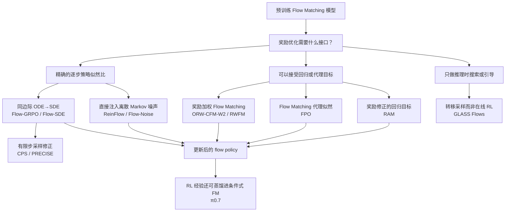

## 为什么有些 Flow Matching RL 必须随机化，而另一些不需要

这篇文章只回答一个问题：**一个已经训练好的 Flow Matching 模型，怎样接入奖励优化？**

最容易误解的结论是“Flow Matching 必须从 ODE 变成 SDE 才能做强化学习”。更准确的表述是：

> 如果把内部去噪步当作策略动作，并使用 PPO/GRPO 的逐步 likelihood ratio，那么确定性的 ODE 转移必须先被随机化；同边际 SDE 是最自然的一种构造。若改用奖励加权回归、Flow Matching 代理似然或 adjoint-matching 回归，则训练 rollout 不一定需要 SDE。

本文是[《流匹配的 RL（一）：统一理解 Diffusion 与 Flow Matching》](/posts/flow-matching-rl-from-unified-diffusion-and-flow-matching/)的续篇。第一篇已经推导随机插值、连续性方程、概率流 ODE、同边际 SDE 以及 velocity/score 转换；本文只保留这些结论的接口，重点放在相关论文究竟怎样把它们用于 RL。

---

## 1. 从第一篇接过来的最小数学接口

### 1.1 ODE 定义模型，SDE 重写路径

给定条件 $c$，预训练模型输出速度场 $u_\theta(t,x,c)$。本文采用 $t=0$ 为噪声、$t=1$ 为数据的方向：

$$
\frac{\mathrm dX_t}{\mathrm dt}
=u_\theta(t,X_t,c),
\qquad X_0\sim p_0.
\tag{1.1}
$$

记 ODE 的单时刻边际为 $\rho_\theta(t,x\mid c)$，score 为

$$
s_\theta(t,x,c)=\nabla_x\log\rho_\theta(t,x\mid c).
\tag{1.2}
$$

对任意 $\kappa(t)\ge0$，可以构造

$$
\boxed{
\mathrm dZ_t
=\bigl(u_\theta+\kappa s_\theta\bigr)(t,Z_t,c)\,\mathrm dt
+\sqrt{2\kappa(t)}\,\mathrm dW_t.
}
\tag{1.3}
$$

在相同初始分布、精确 score 和适当正则性条件下，

$$
\mathcal L(Z_t)=\mathcal L(X_t)=\rho_\theta(t),
\qquad 0\le t\le1.
\tag{1.4}
$$

这只表示 ODE 与 SDE 具有相同的**单时刻边际**，不表示它们具有相同轨迹、联合分布或条件转移。恰恰是这些路径级差异，为 RL 提供了探索和路径似然。

对 Rectified Flow 的线性路径

$$
x_t=(1-t)x_0+t x_1,
\qquad x_0\sim\mathcal N(0,I),
\tag{1.5}
$$

理想 velocity 与 score 之间满足

$$
\boxed{
s(t,x)=\frac{t\,u(t,x)-x}{1-t}.
}
\tag{1.6}
$$

因此，已有 velocity 模型通常可以提供式 (1.3) 所需的 score 补偿。端点附近的除法、模型误差以及相反时间方向会改变具体实现；完整推导见第一篇第 10、13、16 节。

### 1.2 三种时间不能混为一谈

| 记号 | 含义 |
|---|---|
| $t\in[0,1]$ | 连续的 Flow Matching 生成时间 |
| $k=0,\ldots,K$ | 数值求解器的内部去噪步 |
| $h=0,1,\ldots,H$ | 机器人与环境交互的外层决策时间 |

图像生成通常只有一条内部轨迹和一个终点奖励。机器人策略则在每个环境时刻 $h$ 内运行一条内部 flow，生成动作块，再进入下一个环境状态。因此，机器人论文中的“内部去噪 MDP”和“外层环境 MDP”不是同一个时间尺度。

### 1.3 奖励真正想改变什么

设预训练终点分布为 $p_{\mathrm{ref}}(x\mid c)$。KL 正则化的奖励目标为

$$
\max_p
\left\{
\mathbb E_{x\sim p}[R(x,c)]
-\beta D_{\mathrm{KL}}(p\|p_{\mathrm{ref}})
\right\}.
\tag{1.7}
$$

其最优分布是奖励倾斜分布

$$
\boxed{
p^*(x\mid c)
\propto
p_{\mathrm{ref}}(x\mid c)
\exp\!\left(\frac{R(x,c)}{\beta}\right).
}
\tag{1.8}
$$

所以 RL 后训练的目标不是给原轨迹简单加一个扰动，而是把终点概率质量移向高奖励区域。ODE→SDE 只是估计这种移动方向的一种策略接口。

---

## 2. 为什么逐步 PPO/GRPO 不能直接使用确定性 ODE

### 2.1 ODE 有样本随机性，但没有局部策略随机性

ODE 从随机初值 $X_0$ 出发，所以最终样本当然可以多样。然而一旦给定某个中间状态，Euler 离散转移是

$$
X_{k+1}=X_k+h_k u_\theta(t_k,X_k,c),
\tag{2.1}
$$

对应条件分布

$$
p_\theta(X_{k+1}\mid X_k,c)
=\delta\!\left(
X_{k+1}-X_k-h_k u_\theta(t_k,X_k,c)
\right).
\tag{2.2}
$$

这是 Dirac 测度，不是具有普通 Lebesgue 密度的 Gaussian 策略。PPO/GRPO 需要的新旧策略比值

$$
r_k(\theta)=
\frac{\pi_\theta(X_{k+1}\mid X_k,c)}
{\pi_{\theta_{\mathrm{old}}}(X_{k+1}\mid X_k,c)}
\tag{2.3}
$$

因而不能直接照搬到确定性内部步。

理论上可以通过 continuous normalizing flow 的散度积分计算终点密度：

$$
\log p_\theta(X_1)
=\log p_0(X_0)
-\int_0^1 \nabla_x\cdot u_\theta(t,X_t)\,\mathrm dt.
\tag{2.4}
$$

但高维散度估计、反复数值积分和少步离散误差，使它通常不适合作为大模型在线 PPO 的内循环。

### 2.2 随机 SDE 怎样产生策略密度

将式 (1.3) 用 Euler--Maruyama 离散：

$$
Z_{k+1}
=Z_k+h_k b_\theta(t_k,Z_k,c)
+\sqrt{2\kappa_k h_k}\,\epsilon_k,
\qquad
b_\theta=u_\theta+\kappa s_\theta,
\tag{2.5}
$$

其中 $\epsilon_k\sim\mathcal N(0,I)$。于是

$$
\boxed{
\pi_\theta(Z_{k+1}\mid Z_k,c)
=\mathcal N
\left(
Z_k+h_kb_\theta(t_k,Z_k,c),
2\kappa_kh_kI
\right).
}
\tag{2.6}
$$

若当前策略和参考策略使用相同协方差，一步 KL 还有闭式形式：

$$
D_{\mathrm{KL}}(\pi_\theta\|\pi_{\mathrm{ref}})
=\frac{\|\mu_\theta-\mu_{\mathrm{ref}}\|^2}
{4\kappa_kh_k}.
\tag{2.7}
$$

现在内部生成过程可以被视作 MDP：状态是 $(Z_k,t_k,c)$，动作是下一 latent $Z_{k+1}$，策略是式 (2.6)，奖励通常只在终点给出。

### 2.3 “必须变成 SDE”的适用范围

| 更新方式 | 是否需要 ODE→SDE | 原因 |
|---|---:|---|
| 基于内部步精确似然比的 PPO/GRPO | 通常需要随机化；同边际 SDE 是主要路线 | Dirac 转移无法提供普通密度和局部探索 |
| 离散 Markov 噪声策略 | 需要随机化，但不必来自同边际连续 SDE | 直接定义 Gaussian 转移即可 |
| 奖励加权 Flow Matching | 不需要 | 优化的是加权回归目标 |
| Flow Matching 代理似然 | 不需要 | 用 CFM/ELBO 损失差替代真实 likelihood ratio |
| 可微奖励穿过 ODE 反传 | 不需要 | 梯度来自 sampler 和 reward 的可微链路 |
| RAM 式奖励修正回归 | rollout 不需要 | 用终点采样和解析加噪构造训练状态 |

这张表是全文的核心。下面按论文说明每条路线究竟做了什么。

---

## 3. Flow-GRPO：把同边际 SDE 直接变成 GRPO 策略

### 3.1 论文与问题设定

[Jie Liu 等，*Flow-GRPO: Training Flow Matching Models via Online RL*，2025](https://arxiv.org/abs/2505.05470)研究文本到图像 Flow Matching 模型的在线 RL。论文面对两个直接问题：

1. 原模型使用确定性 ODE，无法为每个去噪步提供随机策略密度；
2. 在线 RL 要反复生成图像，完整去噪轨迹使数据采集昂贵。

它的两项核心设计正好对应这两个问题：**ODE-to-SDE** 提供随机转移，**Denoising Reduction** 降低 rollout 成本。

*图 3-1：Flow-GRPO 总体框架。模型用少步 SDE 采集成组轨迹，终点奖励经 GRPO 目标更新 velocity；图源为该论文 Figure 2。*

### 3.2 ODE-to-SDE：保持边际，改变路径

Flow-GRPO 使用反向时间 $t=1\to0$：$t=1$ 是 Gaussian noise，$t=0$ 是图像 latent。按论文记号，概率流 ODE 为

$$
\mathrm dX_t=v_\theta(X_t,t,c)\,\mathrm dt,
\tag{3.1}
$$

与其同边际的反向 SDE 写成

$$
\mathrm dX_t
=\left[
v_\theta(X_t,t,c)
-\frac{\sigma_t^2}{2}\nabla_x\log p_t(X_t\mid c)
\right]\mathrm dt
+\sigma_t\,\mathrm dW_t.
\tag{3.2}
$$

对 Rectified Flow，把 score 用 velocity 消去后得到论文实际使用的漂移：

$$
\boxed{
\mathrm dX_t
=\left[
v_\theta(X_t,t,c)
+\frac{\sigma_t^2}{2t}
\bigl(X_t+(1-t)v_\theta(X_t,t,c)\bigr)
\right]\mathrm dt
+\sigma_t\,\mathrm dW_t.
}
\tag{3.3}
$$

论文选择噪声日程

$$
\sigma_t=a\sqrt{\frac{t}{1-t}},
\tag{3.4}
$$

其中 $a$ 控制探索强度。采样沿反向时间进行，因此数值实现中的 $\Delta t<0$；噪声标准差使用 $\sigma_t\sqrt{|\Delta t|}$。Euler--Maruyama 一步是

$$
X_{t+\Delta t}
=\mu_\theta(X_t,t,c)
+\sigma_t\sqrt{|\Delta t|}\,\epsilon,
\qquad \epsilon\sim\mathcal N(0,I),
\tag{3.5}
$$

其中

$$
\mu_\theta
=X_t+\left[
v_\theta
+\frac{\sigma_t^2}{2t}
\bigl(X_t+(1-t)v_\theta\bigr)
\right]\Delta t.
\tag{3.6}
$$

于是内部策略不再是 Dirac 转移，而是

$$
\pi_\theta(X_{t+\Delta t}\mid X_t,c)
=\mathcal N
\left(
\mu_\theta,
\sigma_t^2|\Delta t|I
\right).
\tag{3.7}
$$

固定旧参数 $\theta_{\mathrm{old}}$ 时，理想连续时间 SDE 与原 ODE 共享每个时刻的边际。因此随机化的目的不是故意改变当前生成分布，而是为训练增加：

- 给定当前 latent 后的随机分支；
- Gaussian 条件转移概率；
- 新旧策略 likelihood ratio；
- 与参考模型的逐步 KL。

若参考策略使用相同协方差，一步 KL 为

$$
D_{\mathrm{KL}}(\pi_\theta\|\pi_{\mathrm{ref}})
=\frac{
\|\mu_\theta-\mu_{\mathrm{ref}}\|^2
}{2\sigma_t^2|\Delta t|}.
\tag{3.8}
$$

所以 velocity 的差异最终被转化成一个可微、闭式的局部 trust-region 惩罚。式 (3.2) 与式 (1.3) 表面的正负号不同，只是生成时间方向不同。

### 3.3 Group rollout 与 GRPO 目标

对同一个 prompt $c$，旧策略生成 $G$ 条随机轨迹，终点图像奖励记为 $R_i$。组内相对优势为

$$
\widehat A_i
=\frac{R_i-\operatorname{mean}(R_1,\ldots,R_G)}
{\operatorname{std}(R_1,\ldots,R_G)+\varepsilon}.
\tag{3.9}
$$

最简单的 credit assignment 是把同一个终点优势分给该轨迹的所有内部步。一步策略比值为

$$
r_{i,k}(\theta)
=\frac{
\pi_\theta(Z_{k+1}^i\mid Z_k^i,c)
}{
\pi_{\theta_{\mathrm{old}}}(Z_{k+1}^i\mid Z_k^i,c)
}.
\tag{3.10}
$$

核心 clipped objective 可写成

$$
\boxed{
\mathcal J_{\mathrm{Flow\text{-}GRPO}}
=\mathbb E
\left[
\frac1{GK}\sum_{i,k}
\min\!\left(
r_{i,k}\widehat A_i,
\operatorname{clip}(r_{i,k},1-\epsilon,1+\epsilon)\widehat A_i
\right)
-\beta\,\mathrm{KL}
\right].
}
\tag{3.11}
$$

组相对优势省去了 value model，逐步 Gaussian 密度则使 GRPO 的比值与 KL 可直接计算。

### 3.4 Denoising Reduction：训练少步，评估恢复完整步数

Flow-GRPO 的第二项贡献不是 SDE 理论，而是数据采集策略。论文在 SD3.5-M 上用 10 个 SDE 步采集训练轨迹，而推理仍使用原来的 40 步。少步训练图像可能带有伪影，但 GRPO 主要利用同组样本的相对排序，仍能获得有效信号；论文报告从 40 步降到 10 步可带来超过四倍的数据采集加速，而最终奖励基本不受影响。

这也说明训练 sampler 与部署 sampler 可以不同：训练需要随机性和密度，部署可以回到高质量的确定性 ODE。但二者的差距必须通过实验验证，不能由连续时间同边际结论自动保证。

### 3.5 论文结果与真正的限制

论文在 SD3.5-M 上报告：GenEval 从 63% 提升到 95%，视觉文字渲染准确率从 59% 提升到 92%，并在 PickScore 人类偏好任务上提升奖励；配合 KL 约束时，作者报告图像质量与多样性没有明显恶化。

Flow-GRPO 的限制也来自它的接口选择：

- 连续时间同边际不等于 5、10 步 Euler SDE 仍精确同边际；
- velocity-to-score 的近似误差会进入 SDE 漂移；
- 终点奖励被广播到所有去噪步，credit assignment 较粗；
- 内部 horizon 随去噪步数增长；
- 噪声太小缺乏探索，太大又会把 latent 推向模型不熟悉的区域。

因此 Flow-GRPO 证明的是“同边际 SDE 可以成为有效的逐步 GRPO 接口”，而不是“任意有限步 SDE sampler 都与原 ODE 等价”。

---

## 4. ReinFlow：直接把离散 flow 变成可学习的 Markov 策略

### 4.1 论文与 Flow-GRPO 的区别

[Tonghe Zhang 等，*ReinFlow: Fine-tuning Flow Matching Policy with Online Reinforcement Learning*，2025](https://arxiv.org/abs/2505.22094)面向连续机器人控制。它与 Flow-GRPO 共享一个判断：确定性内部转移不适合直接做 policy gradient。但 ReinFlow 不追求“连续时间与原 ODE 严格同边际”，而是直接为离散 flow 注入可学习噪声。

给定环境观测 $o_h$，第 $k$ 个内部步写成

$$
A_h^{k+1}
=A_h^k
+\Delta t_k v_\theta(t_k,A_h^k,o_h)
+\sigma_{\theta'}(t_k,A_h^k,o_h)\epsilon_k,
\quad
\epsilon_k\sim\mathcal N(0,I).
\tag{4.1}
$$

于是

$$
\pi_{\theta,\theta'}(A_h^{k+1}\mid A_h^k,o_h)
=\mathcal N
\left(
A_h^k+\Delta t_kv_\theta,
\sigma_{\theta'}^2 I
\right).
\tag{4.2}
$$

完整内部路径的联合 log probability 精确分解为

$$
\log\pi_{\theta,\theta'}(A_h^{0:K}\mid o_h)
=\log p_0(A_h^0)
+\sum_{k=0}^{K-1}
\log\pi_{\theta,\theta'}(A_h^{k+1}\mid A_h^k,o_h).
\tag{4.3}
$$

这里的“精确”是相对于**论文定义的离散 Gaussian Markov 策略**而言，不是说它精确保持原连续 ODE 的所有边际。

### 4.2 为什么路径概率可以更新最终机器人动作

机器人最终执行的是 $A_h^K$，而式 (4.3) 是含全部 latent 的联合概率。ReinFlow 给出 Markov-process policy gradient：对内部路径求 log probability 梯度，并乘以最终动作的 advantage，仍可得到外层策略目标的无偏 policy-gradient 表达。

其核心结构可概括为

$$
\nabla J
=\mathbb E
\left[
\sum_h\gamma^h
A^{\pi}(o_h,A_h^K)
\nabla\sum_{k=0}^{K-1}
\log\pi_{\theta,\theta'}(A_h^{k+1}\mid A_h^k,o_h)
\right].
\tag{4.4}
$$

实际实现不是对每个内部步分别 clip，而是先把内部 log probability 相加，形成环境时刻 $h$ 的路径比值：

$$
\rho_h(\theta,\theta')
=\exp\!\left[
\sum_{k=0}^{K-1}
\left(
\log\pi_{\theta,\theta'}(A_h^{k+1}\mid A_h^k,o_h)
-\log\pi_{\mathrm{old}}(A_h^{k+1}\mid A_h^k,o_h)
\right)
\right].
\tag{4.5}
$$

然后使用标准 PPO surrogate：

$$
\mathcal J_{\mathrm{ReinFlow}}
=\mathbb E_h
\left[
\min\!\left(
\rho_h\widehat A_h,
\operatorname{clip}(\rho_h,1-\epsilon,1+\epsilon)\widehat A_h
\right)
-\alpha\mathcal R_h
\right].
\tag{4.6}
$$

$\mathcal R_h$ 可以是 entropy、KL 或对噪声大小的正则。velocity 网络 $\theta$ 与噪声网络 $\theta'$ 联合更新；噪声网络根据当前 latent、时间和观测动态调节探索强度。训练结束后，论文丢弃噪声网络，恢复确定性的 flow policy 部署。

一轮 ReinFlow 的计算顺序是：用旧参数与噪声网络在环境中 rollout，保存所有内部 latent；用 GAE 或 critic 计算最终动作 advantage；再用保存的内部路径重算式 (4.3) 和式 (4.5)，进行多轮 PPO 更新。这里没有把每个内部 latent 当成真正的环境动作，环境只看到 $A_h^K$。

### 4.3 为什么 ReinFlow 特别适合少步机器人策略

ReinFlow 直接定义有限步转移，不依赖连续时间 SDE 再做粗离散，因此即便只有 1 或 4 个去噪步，式 (4.2) 的策略密度仍是定义上精确的。这使它能同时微调 Rectified Flow 和 Shortcut Model。

论文报告，在腿式运动任务中，Rectified Flow policy 的 episode reward 平均净增长 135.36%，相较 DPPO 节省 82.63% wall time；在状态和视觉操作任务中，Shortcut Model policy 的成功率平均净增长 40.34%，并能在 4 步甚至 1 步下训练。

代价是随机化后的训练策略不再自动继承原 ODE 的连续时间边际保证；性能依赖噪声网络、正则化和离散步数。换句话说，ReinFlow 用“有限步策略定义清楚”换取了“连续同边际解释较弱”。

---

## 5. πRL：在 VLA 中比较 Flow-Noise 与 Flow-SDE

### 5.1 论文定位

[Kang Chen 等，*$\pi_{\mathrm{RL}}$: Online RL Fine-tuning for Flow-based Vision-Language-Action Models*，2025](https://arxiv.org/abs/2510.25889)把前两条路线放进 $\pi_0$、$\pi_{0.5}$ 等 flow-based VLA：

- **Flow-Noise** 继承 ReinFlow 思路，直接构造离散、可学习噪声的内部 Markov 过程；
- **Flow-SDE** 继承 Flow-GRPO 思路，用 ODE-to-SDE 保持理想连续时间边际，并把内部去噪与外部环境组成两层 MDP。

这篇论文的重要性不只是“又做了一次 PPO”，而是清楚展示了图像生成中单条内部 MDP，如何扩展为机器人控制中的两种时间尺度。

*图 5-1：$\pi_{\mathrm{RL}}$ 的两种噪声注入方式。Flow-Noise 学习离散方差，Flow-SDE 使用由 velocity/score 确定的同边际漂移；图源为该论文 Figure 2。*

### 5.2 Flow-Noise：一层环境 MDP加内部路径似然

在一个环境时刻内，用 $\tau_k=k/K$ 表示内部生成时间，$\delta=1/K$。Flow-Noise 定义

$$
\begin{aligned}
\mu_{h,k}
&=A_h^{\tau_k}
+\delta\,v_\theta(A_h^{\tau_k},\tau_k,o_h),\\
\Sigma_{h,k}
&=\operatorname{diag}
\left(
\sigma_{\theta'}^2(A_h^{\tau_k},\tau_k,o_h)
\right),\\
A_h^{\tau_{k+1}}
&\sim\mathcal N(\mu_{h,k},\Sigma_{h,k}).
\end{aligned}
\tag{5.1}
$$

噪声网络输出逐维标准差，并与 velocity 网络联合训练。整个动作生成路径 $\mathcal A_h=(A_h^{\tau_0},\ldots,A_h^{\tau_K})$ 的 log likelihood 为

$$
\log\pi_{\theta,\theta'}(\mathcal A_h\mid o_h)
=\log p_0(A_h^{\tau_0})
+\sum_{k=0}^{K-1}
\log\mathcal N
\left(
A_h^{\tau_{k+1}};\mu_{h,k},\Sigma_{h,k}
\right).
\tag{5.2}
$$

外层 PPO 仍把环境时刻 $h$ 当作一个 step，但策略 ratio 使用式 (5.2) 的整条内部路径 likelihood。它的 horizon 不显式扩张为 $HK$，不过每次重算 likelihood 仍需重放完整去噪轨迹。

它和 ReinFlow 一样，得到的是论文所定义离散策略的精确 log probability；是否保持原 ODE 边际不是该分支的目标。

### 5.3 Flow-SDE：显式两层 MDP

Flow-SDE 不学习独立方差网络，而是沿用 Flow-GRPO 的同边际构造。按论文的 $\tau=0$ 噪声、$\tau=1$ 动作方向，SDE 为

$$
\mathrm dA^\tau
=\left[
v_\theta(A^\tau,\tau,o)
+\frac{\sigma_\tau^2}{2\tau}
\left(
A^\tau+(1-\tau)v_\theta(A^\tau,\tau,o)
\right)
\right]\mathrm d\tau
+\sigma_\tau\,\mathrm dW_\tau.
\tag{5.3}
$$

离散一步仍是 Gaussian：

$$
\begin{aligned}
\mu_\tau
&=A^\tau
+\delta\left[
v_\theta
+\frac{\sigma_\tau^2}{2\tau}
\bigl(A^\tau+(1-\tau)v_\theta\bigr)
\right],\\
\Sigma_\tau
&=\sigma_\tau^2\delta I,
\qquad
A^{\tau+\delta}\sim\mathcal N(\mu_\tau,\Sigma_\tau).
\end{aligned}
\tag{5.4}
$$

Flow-SDE 将内部状态写成

$$
\bar s_h^k=(o_h,A_h^k),
\qquad
\bar a_h^k=A_h^{k+1}.
\tag{5.5}
$$

当 $k<K$ 时，观测 $o_h$ 不变，只推进内部 latent；当 $k=K$ 时，最终动作块 $A_h^K$ 进入环境，得到奖励并转移到 $o_{h+1}$。内部步奖励为零，外层交互后才获得环境奖励。

这样，最终动作难算的 marginal likelihood 被替换为每个 Gaussian 内部转移的 likelihood。代价是有效 horizon 从 $H$ 扩张到约 $HK$，critic 和 credit assignment 都更难。

两种分支最后都进入 PPO，但 ratio 的粒度不同：

$$
\rho_h^{\mathrm{Flow\text{-}Noise}}
=\frac{
\pi_{\theta_{\mathrm{new}},\theta'_{\mathrm{new}}}
(\mathcal A_h\mid o_h)
}{
\pi_{\theta_{\mathrm{old}},\theta'_{\mathrm{old}}}
(\mathcal A_h\mid o_h)
},
\qquad
\rho_{h,k}^{\mathrm{Flow\text{-}SDE}}
=\frac{
\pi_{\theta_{\mathrm{new}}}(A_h^{k+1}\mid A_h^k,o_h)
}{
\pi_{\theta_{\mathrm{old}}}(A_h^{k+1}\mid A_h^k,o_h)
}.
\tag{5.6}
$$

Flow-Noise 用环境 step 的 advantage 乘整条内部路径比值；标准 Flow-SDE 则把同一个外层 advantage 传播到相应内部随机步。

### 5.4 Hybrid ODE--SDE：只随机化一个内部位置

为缩短 horizon，$\pi_{\mathrm{RL}}$ 还提出 hybrid rollout：每个环境时刻随机选择一个去噪位置 $\tau_h$ 做 SDE 策略动作，其余位置用确定性 ODE 完成。若 $\Phi^{\mathrm{ODE}}_{a\to b}$ 表示从 $a$ 积分到 $b$ 的 ODE flow map，则一次环境动作可以写成

$$
\begin{aligned}
A_h^{\tau_h}
&=\Phi^{\mathrm{ODE}}_{0\to\tau_h}(A_h^0),\\
A_h^{\tau_h+\delta}
&\sim\pi_\theta(\cdot\mid A_h^{\tau_h},o_h),\\
A_h^1
&=\Phi^{\mathrm{ODE}}_{\tau_h+\delta\to1}
(A_h^{\tau_h+\delta}).
\end{aligned}
\tag{5.7}
$$

PPO ratio 只来自中间那一个 Gaussian 决策。这样保留一个可计算的随机策略动作，同时避免把所有内部步都暴露给外层 PPO。论文报告 hybrid 两层形式相对标准两层形式约有两倍加速。

实验中，论文在 LIBERO、ManiSkill、MetaWorld 和 CALVIN 上微调 $\pi_0$ 与 $\pi_{0.5}$。例如 few-shot $\pi_0$ 的平均成功率从 51.1 提升到 Flow-SDE 的 78.7 和 Flow-Noise 的 80.3；few-shot $\pi_{0.5}$ 从 55.6 提升到 86.6 和 84.7。论文也报告长程和 OOD 设置上的改善。

这些结果同时提醒我们：训练时噪声增大会降低随机 rollout 的即时成功率，但部署时可以使用更新后的确定性 ODE。评估必须分别报告 stochastic train policy 与 deterministic evaluation policy。

### 5.5 三个逐步 likelihood 方法的对照

| 方法与论文 | 随机化方式 | 优化单位 | 连续时间同边际 | 主要适用场景 |
|---|---|---|---:|---|
| Flow-GRPO | score 补偿的 SDE | 每个去噪步的 GRPO ratio | 理想条件下是 | 图像生成、终点奖励 |
| ReinFlow | 可学习离散 Gaussian 噪声 | 内部路径联合 likelihood 的 PPO | 不要求 | 少步机器人 flow policy |
| $\pi_{\mathrm{RL}}$/Flow-Noise | 可学习离散噪声 | 外层环境 step + 内部联合 likelihood | 不要求 | 大型 flow-based VLA |
| $\pi_{\mathrm{RL}}$/Flow-SDE | 同边际 SDE | 内外两层 MDP | 理想条件下是 | 需要显式探索结构的 VLA |

---

## 6. 从“连续时间正确”到“有限步可用”：CPS 与 PRECISE

ODE-to-SDE 在 Fokker--Planck 层面成立，并不代表 Euler--Maruyama 用 5 或 10 步就能忠实保持边际。后续论文因此把重点从“是否应该加噪声”推进到“怎样离散随机过程”。

> **时间方向。** 为与 CPS 和 PRECISE 原论文的公式一致，本节暂时使用 $t=1$ 为噪声、$t=0$ 为数据，并沿 $t' < t$ 的方向去噪。这只是式 (1.1) 时间方向的反转。

### 6.1 CPS：保持插值系数

[Feng Wang、Zihao Yu，*Coefficients-Preserving Sampling for Reinforcement Learning with Flow Matching*，2025](https://arxiv.org/abs/2509.05952)指出，Flow-GRPO 的 Euler SDE 在有限步下可能出现总噪声系数大于 scheduler 目标的问题。CPS 借鉴 DDIM，把下一状态写成预测 clean latent、预测 noise 和新噪声的组合，并约束噪声系数的平方和匹配目标时间：

$$
Z_{t'}^{\mathrm{CPS}}
=(1-t')\widehat Z_0(t)
+k_1\widehat\epsilon(t)
+k_2 w,
\qquad
k_1^2+k_2^2=t'^2.
\tag{6.1}
$$

它避免 Euler 直接叠加过量噪声，并仍给出 Gaussian 随机转移。但“系数正确”只是必要条件，不足以保证一般数据分布下的完整边际正确。

### 6.2 PRECISE：冻结 posterior mean 后求局部 SDE 闭式解

[Jade Zou 等，*PRECISE: SDE-Consistent Stochastic Sampling for RL Post-Training of Flow-Matching Models*，2026](https://arxiv.org/abs/2605.23522)进一步分析：

- Euler 在一步内冻结 velocity 和 score，无法响应刚注入的新噪声，因而会产生 excess discretization noise；
- CPS 使用 posterior mean 代替仍有不确定性的 clean latent，可能收缩残余协方差，造成 marginal bias。

PRECISE 的做法是：在单个有限步内近似冻结 clean-latent posterior mean $\widehat Z_0(t)$，但保留 SDE 规定的残余随机方差。对 $t'<t$，其转移写成

$$
\boxed{
Z_{t'}
=(1-t')\widehat Z_0(t)
+t'\rho(t',t)\widehat\epsilon(t)
+t'\sqrt{1-\rho(t',t)^2}\,w,
}
\tag{6.2}
$$

其中 $w\sim\mathcal N(0,I)$，$\rho(t',t)$ 由探索噪声日程的积分确定。该式是在“单步内 posterior mean 近似不变”的假设下，对局部线性 SDE 的闭式 Gaussian 转移。

对论文使用的探索日程 $\varepsilon_t=\eta\sqrt{t/(1-t)}$，相关系数具有显式形式

$$
\rho(t',t)
=\left[
\frac{t'(1-t)}{t(1-t')}
\right]^{\eta^2/2}.
\tag{6.3}
$$

$\eta=0$ 时 $\rho=1$，式 (6.2) 退化为确定性更新；$\eta$ 增大时，旧 noise prediction 的占比下降，新随机噪声的占比上升。PRECISE 因而不是额外训练一个网络，而是替换 Flow-GRPO rollout 中的有限步 transition rule；式 (6.2) 本身仍是可计算 likelihood 的 Gaussian 策略。

因此这三者的关系不是简单的版本替换：

| Sampler | 局部假设 | 优点 | 主要风险 |
|---|---|---|---|
| Euler SDE | 步首冻结 drift/score | 简单，直接对应 SDE | 少步时注入过量离散噪声 |
| CPS | 强制插值系数匹配 | 控制总噪声水平 | posterior mean 可能丢失残余不确定性 |
| PRECISE | 单步冻结 clean posterior mean | 保留 SDE 残余方差并有闭式转移 | 依赖局部稳定近似 |

这组工作给 Flow Matching RL 一个重要结论：**sampler 是策略定义的一部分，不是可以随意替换的数值细节。**

### 6.3 GLASS Flows 的边界意义

[Peter Holderrieth 等，*GLASS Flows: Transition Sampling for Alignment of Flow and Diffusion Models*，2025/ICLR 2026](https://arxiv.org/abs/2509.25170)不是在线 RL 微调算法，而是推理时 transition sampler。它从预训练模型构造一个“内层 flow”，用随机初值加确定性 ODE 来采样 $p_{t'|t}(x_{t'}\mid x_t)$，服务于 SMC、树搜索和 Feynman--Kac steering。

*图 6-1：GLASS 用随机内层初值和确定性内层 ODE 采样条件转移；图源为该论文 Figure 1。*

具体地，若预训练 Gaussian probability path 为

$$
X_t\mid z\sim\mathcal N(\alpha_tz,\sigma_t^2I),
\tag{6.4}
$$

GLASS 用相关系数 $\rho$ 定义 $(X_t,X_{t'})$ 在给定 $z$ 下的联合 Gaussian：

$$
\mu=
\begin{bmatrix}\alpha_t\\\alpha_{t'}\end{bmatrix},
\qquad
\Sigma=
\begin{bmatrix}
\sigma_t^2 & \rho\sigma_t\sigma_{t'}\\
\rho\sigma_t\sigma_{t'} & \sigma_{t'}^2
\end{bmatrix}.
\tag{6.5}
$$

这个联合分布定义目标 transition

$$
p_{t'|t}(x_{t'}\mid x_t)
=\frac{p_{t,t'}(x_t,x_{t'})}{p_t(x_t)}.
\tag{6.6}
$$

关键是把两个相关 Gaussian measurement 压缩成关于 clean latent $z$ 的充分统计量

$$
S(x_t,x_{t'})
=\frac{
\mu^\top\Sigma^{-1}
\begin{bmatrix}x_t\\x_{t'}\end{bmatrix}
}{
\mu^\top\Sigma^{-1}\mu
}.
\tag{6.7}
$$

令 $g(t)=\sigma_t^2/\alpha_t^2$，并选择等效时间

$$
t^*=g^{-1}\!\left((\mu^\top\Sigma^{-1}\mu)^{-1}\right),
\qquad
D_{\mu,\Sigma}(x_t,x_{t'})
=D_{t^*}\!\left(\alpha_{t^*}S(x_t,x_{t'})\right).
\tag{6.8}
$$

式 (6.8) 表示 GLASS 的双观测 denoiser 可以直接通过预训练单观测 denoiser $D_t$ 重参数化得到，无需再训练。再把 $D_{\mu,\Sigma}$ 转换成内层 velocity $u_s(\bar x_s\mid x_t,t)$，从随机 $\bar X_0$ 积分确定性 ODE 到 $s=1$，就得到 $X_{t'}$ 的随机样本。随机性来自内层初值，而不是沿积分路径持续注入 Brownian noise。

它的边界意义是：RL 或搜索真正需要的通常是**随机 Markov 转移**，而不是某种特定数值形式的 SDE。只要能正确、有效地采样条件转移，内层 ODE 同样可能提供随机分支。不过 GLASS 不直接解决训练中新旧策略 likelihood ratio，因此不能把它当作 Flow-GRPO 的即插即用替代。

---

## 7. 不做 ODE-to-SDE 的奖励优化路线

### 7.1 奖励加权 Flow Matching：直接改变回归数据分布

[Jiajun Fan 等，*Online Reward-Weighted Fine-Tuning of Flow Matching with Wasserstein Regularization*，2025](https://arxiv.org/abs/2502.06061)不计算逐步策略 likelihood，而是从当前模型在线采样终点，用奖励构造权重，再训练加权 conditional Flow Matching：

$$
\mathcal L_{\mathrm{RWFM}}(\theta)
=\mathbb E
\left[
w(x_1,c)
\|u_\theta(t,x_t,c)-Y_t\|^2
\right].
\tag{7.1}
$$

论文使用指数权重

$$
w(x_1,c)=\exp\bigl(\tau R(x_1,c)\bigr).
\tag{7.2}
$$

所以一次理想加权更新得到 $q_{\mathrm{new}}(x_1)\propto w(x_1)q(x_1)$，与式 (1.8) 的奖励倾斜方向一致。但在线重复 $N$ 轮后会出现 $w(x_1)^N$；没有约束时，分布会趋向 $\arg\max R$ 附近的 Dirac 测度。

ORW-CFM-W2 因而使用 velocity 差构造终点 Wasserstein-2 距离的可计算上界：

$$
W_2^2(p_1^\theta,p_1^{\mathrm{ref}})
\le
e^{2L}
\int_0^1
\mathbb E_{x\sim p_t^\theta}
\left[
\|v_\theta(t,x)-v_{\mathrm{ref}}(t,x)\|^2
\right]\mathrm dt,
\tag{7.3}
$$

其中 $L$ 是参考 velocity 的 Lipschitz 常数。去掉与优化无关的常数后，论文的实际目标可概括为

$$
\boxed{
\mathcal L_{\mathrm{ORW\text{-}CFM\text{-}W2}}
=\mathbb E
\left[
w(x_1,c)\|v_\theta-u(\cdot\mid x_1,c)\|^2
+\alpha\|v_\theta-v_{\mathrm{ref}}\|^2
\right].
}
\tag{7.4}
$$

在论文的理想分析中，第 $N$ 轮后的分布满足

$$
q_\theta^N(x_1)
\propto
q(x_1)
\exp\!\left[
\tau N R(x_1)
-\beta\sum_{n=1}^N D^{n-1}(x_1)
\right],
\tag{7.5}
$$

其中 $D^{n-1}(x_1)$ 是第 $n-1$ 轮 velocity 与参考 velocity 的条件平方差。第一项把质量推向高奖励区域，第二项惩罚偏离参考 flow；$\tau$ 和 $\alpha$ 分别控制 reward greediness 与 diversity preservation。

这一路线的优势是完全复用预训练式回归，不需要路径 likelihood；缺点是它更接近 reward-weighted regression 或 cross-entropy method，缺少 PPO 那样明确的新旧策略 trust region，权重退化时容易被少数高奖励样本主导。

[Samuel Pfrommer 等，*Reinforcement Learning for Flow-Matching Policies*，2025](https://arxiv.org/abs/2507.15073)把类似思想用于机器人 flow policy，并提出两类方法：

1. **RWFM**：通过 action-trajectory explorer 产生优于示范的新动作块，再按回报加权 Flow Matching 回归；
2. **带 learned reward surrogate 的 GRPO**：学习动作轨迹的 reward surrogate，用组相对优势加权 Flow Matching 损失，而不依赖 ODE 内部步的真实策略比值。

对于第二种方法，同一观测 $\tilde o$ 下采样 $G$ 个动作块，reward surrogate 给出 $r_i=R_\phi(\tilde o,A_i)$，优势为

$$
a_i
=\frac{r_i-\operatorname{mean}(r_1,\ldots,r_G)}
{\operatorname{std}(r_1,\ldots,r_G)+\varepsilon}.
\tag{7.6}
$$

这里没有 PPO ratio；优势先指数化为正权重，再乘在 Flow Matching regression 上：

$$
\mathcal L_{\mathrm{GRPO\text{-}FM}}
=\mathbb E
\left[
\frac1G\sum_{i=1}^G
\exp(\alpha a_i)
\left\|
v_\theta((A_i')^\tau,\tilde o,\tau)
-u((A_i')^\tau\mid A_i')
\right\|^2
\right].
\tag{7.7}
$$

$A_i'$ 是 action-trajectory explorer 对 $A_i$ 加入平滑 bump 后的候选轨迹。reward surrogate 通过真实 rollout 数据回归：

$$
\mathcal L_R(\phi)
=\mathbb E_{(\tilde o,A,O)\sim\mathcal D}
\left[
\|R_\phi(\tilde o,A)-R(\tilde o,A,O)\|^2
\right].
\tag{7.8}
$$

训练在“优化 policy”和“收集新 rollout、修正 reward surrogate”之间交替，避免策略长期利用 surrogate 的 OOD 误差。论文还把动作 chunk 的时间长度纳入生成变量，用于 minimum-time control。它说明“GRPO”这个名字不一定意味着必须有逐步 Gaussian likelihood；关键要看优势究竟乘在真实 log probability 上，还是转化为 Flow Matching 的样本权重。

### 7.2 FPO：用 CFM/ELBO 损失差代理策略比值

[David McAllister 等，*Flow Matching Policy Gradients*，2025](https://arxiv.org/abs/2507.21053)提出 Flow Policy Optimization（FPO）。它从加权 denoising/Flow Matching 损失与 ELBO 的关系出发，用损失差构造 PPO 风格比值：

$$
\boxed{
\widehat r_\theta^{\mathrm{FPO}}
=\exp\!\left(
\widehat{\mathcal L}_{\theta_{\mathrm{old}}}^{\mathrm{FM}}
-\widehat{\mathcal L}_{\theta}^{\mathrm{FM}}
\right).
}
\tag{7.9}
$$

再将 $\widehat r_\theta^{\mathrm{FPO}}$ 代入 PPO-clip：

$$
\mathcal J_{\mathrm{FPO}}
=\mathbb E
\left[
\min\!\left(
\widehat r_\theta^{\mathrm{FPO}}\widehat A,
\operatorname{clip}(\widehat r_\theta^{\mathrm{FPO}},1-\epsilon,1+\epsilon)\widehat A
\right)
\right].
\tag{7.10}
$$

FPO 的 rollout 可以使用 ODE、SDE、高阶 solver 或不同采样步数，因为 policy update 不再绑定某个内部 Gaussian 去噪 MDP。它直接在外层环境的 state-action pair 上计算 advantage，避免把 horizon 乘以去噪步数。

实际计算时，对每个环境 action $a_h$ 固定保存 $N_{\mathrm{mc}}$ 组时间—噪声样本 $(\tau_j,\epsilon_j)$，并在所有 PPO epoch 中复用：

$$
\widehat r_\theta^{\mathrm{FPO}}
=\exp\!\left[
-\frac1{N_{\mathrm{mc}}}
\sum_{j=1}^{N_{\mathrm{mc}}}
\left(
\ell_\theta(\tau_j,\epsilon_j)
-\ell_{\theta_{\mathrm{old}}}(\tau_j,\epsilon_j)
\right)
\right].
\tag{7.11}
$$

保存同一组 $(\tau_j,\epsilon_j)$ 很重要，否则新旧损失差会混入额外 Monte Carlo 噪声。代价是式 (7.9) 是 ELBO/CFM 代理比，不是真实终点 likelihood ratio；当 $N_{\mathrm{mc}}=1$ 时，由 Jensen 不等式

$$
\mathbb E_{\tau,\epsilon}
\left[
\exp(\ell_{\mathrm{old}}-\ell_\theta)
\right]
\ge
\exp\!\left(
\mathbb E[\ell_{\mathrm{old}}-\ell_\theta]
\right),
\tag{7.12}
$$

比值估计存在向上偏差。FPO 的判断是：接受这个可控代理误差，可以换来 sampler 无关和实现简洁。

### 7.3 RAM：用终点奖励修正预训练回归目标

[Andreas Bergmeister 等，*Reinforce Adjoint Matching: Scaling RL Post-Training of Diffusion and Flow-Matching Models*，2026](https://arxiv.org/abs/2605.10759)提出 Reinforce Adjoint Matching（RAM）。它仍处理黑盒奖励，但不使用 SDE rollout、reward gradient 或沿轨迹的 backward adjoint sweep。

为贴合 RAM 原论文，本小节记 $X_0$ 为 clean endpoint、$X_1$ 为 Gaussian noise，这与本文前半部分的全局时间方向相反。

RAM 从 KL 正则化随机最优控制得到一个结构结论：最优过程改变的是 clean endpoint 的分布，而给定 clean endpoint 后的解析加噪规律保持不变。于是训练可以写成：

1. 用当前模型的任意 sampler（可为 ODE）生成终点 $X_0$；
2. 计算一次黑盒奖励 $R(X_0)$；
3. 像预训练一样解析构造 $X_t=(1-t)X_0+t\epsilon$；
4. 用 Bayes bridge score 和 REINFORCE 恒等式，把奖励变成 velocity 的修正回归目标；
5. 一个终点复用多个独立噪声 $\epsilon$，摊薄采样与奖励成本。

*图 7-1：RAM 从当前模型采样 clean endpoint，查询一次奖励，再为同一终点解析生成多个独立 noisy state；图源为该论文 Figure 1。*

对线性 noising kernel，RAM 使用的 backward bridge score 可由当前 velocity 写成

$$
\nabla_{x_t}\log p_{0|t}(x_0\mid x_t)
=\frac{1-t}{t}
\left(v_t(x_t)-(\epsilon-x_0)\right).
\tag{7.13}
$$

这里的 bridge score 不是额外训练的 score network。在线性插值下，条件 score 可以直接由当前 velocity 与单样本的 Flow Matching target $\epsilon-X_0$ 之差恢复。RAM 再把随机控制中的 score correction 写成 velocity correction：

$$
\sigma_t u_t
\mathrel{=}
2\bigl(v_t^\theta-v_t^{\mathrm{ref}}\bigr),
\tag{7.14}
$$

其中 $u_t$ 是相对参考过程的控制量，$\sigma_t$ 是相应随机过程的扩散系数，$v_t^{\mathrm{ref}}$ 是预训练模型的参考 velocity。这个关系解释了为什么 RAM 虽由随机最优控制推导，却可以把最终算法重新写成普通的 velocity regression，而不必真的用 SDE rollout。

把 REINFORCE 权重、bridge score 与式 (7.14) 合并后，论文给出的主训练目标为

$$
\boxed{
\begin{aligned}
\mathcal L_{\mathrm{RAM}}(\theta)
\mathrel{=}
\mathbb E_t
\Bigl[
\bigl\|
v_t^\theta(X_t)
\mathbin{-}
\operatorname{sg}\bigl(
&v_t^{\mathrm{ref}}(X_t)\\
&+R(X_0)
\bigl((\epsilon-X_0)-v_t^\theta(X_t)\bigr)
\bigr)
\bigr\|^2
\Bigr].
\end{aligned}
}
\tag{7.15}
$$

其中 $X_0\sim p_0^\theta$，$X_t=(1-t)X_0+t\epsilon$，$\epsilon\sim\mathcal N(0,I)$，$\operatorname{sg}$ 表示 stop-gradient。这个目标可以拆成三层含义：

- $v_t^{\mathrm{ref}}(X_t)$ 是锚点，阻止策略无约束偏离预训练生成分布；
- $(\epsilon-X_0)-v_t^\theta(X_t)$ 是当前模型相对单样本 Flow Matching target 的残差；
- $R(X_0)$ 决定残差修正的方向和幅度，因此高奖励终点会更强地把 velocity 拉向能够重现该终点的方向。

实现时，模型先完整生成 $X_0$ 并获得一次奖励，再为同一个 $X_0$ 重采样若干 $(t,\epsilon)$ 来估计式 (7.15)。因此 RAM 的计算图不穿过生成 sampler，也不需要奖励可微；ODE、SDE 或高阶求解器都只负责产生训练终点。

RAM 主算法为了图像尺度的可扩展性，丢弃了 adjoint 分解中的 path-cost correction；因此它不是完全无近似。论文说明该近似在初始化处成立，并与 KL 最优分布共享固定点结构。论文在 SD3.5-M 的 composability、OCR 和 PickScore 上报告，以最多约 50 倍更少的训练 step 达到 Flow-GRPO 的峰值奖励。

### 7.4 四条训练路线怎样选择

| 论文/方法 | 使用的“策略信号” | Rollout | 主要优点 | 核心近似或风险 |
|---|---|---|---|---|
| Flow-GRPO | 内部 Gaussian transition ratio | SDE | PPO/GRPO 解释直接 | 有限步 sampler bias、长内部 horizon |
| Reward-Weighted FM | 奖励权重乘 FM 回归 | ODE 或任意 sampler | 最接近预训练，简单 | 权重退化、模式坍缩、trust region 较弱 |
| FPO | CFM/ELBO 损失差代理 ratio | 任意 sampler | sampler 无关、外层 horizon 不膨胀 | 代理比与 Monte Carlo 偏差 |
| RAM | 奖励修正的 adjoint-matching 回归 target | ODE 或任意 sampler | 无 SDE rollout、无 reward gradient，可复用终点 | 主版本忽略 path-cost correction |

---

## 8. π0.7：RL 经验也可以被蒸馏进条件式 Flow Matching

[Physical Intelligence，*$\pi_{0.7}$: a Steerable Generalist Robotic Foundation Model with Emergent Capabilities*，2026](https://arxiv.org/abs/2604.15483)需要与前面的在线 RL 算法严格区分：**$\pi_{0.7}$ 本身不是一种 ODE-to-SDE 或 PPO 算法。**

它的 action expert 仍使用 Flow Matching 预测动作，但训练上下文包含更丰富的 episode metadata，例如：

- episode 总速度或长度；
- 1–5 的整体质量标签；
- 当前片段是否包含 mistake；
- subtask instruction、subgoal image 和 control mode。

训练数据不仅包括高质量示范，还包括失败轨迹、低质量轨迹、旧模型评估数据，以及 $\pi_{0.6}^*$ 等 RL specialist 在训练或评估中产生的 autonomous rollout。metadata 告诉模型“这条轨迹质量如何”，避免把所有行为无差别模仿。推理时再提示高质量、无错误和期望速度，从条件分布中选择高质量行为。

从本文视角看，$\pi_{0.7}$ 展示的是奖励信息的另一种去向：

$$
\boxed{
\text{RL specialist rollout}
\longrightarrow
\text{带质量标签的数据}
\longrightarrow
\text{条件式 Flow Matching 蒸馏}
\longrightarrow
\text{可提示的通用策略}.
}
\tag{8.1}
$$

论文报告，移除 evaluation data 或移除 episode metadata 都会降低 out-of-the-box 表现；完整模型在部分灵巧任务上可匹配甚至超过单任务 RL specialist。这里的关键不是计算 flow likelihood，而是把“成功、失败、速度、错误”等 RL 经验显式编码进条件变量和训练分布。

---

## 9. 最终逻辑：先决定优化接口，再决定是否从 ODE 到 SDE

面对一个 Flow Matching 奖励优化问题，可以按以下顺序判断。

### 9.1 是否必须使用逐步 likelihood-ratio policy gradient

如果答案是“是”，就需要把确定性的内部过程变成随机 Markov 策略：

- 希望保留连续时间边际解释：选择 Flow-GRPO/Flow-SDE，并认真设计有限步 sampler；
- 更重视少步离散策略的精确 likelihood：选择 ReinFlow/Flow-Noise 式直接噪声注入；
- 机器人还有外层环境时间：明确采用一层联合 likelihood、两层 MDP，还是 hybrid ODE--SDE。

### 9.2 是否可以接受代理目标

如果不要求精确内部 transition ratio，则可以避开 SDE rollout：

- 奖励天然适合样本重加权：Reward-Weighted Flow Matching；
- 希望保留 PPO clip，但接受 ELBO 代理：FPO；
- 希望保持预训练式回归并使用黑盒奖励：RAM；
- 只需要吸收已有 RL 经验：像 $\pi_{0.7}$ 一样做带质量条件的蒸馏。

### 9.3 无论选择哪条路线，都必须单独验证的四件事

1. **分布忠实性**：随机训练 sampler 与部署 ODE 的终点差异有多大；
2. **探索质量**：噪声是否产生有意义的新行为，而不是分布外破坏；
3. **目标忠实性**：真实 likelihood、ELBO 代理或奖励权重究竟优化了什么；
4. **奖励泛化**：reward 上升是否伴随质量、多样性、安全性或 OOD 性能下降。

最终可以把全文压缩成一句话：

> **ODE-to-SDE 不是 Flow Matching 使用奖励学习的普遍前提；它是把确定性生成路径改写成“可探索、可计算逐步 likelihood”的 PPO/GRPO 策略接口。**

---

## 参考文献

1. Yaron Lipman et al. [Flow Matching for Generative Modeling](https://arxiv.org/abs/2210.02747). ICLR 2023.
2. Xingchao Liu, Chengyue Gong, Qiang Liu. [Flow Straight and Fast: Learning to Generate and Transfer Data with Rectified Flow](https://arxiv.org/abs/2209.03003). 2022.
3. Yang Song et al. [Score-Based Generative Modeling through Stochastic Differential Equations](https://arxiv.org/abs/2011.13456). ICLR 2021.
4. Jie Liu et al. [Flow-GRPO: Training Flow Matching Models via Online RL](https://arxiv.org/abs/2505.05470). 2025.
5. Tonghe Zhang et al. [ReinFlow: Fine-tuning Flow Matching Policy with Online Reinforcement Learning](https://arxiv.org/abs/2505.22094). 2025.
6. Kang Chen et al. [$\pi_{\mathrm{RL}}$: Online RL Fine-tuning for Flow-based Vision-Language-Action Models](https://arxiv.org/abs/2510.25889). 2025.
7. Feng Wang, Zihao Yu. [Coefficients-Preserving Sampling for Reinforcement Learning with Flow Matching](https://arxiv.org/abs/2509.05952). 2025.
8. Jade Zou et al. [PRECISE: SDE-Consistent Stochastic Sampling for RL Post-Training of Flow-Matching Models](https://arxiv.org/abs/2605.23522). 2026.
9. Peter Holderrieth et al. [GLASS Flows: Transition Sampling for Alignment of Flow and Diffusion Models](https://arxiv.org/abs/2509.25170). ICLR 2026.
10. Jiajun Fan et al. [Online Reward-Weighted Fine-Tuning of Flow Matching with Wasserstein Regularization](https://arxiv.org/abs/2502.06061). ICLR 2025.
11. Samuel Pfrommer, Yixiao Huang, Somayeh Sojoudi. [Reinforcement Learning for Flow-Matching Policies](https://arxiv.org/abs/2507.15073). 2025.
12. David McAllister et al. [Flow Matching Policy Gradients](https://arxiv.org/abs/2507.21053). 2025.
13. Andreas Bergmeister et al. [Reinforce Adjoint Matching: Scaling RL Post-Training of Diffusion and Flow-Matching Models](https://arxiv.org/abs/2605.10759). 2026.
14. Physical Intelligence et al. [$\pi_{0.7}$: a Steerable Generalist Robotic Foundation Model with Emergent Capabilities](https://arxiv.org/abs/2604.15483). 2026.

