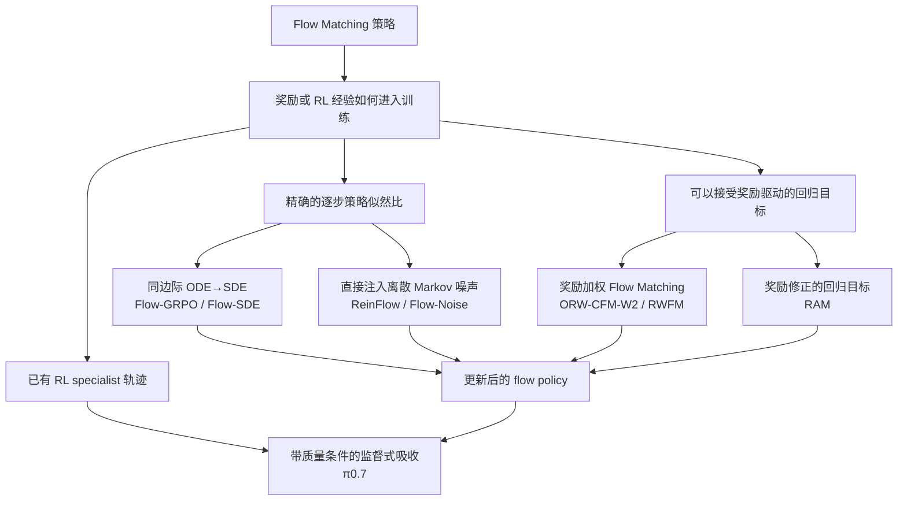
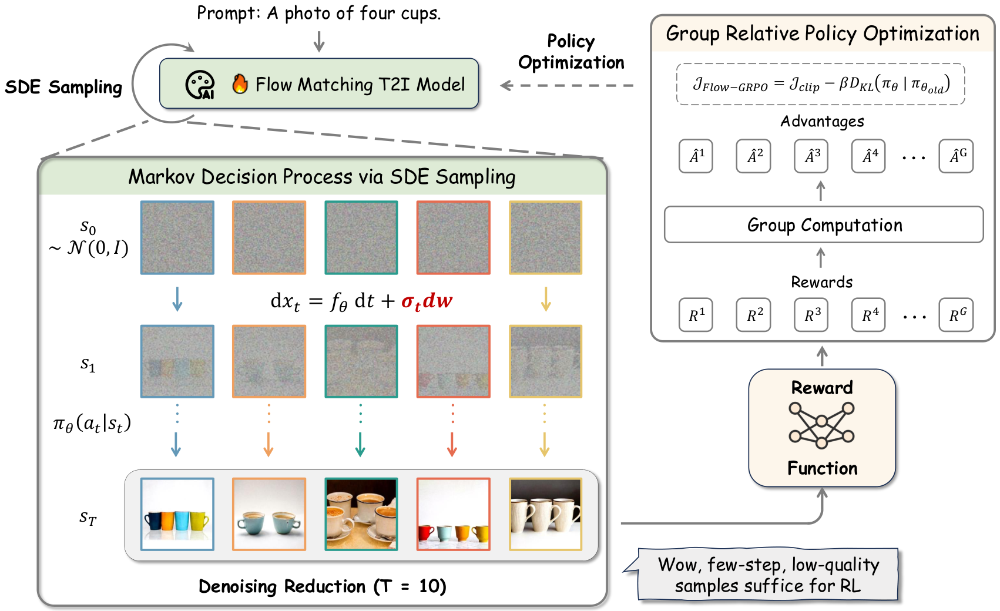
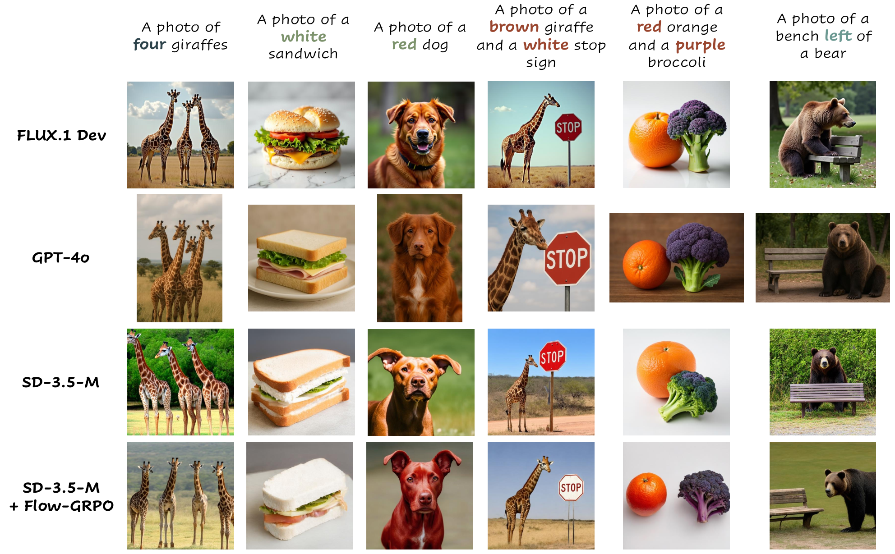
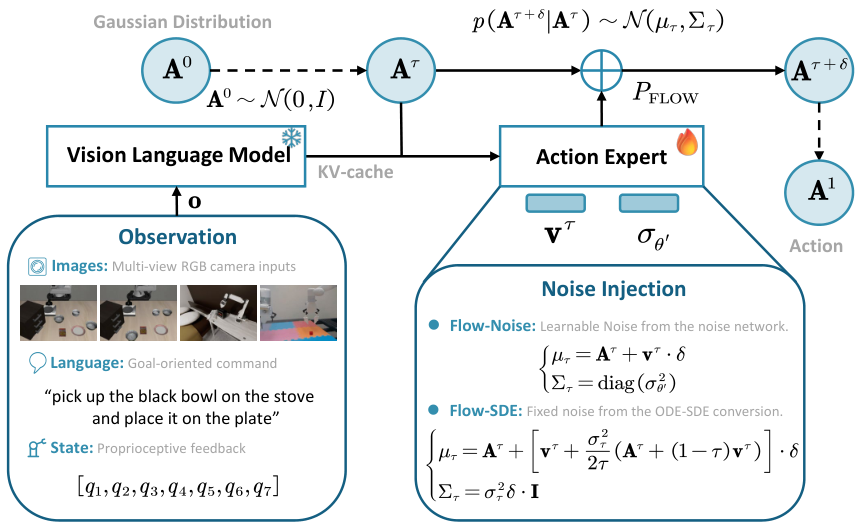
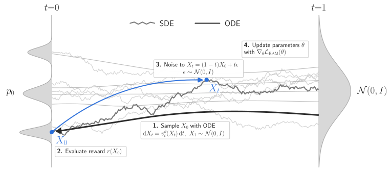

## Flow Matching 接入奖励信息的四种方式

已经训练好的 Flow Matching 模型可以通过四种方式利用奖励或 RL 经验。前三种直接更新当前策略，第四种则把其他策略产生的经验吸收到通用模型中：

1. **同边际 SDE**：使用 score 补偿把概率流 ODE 改写成随机 SDE，再用每个内部去噪步的 Gaussian likelihood ratio 进行 PPO/GRPO 更新，代表方法包括 Flow-GRPO 和 Flow-SDE。
2. **离散随机策略**：直接给有限步 flow 定义 Gaussian Markov 转移，并优化内部路径 likelihood，代表方法包括 ReinFlow 和 Flow-Noise。
3. **奖励驱动的回归目标**：用奖励加权 Flow Matching 或奖励修正回归更新 velocity，不依赖逐步 SDE likelihood，代表方法包括 RWFM 和 RAM。
4. **条件式经验吸收**：$\pi_{0.7}$ 把 RL specialist 的 rollout 与其他异质数据一起加入监督训练，并用质量、错误和速度等条件区分不同数据模式；它本身不执行在线策略梯度。

本文是[《流匹配的 RL（一）：统一理解 Diffusion、Flow Matching 及 ODE、SDE》](/posts/flow-matching-rl-from-unified-diffusion-and-flow-matching/)的续篇。第一篇已经推导随机插值、连续性方程、概率流 ODE、同边际 SDE 以及 velocity/score 转换；本文只保留这些结论的接口，重点介绍相关论文将它们用于 RL 的具体方式。

> **时间约定。** 本文主要使用“生成时间 $0\to1$：噪声到数据”，并明确区分概率流速度、SDE 漂移与布朗噪声幅度。引用论文使用相反时间方向时，会单独说明端点和采样步长。连续时间同边际与有限步转移也会分开讨论。

---

## 1. 从 Linear Flow Matching 接入奖励优化

第一篇第四部分第 13 节给出了 Linear Flow Matching / Rectified Flow 的基础形式。训练时，从噪声端点 $x_0$ 和数据端点 $x_1$ 构造线性路径

$$
x_t=(1-t)x_0+t x_1,
\qquad
x_0\sim\mathcal N(0,I),\quad t:0\to1.
$$

这条训练路径的速度标签为

$$
Y_t=x_1-x_0.
$$

模型通过第一篇式 (13.1) 学习条件平均速度：

$$
\boxed{
\mathcal L_{\mathrm{FM}}(\theta)
\mathrel{=}
\mathbb E
\left\|
b_\theta\bigl(t,(1-t)x_0+t x_1,c\bigr)
-(x_1-x_0)
\right\|^2.
}
$$

训练完成后，模型从高斯噪声出发，沿学习到的速度场运行 ODE：

$$
\boxed{
\frac{\mathrm dX_t}{\mathrm dt}
=b_\theta(t,X_t,c),
\qquad
X_0\sim\mathcal N(0,I).
}
$$

因此，预训练 Flow Matching 模型通常提供的是一个确定性 ODE 生成器。第 2 章先解释奖励优化需要什么概率接口，第 3–6 章讨论如何直接更新这类模型；第 7 章则讨论另一种情况：不对当前模型做在线 RL，而是让通用 Flow Matching 策略监督学习已有 RL specialist 的行为数据。

### 1.1 三种时间不能混为一谈

| 记号 | 含义 |
|---|---|
| $t\in[0,1]$ | 连续的 Flow Matching 生成时间；$0$ 是噪声，$1$ 是数据或动作 |
| $k=0,\ldots,K$ | 数值求解器的内部去噪步 |
| $h=0,1,\ldots,H$ | 机器人与环境交互的外层决策时间 |

图像生成中，每个生成样本对应一条内部轨迹和一个终点奖励；同一 prompt 的多条样本只是并行 rollout，不会串成外层环境时间。机器人策略则在每个环境时刻 $h$ 内运行一条内部 flow，生成动作块，再进入下一个环境状态。因此，机器人论文中的“内部去噪 MDP”和“外层环境 MDP”不是同一个时间尺度。

### 1.2 奖励优化改变终点分布

设预训练终点分布为 $p_{\mathrm{ref}}(x\mid c)$。KL 正则化的奖励目标为

$$
\max_p
\left\{
\mathbb E_{x\sim p}[R(x,c)]
-\beta D_{\mathrm{KL}}(p\|p_{\mathrm{ref}})
\right\}.
\tag{1.1}
$$

其最优分布是奖励倾斜分布

$$
\boxed{
p^*(x\mid c)
\propto
p_{\mathrm{ref}}(x\mid c)
\exp\!\left(\frac{R(x,c)}{\beta}\right).
}
\tag{1.2}
$$

式 (1.1)–(1.2) 对固定条件下的终点奖励或 contextual-bandit 视角是精确的；在机器人序列决策中，状态访问分布也会随策略改变，不能把整段 MDP 直接缩成同一个终点分布公式。它在本文中主要提供一个共同直觉：奖励后训练要把概率质量移向高回报行为，而不是给原轨迹简单加一个扰动。ODE-to-SDE 并不决定目标分布，只是为某些 PPO/GRPO 更新提供随机策略与 likelihood 接口。

---

## 2. 确定性 ODE 不支持逐步 PPO/GRPO likelihood ratio

### 2.1 ODE 不产生逐步动作概率

ODE 本质上是一个确定函数。给定当前状态 $X_k$，它只会算出唯一的下一状态：

$$
\boxed{
X_k
\xrightarrow{\text{ODE}}
X_{k+1}.
}
\tag{2.1}
$$

它不会同时给出多个可能的下一状态，也不会告诉我们每个状态出现的概率。

随机初始噪声可以让 ODE 生成不同的最终样本，但当某个 $X_k$ 已经确定后，这一步仍然只有一个结果。随机性来自最开始的噪声，不来自 ODE 的每一步。

PPO/GRPO 需要比较：同一个动作在旧模型下的概率和在新模型下的概率。ODE 每一步只输出一个位置，不输出这个位置的概率，因此无法直接计算逐步 likelihood ratio。

$$
\boxed{
\text{ODE 输出唯一的下一位置，不输出该位置的概率。}
}
$$

### 2.2 随机 SDE 提供可计算的策略密度

将与概率流 ODE 同边际的正向 SDE 用 Euler--Maruyama 离散。为避免与概率流速度 $b_\theta$ 混淆，把 SDE 漂移另记为 $a_\theta$：

$$
Z_{k+1}
=Z_k+h_k a_\theta(t_k,Z_k,c)
+\sqrt{2\epsilon_k^{\mathrm{diff}} h_k}\,\xi_k,
\qquad
a_\theta(t,x,c)
=b_\theta(t,x,c)+\epsilon(t)s_\theta(t,x,c),
\tag{2.2}
$$

其中 $h_k=t_{k+1}-t_k>0$，$\epsilon_k^{\mathrm{diff}}=\epsilon(t_k)>0$ 是扩散系数，$\xi_k\sim\mathcal N(0,I)$ 是每一步重新采样的标准高斯。于是

$$
\boxed{
\pi_\theta(Z_{k+1}\mid Z_k,c)
=\mathcal N
\left(
Z_k+h_ka_\theta(t_k,Z_k,c),
2\epsilon_k^{\mathrm{diff}}h_kI
\right).
}
\tag{2.3}
$$

若当前策略和参考策略使用相同协方差，一步 KL 还有闭式形式：

$$
D_{\mathrm{KL}}(\pi_\theta\|\pi_{\mathrm{ref}})
=\frac{\|\mu_\theta-\mu_{\mathrm{ref}}\|^2}
{4\epsilon_k^{\mathrm{diff}}h_k}.
\tag{2.4}
$$

现在内部生成过程可以被视作 MDP：状态是 $(Z_k,t_k,c)$，动作是下一 latent $Z_{k+1}$，策略是式 (2.3)，奖励通常只在终点给出。

### 2.3 什么时候需要随机化内部过程

确定性 ODE 的一步转移是 Dirac 分布，不能直接提供 PPO/GRPO 所需的普通概率密度。因此，如果要计算真实的内部路径 likelihood ratio，就必须引入随机转移。

随机化有两种主要方式：

- **Flow-GRPO / Flow-SDE**：从连续同边际 SDE 得到 Gaussian 一步转移；
- **ReinFlow / Flow-Noise**：直接定义有限步 Gaussian 转移，不要求它来自连续 SDE。

如果使用奖励驱动的回归目标，则不需要将 ODE 随机化。

| 更新方式 | 是否需要随机化内部过程 | 代表方法 |
|---|---:|---|
| 使用真实内部 likelihood ratio 的 PPO/GRPO | 需要 | Flow-GRPO、Flow-SDE、ReinFlow、Flow-Noise |
| 使用奖励驱动的回归目标 | 不需要 | Reward-Weighted Flow Matching、RAM |

> **核心结论：**真正需要的是“具有可计算密度的随机转移”，不一定是某种特定形式的 SDE。

---

## 3. Flow-GRPO：把同边际 SDE 直接变成 GRPO 策略

### 3.1 论文与问题设定

[Jie Liu 等，*Flow-GRPO: Training Flow Matching Models via Online RL*，2025](https://arxiv.org/abs/2505.05470)研究文本到图像 Flow Matching 模型的在线 RL。论文面对两个直接问题：

1. 原模型使用确定性 ODE，无法为每个去噪步提供随机策略密度；
2. 在线 RL 要反复生成图像，完整去噪轨迹使数据采集昂贵。

它的两项核心设计正好对应这两个问题：**ODE-to-SDE** 提供随机转移，**Denoising Reduction** 降低 rollout 成本。

*图 3-1：Flow-GRPO 总体框架。模型用少步 SDE 采集成组轨迹，终点奖励经 GRPO 目标更新 velocity；图源为该论文 Figure 2。*

### 3.2 ODE-to-SDE：保持边际，改变路径

第一篇 10.4 节的式 (10.5) 汇总了同一条边际路径对应的三种动力学：

$$
\boxed{
\begin{aligned}
\text{概率流 ODE：}\quad
&\dot X_t=b(t,X_t),
\\
\text{前向 SDE：}\quad
&\mathrm dZ_t=(b+\epsilon s)\,\mathrm dt
+\sqrt{2\epsilon}\,\mathrm dW_t,
\\
\text{反向 SDE：}\quad
&\mathrm dZ_t=(b-\epsilon s)\,\mathrm dt
+\sqrt{2\epsilon}\,\mathrm d\overline W_t,
\qquad t:1\to0.
\end{aligned}
}
$$

Flow-GRPO 使用同样的反向时间 $t=1\to0$：$t=1$ 是 Gaussian noise，$t=0$ 是图像 latent。在第一篇式 (10.5) 中令

$$
b=v_\theta,
\qquad
s=\nabla_x\log p_t,
\qquad
\epsilon(t)=\frac{\sigma_t^2}{2},
$$

概率流 ODE 即为

$$
\mathrm dX_t=v_\theta(X_t,t,c)\,\mathrm dt,
\tag{3.1}
$$

反向 SDE 即为

$$
\mathrm dX_t
=\left[
v_\theta(X_t,t,c)
-\frac{\sigma_t^2}{2}\nabla_x\log p_t(X_t\mid c)
\right]\mathrm dt
+\sigma_t\,\mathrm dW_t.
\tag{3.2}
$$

这里 $\sigma_t$ 是 SDE 的布朗噪声幅度；式 (3.2) 沿用论文的 $\mathrm dW_t$ 记号，对应第一篇的反向布朗增量 $\mathrm d\overline W_t$。

对 Rectified Flow，从式 (3.2) 到式 (3.3) 还要用到第一篇式 (16.4) 的 score--velocity 转换。Flow-GRPO 的反向线性路径可写成

$$
X_t=(1-t)X_0+t\varepsilon,
\qquad X_0\sim p_{\mathrm{data}},
\quad \varepsilon\sim\mathcal N(0,I).
$$

这对应第一篇式 (15.1) 中的 $a(t)=1-t$ 和路径噪声系数 $\sigma_{\mathrm{path}}(t)=t$。再由第一篇式 (16.4) 得

$$
\nabla_x\log p_t(x\mid c)
=-\frac{1}{t}
\bigl(x+(1-t)v_\theta(x,t,c)\bigr).
$$

> **记号区分。** $\sigma_{\mathrm{path}}(t)=t$ 是线性概率路径中原始高斯噪声的系数；式 (3.2) 中的 $\sigma_t$ 则是后来构造的 SDE 布朗噪声幅度。两者作用不同，不能混为同一个量。

将这个 score--velocity 关系代入式 (3.2)，即得论文实际使用的 velocity 漂移：

$$
\boxed{
\mathrm dX_t
=\left[
v_\theta(X_t,t,c)
+\frac{\sigma_t^2}{2t}
\bigl(X_t+(1-t)v_\theta(X_t,t,c)\bigr)
\right]\mathrm dt
+\sigma_t\,\mathrm dW_t.
}
\tag{3.3}
$$

论文选择噪声日程

$$
\sigma_t=a\sqrt{\frac{t}{1-t}},
\tag{3.4}
$$

其中 $a$ 控制探索强度。采样沿反向时间进行，因此数值实现中的 $\Delta t<0$；噪声标准差使用 $\sigma_t\sqrt{|\Delta t|}$。Euler--Maruyama 一步是

$$
X_{t+\Delta t}
=\mu_\theta(X_t,t,c)
+\sigma_t\sqrt{|\Delta t|}\,\epsilon,
\qquad \epsilon\sim\mathcal N(0,I),
\tag{3.5}
$$

其中

$$
\mu_\theta
=X_t+\left[
v_\theta
+\frac{\sigma_t^2}{2t}
\bigl(X_t+(1-t)v_\theta\bigr)
\right]\Delta t.
\tag{3.6}
$$

于是内部策略不再是 Dirac 转移，而是

$$
\pi_\theta(X_{t+\Delta t}\mid X_t,c)
=\mathcal N
\left(
\mu_\theta,
\sigma_t^2|\Delta t|I
\right).
\tag{3.7}
$$

固定旧参数 $\theta_{\mathrm{old}}$，并且式 (3.2) 中使用的 score 确实对应这组参数诱导的 ODE 边际时，理想连续时间 SDE 与原 ODE 共享每个时刻的边际。因此随机化的目的不是故意改变当前生成分布，而是为训练增加：

- 给定当前 latent 后的随机分支；
- Gaussian 条件转移概率；
- 新旧策略 likelihood ratio；
- 与参考模型的逐步 KL。

若参考策略使用相同协方差，一步 KL 为

$$
D_{\mathrm{KL}}(\pi_\theta\|\pi_{\mathrm{ref}})
=\frac{
\|\mu_\theta-\mu_{\mathrm{ref}}\|^2
}{2\sigma_t^2|\Delta t|}.
\tag{3.8}
$$

所以 velocity 的差异最终被转化成一个可微、闭式的局部 trust-region 惩罚。反向 SDE 与正向 SDE 的 score 漂移正负号不同，原因就是运行方向不同。

### 3.3 Group rollout 与 GRPO 目标

对同一个 prompt $c$，旧策略生成 $G$ 条随机轨迹，终点图像奖励记为 $R_i$。组内相对优势为

$$
\widehat A_i
=\frac{R_i-\operatorname{mean}(R_1,\ldots,R_G)}
{\operatorname{std}(R_1,\ldots,R_G)+\varepsilon}.
\tag{3.9}
$$

最简单的 credit assignment 是把同一个终点优势分给该轨迹的所有内部步。一步策略比值为

$$
r_{i,k}(\theta)
=\frac{
\pi_\theta(Z_{k+1}^i\mid Z_k^i,c)
}{
\pi_{\theta_{\mathrm{old}}}(Z_{k+1}^i\mid Z_k^i,c)
}.
\tag{3.10}
$$

核心 clipped objective 可写成

$$
\boxed{
\mathcal J_{\mathrm{Flow\text{-}GRPO}}
=\mathbb E
\left[
\frac1{GK}\sum_{i,k}
\min\!\left(
r_{i,k}\widehat A_i,
\operatorname{clip}(r_{i,k},1-\epsilon,1+\epsilon)\widehat A_i
\right)
-\beta\,\mathrm{KL}
\right].
}
\tag{3.11}
$$

组相对优势省去了 value model，逐步 Gaussian 密度则使 GRPO 的比值与 KL 可直接计算。

### 3.4 Denoising Reduction：训练少步，评估恢复完整步数

Flow-GRPO 的第二项贡献不是 SDE 理论，而是数据采集策略。论文在 SD3.5-M 上用 10 个 SDE 步采集训练轨迹，而推理仍使用原来的 40 步。少步训练图像可能带有伪影，但 GRPO 主要利用同组样本的相对排序，仍能获得有效信号；论文报告从 40 步降到 10 步可带来超过四倍的数据采集加速，而最终奖励基本不受影响。

这也说明训练 sampler 与部署 sampler 可以不同：训练需要随机性和密度，部署可以回到高质量的确定性 ODE。但二者的差距必须通过实验验证，不能由连续时间同边际结论自动保证。

### 3.5 论文结果与真正的限制

论文在 SD3.5-M 上报告：GenEval 从 63% 提升到 95%，视觉文字渲染准确率从 59% 提升到 92%，并在 PickScore 人类偏好任务上提升奖励；配合 KL 约束时，作者报告图像质量与多样性没有明显恶化。

*图 3-2：GenEval 定性对比。SD3.5-M 经 Flow-GRPO 训练后，在物体计数、颜色、属性绑定和空间关系上更准确；图源为该论文 Figure 3。*

Flow-GRPO 仍有三个主要限制：

- 10 步 SDE 是对连续过程的粗略离散，不保证严格保持原 ODE 边际；
- 同一个终点奖励分给所有去噪步，无法准确判断哪一步起了作用；
- 噪声太小时探索不足，太大时又会破坏生成质量。

因此，少步 SDE 的实际效果仍需要通过实验验证。

---

## 4. ReinFlow：直接把离散 flow 变成可学习的 Markov 策略

### 4.1 从确定性 flow 到随机 Markov 策略

[Tonghe Zhang 等，*ReinFlow: Fine-tuning Flow Matching Policy with Online Reinforcement Learning*，2025](https://arxiv.org/abs/2505.22094)研究如何用在线强化学习微调机器人 flow policy。

在环境时刻 $h$，策略先接收观测 $o_h$，再从初始噪声 $A_h^0\sim p_0$ 出发，经过 $K$ 个内部去噪步得到 $A_h^K$。机器人真正执行的是最终动作 $A_h^K$，中间的 $A_h^1,\ldots,A_h^{K-1}$ 都是内部 latent。

原来的 Euler 更新是确定性的：

$$
A_h^{k+1}
=A_h^k+\Delta t_kv_\theta(t_k,A_h^k,o_h).
$$

给定 $A_h^k$ 和 $o_h$ 后，下一步 $A_h^{k+1}$ 便完全确定，对应的是 Dirac 转移，无法直接得到 PPO 所需的普通概率密度和似然比。ReinFlow 因此不从连续时间 SDE 出发，而是直接在每个离散更新中加入可学习的高斯噪声：

$$
A_h^{k+1}
=A_h^k
+\Delta t_k v_\theta(t_k,A_h^k,o_h)
+\sigma_{\theta'}(t_k,A_h^k,o_h)\epsilon_k,
\quad
\epsilon_k\sim\mathcal N(0,I).
\tag{4.1}
$$

其中，$\theta$ 是 velocity 网络的参数，$\theta'$ 是噪声网络的参数；$\sigma_{\theta'}$ 根据当前 latent、时间和观测决定这一步的探索强度。

给定 $A_h^k$ 和 $o_h$，式 (4.1) 的均值是确定性 Euler 更新，方差由噪声网络给出。因此，这一步的条件分布为

$$
\pi_{\theta,\theta'}(A_h^{k+1}\mid A_h^k,o_h)
=\mathcal N
\left(
A_h^k+\Delta t_kv_\theta,
\sigma_{\theta'}^2 I
\right).
\tag{4.2}
$$

现在每个内部步都有可计算的高斯密度，整条去噪路径也就构成了一个 Markov 策略。固定环境时刻 $h$，其内部路径为

$$
A_h^0\rightarrow A_h^1\rightarrow\cdots\rightarrow A_h^K.
$$

式 (4.3) 来自概率的链式法则和 Markov 假设。由于下一步 $A_h^{k+1}$ 只依赖当前状态 $A_h^k$ 和观测 $o_h$，整条路径的联合概率为

$$
\pi_{\theta,\theta'}(A_h^{0:K}\mid o_h)
=p_0(A_h^0)
\prod_{k=0}^{K-1}
\pi_{\theta,\theta'}(A_h^{k+1}\mid A_h^k,o_h).
$$

其中每个一步转移概率都是式 (4.2) 的高斯密度。对上式取对数，乘积变成求和：

$$
\log\pi_{\theta,\theta'}(A_h^{0:K}\mid o_h)
=\log p_0(A_h^0)
+\sum_{k=0}^{K-1}
\log\pi_{\theta,\theta'}(A_h^{k+1}\mid A_h^k,o_h).
\tag{4.3}
$$

这里分解的是**论文定义的离散 Gaussian Markov 策略**的路径概率，并不表示它保持了原连续 ODE 的所有边际。

### 4.2 路径概率对最终机器人动作的更新

机器人最终执行的是 $A_h^K$，而式 (4.3) 是含全部 latent 的联合概率。把内部路径视为策略的辅助随机变量，在路径确实由这些 Markov 转移采样、奖励只通过最终动作与环境轨迹产生等通常条件下，对联合路径的 log probability 求梯度并乘以最终动作的 advantage，可以得到外层期望回报的 policy-gradient 表达。

其核心结构可概括为

$$
\nabla J
=\mathbb E
\left[
\sum_h\gamma^h
A^{\pi}(o_h,A_h^K)
\nabla\sum_{k=0}^{K-1}
\log\pi_{\theta,\theta'}(A_h^{k+1}\mid A_h^k,o_h)
\right].
\tag{4.4}
$$

实际实现不是对每个内部步分别 clip，而是先把内部 log probability 相加，形成环境时刻 $h$ 的路径比值：

$$
\rho_h(\theta,\theta')
=\exp\!\left[
\sum_{k=0}^{K-1}
\left(
\log\pi_{\theta,\theta'}(A_h^{k+1}\mid A_h^k,o_h)
-\log\pi_{\mathrm{old}}(A_h^{k+1}\mid A_h^k,o_h)
\right)
\right].
\tag{4.5}
$$

初始噪声分布 $p_0(A_h^0)$ 不随参数变化，因此会在新旧路径概率的比值中抵消。真正参与式 (4.5) 的是后续 $K$ 个 Gaussian 转移。

然后使用标准 PPO surrogate：

$$
\mathcal J_{\mathrm{ReinFlow}}
=\mathbb E_h
\left[
\min\!\left(
\rho_h\widehat A_h,
\operatorname{clip}(\rho_h,1-\epsilon,1+\epsilon)\widehat A_h
\right)
-\alpha\mathcal R_h
\right].
\tag{4.6}
$$

$\mathcal R_h$ 可以是 entropy、KL 或对噪声大小的正则。velocity 网络 $\theta$ 与噪声网络 $\theta'$ 联合更新；噪声网络根据当前 latent、时间和观测动态调节探索强度。训练结束后，论文丢弃噪声网络，恢复确定性的 flow policy 部署。

一轮 ReinFlow 的计算顺序是：用旧参数与噪声网络在环境中 rollout，保存所有内部 latent；用 GAE 或 critic 计算最终动作 advantage；再用保存的内部路径重算式 (4.3) 和式 (4.5)，进行多轮 PPO 更新。这里没有把每个内部 latent 当成真正的环境动作，环境只看到 $A_h^K$。

### 4.3 ReinFlow 适合少步机器人策略的原因

ReinFlow 直接定义有限步转移，不依赖连续时间 SDE 再做粗离散，因此即便只有 1 或 4 个去噪步，式 (4.2) 的策略密度仍是定义上精确的。这使它能同时微调 Rectified Flow 和 Shortcut Model。

论文报告，在腿式运动任务中，Rectified Flow policy 的 episode reward 平均净增长 135.36%，相较 DPPO 节省 82.63% wall time；在状态和视觉操作任务中，Shortcut Model policy 的成功率平均净增长 40.34%，并能在 4 步甚至 1 步下训练。

代价是随机化后的训练策略不再自动继承原 ODE 的连续时间边际保证；性能依赖噪声网络、正则化和离散步数，而且多个内部 log ratio 相加后，方差通常会随路径变长而增大。训练结束时丢弃噪声网络也会引入训练策略与部署策略的差异。换句话说，ReinFlow 用“有限步策略定义清楚”换取了“连续同边际解释较弱”。

---

## 5. $\pi_{\mathrm{RL}}$：在 VLA 中比较 Flow-Noise 与 Flow-SDE

### 5.1 论文定位

[Kang Chen 等，*$\pi_{\mathrm{RL}}$: Online RL Fine-tuning for Flow-based Vision-Language-Action Models*，2025](https://arxiv.org/abs/2510.25889)把前两条路线放进 $\pi_0$、$\pi_{0.5}$ 等 flow-based VLA：

- **Flow-Noise** 继承 ReinFlow 思路，直接构造离散、可学习噪声的内部 Markov 过程；
- **Flow-SDE** 继承 Flow-GRPO 思路，用 ODE-to-SDE 保持理想连续时间边际，并把内部去噪与外部环境组成两层 MDP。

这篇论文的重要性不只是“又做了一次 PPO”，还在于它把图像生成中的单条内部 MDP 扩展为机器人控制中的两种时间尺度。

*图 5-1：$\pi_{\mathrm{RL}}$ 的两种噪声注入方式。Flow-Noise 学习离散方差，Flow-SDE 使用由 velocity/score 确定的同边际漂移；图源为该论文 Figure 2。*

### 5.2 Flow-Noise：与 ReinFlow 相同的路径策略

为与第 4 章一致，记 $A_h^0$ 为环境时刻 $h$ 的初始噪声，$A_h^K$ 为最终动作。Flow-Noise 直接在离散 Euler 更新中加入可学习噪声，其一步转移写成

$$
\pi_{\theta,\theta'}(A_h^{k+1}\mid A_h^k,o_h)
=\mathcal N\!\left(
A_h^k+\Delta t_kv_\theta(t_k,A_h^k,o_h),
\sigma_{\theta'}^2(t_k,A_h^k,o_h)I
\right).
\tag{5.1}
$$

这与 ReinFlow 的式 (4.2) 是同一种构造：$\theta$ 控制 velocity，$\theta'$ 控制探索噪声。为简化记号，式 (5.1) 写成 $\sigma_{\theta'}^2I$；实际逐维输出噪声时，各动作维度使用各自的方差。

由式 (4.3)，整条内部路径的 log probability 为

$$
\log\pi_{\theta,\theta'}(A_h^{0:K}\mid o_h)
=\log p_0(A_h^0)
+\sum_{k=0}^{K-1}
\log\pi_{\theta,\theta'}(A_h^{k+1}\mid A_h^k,o_h).
\tag{5.2}
$$

外层 PPO 仍把环境时刻 $h$ 当作一个 step，并用式 (5.2) 计算整条内部路径的 ratio。因此，Flow-Noise 不把 horizon 显式扩张为 $HK$，但更新时仍要重算所有内部步的 log probability。它与 ReinFlow 一样，直接定义有限步随机策略，不要求保持原 ODE 的连续时间边际。

### 5.3 Flow-SDE：把每个内部步作为 PPO step

Flow-SDE 不训练独立的噪声网络，而是复用第 3 章的 ODE-to-SDE 构造。为统一记号，本节仍令 $t=1$ 表示噪声、$t=0$ 表示动作，并记 $\Delta t_k=t_{k+1}-t_k<0$。原论文若使用相反的时间坐标，只需同时变换时间、velocity 和噪声日程，算法含义不变。

把式 (3.3) 方括号内的 SDE 漂移简记为 $b_\theta^{\mathrm{SDE}}$，则 Euler--Maruyama 更新为

$$
A_h^{k+1}
=A_h^k
+b_\theta^{\mathrm{SDE}}(t_k,A_h^k,o_h)\Delta t_k
+\sigma_{t_k}\sqrt{|\Delta t_k|}\,\epsilon_k,
\qquad
\epsilon_k\sim\mathcal N(0,I).
\tag{5.3}
$$

因此，每个内部步的策略密度为

$$
\pi_\theta(A_h^{k+1}\mid A_h^k,o_h)
=\mathcal N\!\left(
A_h^k+b_\theta^{\mathrm{SDE}}\Delta t_k,
\sigma_{t_k}^2|\Delta t_k|I
\right).
\tag{5.4}
$$

式 (5.3)--(5.4) 就是把第 3 章的式 (3.5)--(3.6) 从图像 latent 换成机器人动作 latent。两者的关键区别在于：Flow-Noise 的噪声由 $\theta'$ 学习，Flow-SDE 的漂移和噪声日程则来自同边际 SDE。

Flow-SDE 把每个内部转移都看成两层 MDP 中的一个策略 step：

$$
s_{h,k}=(o_h,A_h^k),
\qquad
a_{h,k}=A_h^{k+1}.
\tag{5.5}
$$

在 $k=0,\ldots,K-1$ 的内部去噪过程中，环境观测 $o_h$ 保持不变，内部奖励为零；得到 $A_h^K$ 后，机器人执行这个动作，环境才返回奖励并转移到 $o_{h+1}$。

这样，难以直接计算的最终动作边际概率被替换为每个内部高斯转移的概率。代价是有效 horizon 从 $H$ 扩张到约 $HK$，critic 和 credit assignment 都更难。

两种分支最后都使用 PPO，区别只在 ratio 的计算粒度：

$$
\begin{aligned}
\rho_h^{\mathrm{Noise}}
&=\exp\!\left[
\sum_{k=0}^{K-1}
\left(
\log\pi_{\theta,\theta'}(A_h^{k+1}\mid A_h^k,o_h)
-\log\pi_{\mathrm{old}}(A_h^{k+1}\mid A_h^k,o_h)
\right)
\right],\\
\rho_{h,k}^{\mathrm{SDE}}
&=\frac{
\pi_\theta(A_h^{k+1}\mid A_h^k,o_h)
}{
\pi_{\mathrm{old}}(A_h^{k+1}\mid A_h^k,o_h)
}.
\end{aligned}
\tag{5.6}
$$

Flow-Noise 用一个环境 advantage 乘整条路径的 ratio；Flow-SDE 则在每个内部随机步计算 ratio，并把相应的外层 advantage 用于这些内部步。

### 5.4 Hybrid ODE--SDE：只随机化一个内部位置

为缩短 horizon，$\pi_{\mathrm{RL}}$ 还提出 hybrid rollout：在每个环境时刻随机选择一个内部位置 $j_h$ 使用 SDE，其余位置仍使用确定性 ODE。整个更新可以简单写成

$$
A_h^{k+1}
\mathrel{=}
\begin{cases}
A_h^k+v_\theta(t_k,A_h^k,o_h)\Delta t_k,
&k\ne j_h,\\[4pt]
A_h^k+b_\theta^{\mathrm{SDE}}(t_k,A_h^k,o_h)\Delta t_k
+\sigma_{t_k}\sqrt{|\Delta t_k|}\,\epsilon_k,
&k=j_h.
\end{cases}
\tag{5.7}
$$

PPO ratio 只来自 $k=j_h$ 的那一次高斯决策。这样既保留了可计算的随机策略密度，又不必把所有内部步都暴露给外层 PPO。论文报告 hybrid 两层形式相对标准两层形式约有两倍加速。

实验中，论文在 LIBERO、ManiSkill、MetaWorld 和 CALVIN 上微调 $\pi_0$ 与 $\pi_{0.5}$。例如 few-shot $\pi_0$ 的平均成功率从 51.1 提升到 Flow-SDE 的 78.7 和 Flow-Noise 的 80.3；few-shot $\pi_{0.5}$ 从 55.6 提升到 86.6 和 84.7。论文也报告长程和 OOD 设置上的改善。

这些结果同时提醒我们：训练时噪声增大会降低随机 rollout 的即时成功率，但部署时可以使用更新后的确定性 ODE。评估必须分别报告 stochastic train policy 与 deterministic evaluation policy。

### 5.5 四种逐步 likelihood 实现的对照

| 方法与论文 | 随机化方式 | 优化单位 | 连续时间同边际 | 主要适用场景 |
|---|---|---|---:|---|
| Flow-GRPO | score 补偿的 SDE | 每个去噪步的 GRPO ratio | 理想条件下是 | 图像生成、终点奖励 |
| ReinFlow | 可学习离散 Gaussian 噪声 | 内部路径联合 likelihood 的 PPO | 不要求 | 少步机器人 flow policy |
| $\pi_{\mathrm{RL}}$/Flow-Noise | 可学习离散噪声 | 外层环境 step + 内部联合 likelihood | 不要求 | 大型 flow-based VLA |
| $\pi_{\mathrm{RL}}$/Flow-SDE | score 补偿的 SDE | 内外两层 MDP | 方向、score 与步长一致时是 | 需要显式探索结构的 VLA |

---

## 6. 不做 ODE-to-SDE 的奖励优化路线

### 6.1 奖励加权 Flow Matching：直接改变回归数据分布

[Jiajun Fan 等，*Online Reward-Weighted Fine-Tuning of Flow Matching with Wasserstein Regularization*，2025](https://arxiv.org/abs/2502.06061)不计算逐步策略 likelihood，而是从当前模型在线采样终点，用奖励构造权重，再训练加权 conditional Flow Matching：

$$
\mathcal L_{\mathrm{RWFM}}(\theta)
=\mathbb E
\left[
w(x_1,c)
\|u_\theta(t,x_t,c)-Y_t\|^2
\right].
\tag{6.1}
$$

论文使用指数权重

$$
w(x_1,c)=\exp\bigl(\tau R(x_1,c)\bigr).
\tag{6.2}
$$

所以一次理想加权更新得到 $q_{\mathrm{new}}(x_1)\propto w(x_1)q(x_1)$，与式 (1.2) 的奖励倾斜方向一致。但在线重复 $N$ 轮后会出现 $w(x_1)^N$；没有约束时，分布会趋向 $\arg\max R$ 附近的 Dirac 测度。

ORW-CFM-W2 因而使用 velocity 差构造终点 Wasserstein-2 距离的可计算上界：

$$
W_2^2(p_1^\theta,p_1^{\mathrm{ref}})
\le
e^{2L}
\int_0^1
\mathbb E_{x\sim p_t^\theta}
\left[
\|v_\theta(t,x)-v_{\mathrm{ref}}(t,x)\|^2
\right]\mathrm dt,
\tag{6.3}
$$

其中 $L$ 是参考 velocity 的 Lipschitz 常数。去掉与优化无关的常数后，论文的实际目标可概括为

$$
\boxed{
\mathcal L_{\mathrm{ORW\text{-}CFM\text{-}W2}}
=\mathbb E
\left[
w(x_1,c)\|v_\theta-u(\cdot\mid x_1,c)\|^2
+\alpha\|v_\theta-v_{\mathrm{ref}}\|^2
\right].
}
\tag{6.4}
$$

在论文的理想分析中，第 $N$ 轮后的分布满足

$$
q_\theta^N(x_1)
\propto
q(x_1)
\exp\!\left[
\tau N R(x_1)
-\beta\sum_{n=1}^N D^{n-1}(x_1)
\right],
\tag{6.5}
$$

其中 $D^{n-1}(x_1)$ 是第 $n-1$ 轮 velocity 与参考 velocity 的条件平方差。第一项把质量推向高奖励区域，第二项惩罚偏离参考 flow；$\tau$ 控制 reward greediness，式中的 $\beta$ 则概括由 Wasserstein 正则强度带来的 diversity-preservation 系数。

这一路线的优势是完全复用预训练式回归，不需要路径 likelihood；缺点是它更接近 reward-weighted regression 或 cross-entropy method，缺少 PPO 那样明确的新旧策略 trust region，权重退化时容易被少数高奖励样本主导。

[Samuel Pfrommer 等，*Reinforcement Learning for Flow-Matching Policies*，2025](https://arxiv.org/abs/2507.15073)把类似思想用于机器人 flow policy，并提出两类方法：

1. **RWFM**：通过 action-trajectory explorer 产生优于示范的新动作块，再按回报加权 Flow Matching 回归；
2. **带 learned reward surrogate 的 GRPO**：学习动作轨迹的 reward surrogate，用组相对优势加权 Flow Matching 损失，而不依赖 ODE 内部步的真实策略比值。

对于第二种方法，同一观测 $\tilde o$ 下采样 $G$ 个动作块，reward surrogate 给出 $r_i=R_\phi(\tilde o,A_i)$，优势为

$$
a_i
=\frac{r_i-\operatorname{mean}(r_1,\ldots,r_G)}
{\operatorname{std}(r_1,\ldots,r_G)+\varepsilon}.
\tag{6.6}
$$

这里没有 PPO ratio；优势先指数化为正权重，再乘在 Flow Matching regression 上：

$$
\mathcal L_{\mathrm{GRPO\text{-}FM}}
=\mathbb E
\left[
\frac1G\sum_{i=1}^G
\exp(\alpha a_i)
\left\|
v_\theta((A_i')^\tau,\tilde o,\tau)
-u((A_i')^\tau\mid A_i')
\right\|^2
\right].
\tag{6.7}
$$

$A_i'$ 是 action-trajectory explorer 对 $A_i$ 加入平滑 bump 后的候选轨迹。reward surrogate 通过真实 rollout 数据回归：

$$
\mathcal L_R(\phi)
=\mathbb E_{(\tilde o,A,O)\sim\mathcal D}
\left[
\|R_\phi(\tilde o,A)-R(\tilde o,A,O)\|^2
\right].
\tag{6.8}
$$

训练在“优化 policy”和“收集新 rollout、修正 reward surrogate”之间交替，避免策略长期利用 surrogate 的 OOD 误差。论文还把动作 chunk 的时间长度纳入生成变量，用于 minimum-time control。“GRPO”这个名称不一定意味着方法具有逐步 Gaussian likelihood；两类实现的关键区别在于优势作用于真实 log probability，还是被转化为 Flow Matching 的样本权重。

### 6.2 RAM：用终点奖励修正预训练回归目标

[Andreas Bergmeister 等，*Reinforce Adjoint Matching: Scaling RL Post-Training of Diffusion and Flow-Matching Models*，2026](https://arxiv.org/abs/2605.10759)提出 Reinforce Adjoint Matching（RAM）。它仍处理黑盒奖励，但不使用 SDE rollout、reward gradient 或沿轨迹的 backward adjoint sweep。

为贴合 RAM 原论文，本小节记 $X_0$ 为 clean endpoint、$X_1$ 为 Gaussian noise，这与本文前半部分的全局时间方向相反。

RAM 从 KL 正则化随机最优控制得到一个结构结论：最优过程改变的是 clean endpoint 的分布，而给定 clean endpoint 后的解析加噪规律保持不变。于是训练可以写成：

1. 用当前模型的任意 sampler（可为 ODE）生成终点 $X_0$；
2. 计算一次黑盒奖励 $R(X_0)$；
3. 像预训练一样解析构造 $X_t=(1-t)X_0+t\epsilon$；
4. 用 Bayes bridge score 和 REINFORCE 恒等式，把奖励变成 velocity 的修正回归目标；
5. 一个终点复用多个独立噪声 $\epsilon$，摊薄采样与奖励成本。

*图 6-1：RAM 从当前模型采样 clean endpoint，查询一次奖励，再为同一终点解析生成多个独立 noisy state；图源为该论文 Figure 1。*

对线性 noising kernel，RAM 使用的 backward bridge score 可由当前 velocity 写成

$$
\nabla_{x_t}\log p_{0|t}(x_0\mid x_t)
=\frac{1-t}{t}
\left(v_t(x_t)-(\epsilon-x_0)\right).
\tag{6.9}
$$

这里的 bridge score 不是额外训练的 score network。在线性插值下，条件 score 可以直接由当前 velocity 与单样本的 Flow Matching target $\epsilon-X_0$ 之差恢复。RAM 再把随机控制中的 score correction 写成 velocity correction：

$$
\sigma_t u_t
=2\bigl(v_t^\theta-v_t^{\mathrm{ref}}\bigr),
\tag{6.10}
$$

其中 $u_t$ 是相对参考过程的控制量，$\sigma_t$ 是相应随机过程的扩散系数，$v_t^{\mathrm{ref}}$ 是预训练模型的参考 velocity。这个关系使 RAM 能够把随机最优控制推导重新写成普通的 velocity regression，而无需实际运行 SDE rollout。

把 REINFORCE 权重、bridge score 与式 (6.10) 合并后，论文给出的主训练目标为

$$
\boxed{
\begin{aligned}
\mathcal L_{\mathrm{RAM}}(\theta)
=\mathbb E_t
\Bigl[
\bigl\|
v_t^\theta(X_t)
-\operatorname{sg}\bigl(
&v_t^{\mathrm{ref}}(X_t)\\
&+R(X_0)
\bigl((\epsilon-X_0)-v_t^\theta(X_t)\bigr)
\bigr)
\bigr\|^2
\Bigr].
\end{aligned}
}
\tag{6.11}
$$

其中 $X_0\sim p_0^\theta$，$X_t=(1-t)X_0+t\epsilon$，$\epsilon\sim\mathcal N(0,I)$，$\operatorname{sg}$ 表示 stop-gradient。这个目标可以拆成三层含义：

- $v_t^{\mathrm{ref}}(X_t)$ 是锚点，阻止策略无约束偏离预训练生成分布；
- $(\epsilon-X_0)-v_t^\theta(X_t)$ 是当前模型相对单样本 Flow Matching target 的残差；
- $R(X_0)$ 决定残差修正的方向和幅度，因此高奖励终点会更强地把 velocity 拉向能够重现该终点的方向。

实现时，模型先完整生成 $X_0$ 并获得一次奖励，再为同一个 $X_0$ 重采样若干 $(t,\epsilon)$ 来估计式 (6.11)。因此 RAM 的计算图不穿过生成 sampler，也不需要奖励可微；ODE、SDE 或高阶求解器都只负责产生训练终点。

RAM 主算法为了图像尺度的可扩展性，丢弃了 adjoint 分解中的 path-cost correction；因此它不是完全无近似。论文说明该近似在初始化处成立，并与 KL 最优分布共享固定点结构。论文在 SD3.5-M 的 composability、OCR 和 PickScore 上报告，以最多约 50 倍更少的训练 step 达到 Flow-GRPO 的峰值奖励。

### 6.3 三条更新路线的对照

下表把 Flow-GRPO 作为基准，与本章两种不依赖真实内部 likelihood 的路线放在一起比较：

| 论文/方法 | 使用的“策略信号” | Rollout | 主要优点 | 核心近似或风险 |
|---|---|---|---|---|
| Flow-GRPO | 内部 Gaussian transition ratio | SDE | PPO/GRPO 解释直接 | 有限步 sampler bias、长内部 horizon |
| Reward-Weighted FM | 奖励权重乘 FM 回归 | ODE 或任意 sampler | 最接近预训练，简单 | 权重退化、模式坍缩、trust region 较弱 |
| RAM | 奖励修正的 adjoint-matching 回归 target | ODE 或任意 sampler | 无 SDE rollout、无 reward gradient，可复用终点 | 主版本忽略 path-cost correction |

---

## 7. $\pi_{0.7}$：用条件提示吸收 RL 经验，而不是再做在线 RL

[Physical Intelligence，*$\pi_{0.7}$: a Steerable Generalist Robotic Foundation Model with Emergent Capabilities*，2026](https://arxiv.org/abs/2604.15483)与前几章的方法处在不同阶段。Flow-GRPO、ReinFlow、奖励加权 Flow Matching 和 RAM 都在直接更新当前策略；$\pi_{0.7}$ 回答的则是：**已经有示范、评估数据和 RL specialist 轨迹后，怎样把这些经验吸收到一个通用 Flow Matching 策略中？**

因此，把它简单称为“另一种 RL 算法”并不准确。RL 已经在上游 specialist 的训练中发生；$\pi_{0.7}$ 本身主要进行带丰富条件的监督式策略训练，不计算 advantage、策略 ratio 或 ODE 内部转移的 likelihood。

### 7.1 条件信息怎样进入 Flow Matching

在环境时刻 $h$，令 $A_h$ 表示数据中的动作块，$o_h$ 表示观测历史，$q_h$ 表示任务与策略上下文。$q_h$ 不只包含“做什么”，还包含“以什么方式做”，例如 episode 质量、速度、是否出现错误、子任务指令、子目标图像和控制模式。

从噪声 $\varepsilon\sim\mathcal N(0,I)$ 与数据动作 $A_h$ 构造

$$
A_h^\tau=(1-\tau)\varepsilon+\tau A_h,
\qquad \tau\sim\mathcal U[0,1].
$$

只看 action expert，并省略 VLM backbone 的其他训练目标与工程细节，其动作损失仍可写成普通的条件式 Flow Matching：

$$
\boxed{
\mathcal L_{\pi_{0.7}}
=\mathbb E
\left[
\left\|
v_\theta(\tau,A_h^\tau,o_h,q_h)
-(A_h-\varepsilon)
\right\|^2
\right].
}
\tag{7.1}
$$

关键变化不在速度标签 $A_h-\varepsilon$，而在条件 $q_h$。奖励不会作为一个系数直接乘在式 (7.1) 上；高质量和低质量轨迹仍然都是监督样本，但模型被要求学习不同的条件分布

$$
p_\theta(A_h\mid o_h,q_h=\text{高质量、无错误})
\quad\text{与}\quad
p_\theta(A_h\mid o_h,q_h=\text{低质量或有错误}).
\tag{7.2}
$$

这与 reward-weighted regression 的差别很重要：后者通过增大高奖励样本的损失权重改变无条件的数据占比；$\pi_{0.7}$ 则保留异质数据，并用条件变量把不同质量和策略模式分开。

### 7.2 训练条件与推理条件必须配对

整个过程可以写成两阶段：

$$
\boxed{
\underbrace{
\text{示范、失败、evaluation、RL specialist 轨迹}
\xrightarrow{\text{添加质量与策略条件}}
\text{条件式 Flow Matching 训练}
}_{\text{训练：学习多个行为模式}}
\quad\Longrightarrow\quad
\underbrace{
q_h=\text{高质量、无错误、期望速度}
\xrightarrow{\text{Flow Matching 采样}}
A_h
}_{\text{推理：调用目标模式}}.
}
\tag{7.3}
$$

论文在训练中对部分 prompt 组件做 dropout，因此推理时还可以对 metadata 使用 classifier-free guidance，增强“高质量”或“更快”等条件的作用。论文的默认配置会把 overall quality 设为 5、mistake 设为 false，并把 overall speed 设为由该任务 episode length 的第 15 百分位数得到的较快档位。这个步骤不是在部署时重新做 RL，而是用 prompt 选择模型已经学到的条件行为分布。

这也解释了为什么 metadata 不是可有可无的描述文字：如果训练时不给失败轨迹标出“有错误”，推理时的“无错误”条件便没有可识别的对照；如果训练集中从未包含某种高质量行为，仅靠把 quality 提示成 5 也不能凭空创造相应技能。

---

## 8. 全文总结：四种方式与当前挑战

全文的出发点只有一个：预训练 Flow Matching 通常给出确定性 ODE，而 PPO/GRPO 的逐步策略比值要求具有普通概率密度的随机转移。围绕“奖励信息从哪里进入模型”，现有工作形成了四条不同路线。

### 8.1 四种方式解决的不是同一个问题

| 路线 | 奖励或经验怎样进入训练 | 代表方法 | 主要代价 |
|---|---|---|---|
| 同边际 ODE-to-SDE | 把内部去噪步变成 Gaussian 策略，计算逐步 likelihood ratio | Flow-GRPO、Flow-SDE | 离散后不再自动同边际，内部 horizon 变长 |
| 离散随机策略 | 直接给有限步 flow 定义 Gaussian Markov 转移，优化路径联合 likelihood | ReinFlow、Flow-Noise | 随机训练策略与确定性部署策略存在差异 |
| 奖励驱动的回归 | 用终点奖励加权样本或修正 velocity 回归目标 | Reward-Weighted FM、RAM | 缺少真实策略 ratio，依赖正则或近似控制分布漂移 |
| 条件式经验吸收 | 把 specialist、示范与评估轨迹写入监督数据，用条件选择行为模式 | $\pi_{0.7}$ | 依赖数据覆盖和条件标签，本身不是在线 RL |

前两条路线的核心是构造**可计算的随机策略密度**；第三条路线直接改变 Flow Matching 的回归目标；第四条路线则复用已经产生的 RL 经验。它们都能让奖励影响最终策略，但优化对象、概率含义和适用阶段并不相同。

### 8.2 当前仍然存在的挑战

1. **连续理论与离散实现之间有差距。** 同边际结论描述连续时间精确过程；实际训练常用很少的 Euler 步，时间网格、漂移评估位置和噪声日程都会改变真实转移分布。
2. **内部 credit assignment 仍然粗糙。** 图像任务常把一个终点奖励分给全部去噪步；机器人任务还叠加了外层环境时间。内部步数越多，路径 ratio 的方差和 critic 的学习难度通常越大。
3. **不同方法中的“概率”不能互换。** 单步 Gaussian likelihood、内部路径联合 likelihood、最终动作边际概率和奖励回归权重是四种不同信号。用哪种 sampler 采样，就必须按同一种转移规则计算概率。
4. **探索策略与部署策略可能不一致。** ReinFlow 和 Flow-Noise 会在训练时加入噪声，Flow-GRPO 和 Flow-SDE 也可能在部署时切回确定性 ODE。随机训练得到的改进能否保留，需要单独实验验证。
5. **奖励提升不等于整体能力提升。** 奖励加权可能导致模式坍缩，在线 RL 可能利用 reward model 漏洞；除了回报，还应同时检查生成质量、多样性、成功率和分布外泛化。
6. **经验吸收受数据覆盖约束。** 条件提示只能选择模型已经学到的行为模式。质量标签有噪声、目标行为缺失或推理条件与训练条件不一致时，监督式吸收不能凭空补出新技能。
7. **计算成本仍然限制规模化。** 在线 rollout、环境交互、奖励查询、内部 latent 存储和多轮策略更新都很昂贵；少步采样、终点复用和混合 ODE--SDE 虽能降本，但也会引入新的偏差。

### 8.3 最终判断标准

选择方法时依次回答三个问题：

1. 是否必须使用真实的内部 likelihood ratio？
2. 奖励是在训练时在线获得，还是已经沉淀为 specialist 轨迹？
3. 训练使用的随机 sampler 与最终部署的确定性 sampler 是否一致？

如果需要真实内部 ratio，就选择同边际 SDE 或离散 Gaussian Markov 策略；如果只需要利用终点奖励，可以直接修改 Flow Matching 回归；如果奖励已经体现在数据中，则使用带条件的监督式经验吸收。

> **总结：**ODE-to-SDE 不是 Flow Matching 强化学习的统一答案，它只解决“如何获得内部随机策略密度”这一类问题。真正统一四条路线的，是奖励最终如何改变动作或样本的终点分布。

---

## 参考文献

1. Michael S. Albergo, Nicholas M. Boffi, Eric Vanden-Eijnden. [Stochastic Interpolants: A Unifying Framework for Flows and Diffusions](https://arxiv.org/abs/2303.08797). 2023/2025.
2. Yaron Lipman et al. [Flow Matching for Generative Modeling](https://arxiv.org/abs/2210.02747). ICLR 2023.
3. Xingchao Liu, Chengyue Gong, Qiang Liu. [Flow Straight and Fast: Learning to Generate and Transfer Data with Rectified Flow](https://arxiv.org/abs/2209.03003). 2022.
4. Yang Song et al. [Score-Based Generative Modeling through Stochastic Differential Equations](https://arxiv.org/abs/2011.13456). ICLR 2021.
5. Jie Liu et al. [Flow-GRPO: Training Flow Matching Models via Online RL](https://arxiv.org/abs/2505.05470). 2025.
6. Tonghe Zhang et al. [ReinFlow: Fine-tuning Flow Matching Policy with Online Reinforcement Learning](https://arxiv.org/abs/2505.22094). 2025.
7. Kang Chen et al. [$\pi_{\mathrm{RL}}$: Online RL Fine-tuning for Flow-based Vision-Language-Action Models](https://arxiv.org/abs/2510.25889). 2025.
8. Jiajun Fan et al. [Online Reward-Weighted Fine-Tuning of Flow Matching with Wasserstein Regularization](https://arxiv.org/abs/2502.06061). ICLR 2025.
9. Samuel Pfrommer, Yixiao Huang, Somayeh Sojoudi. [Reinforcement Learning for Flow-Matching Policies](https://arxiv.org/abs/2507.15073). 2025.
10. Andreas Bergmeister et al. [Reinforce Adjoint Matching: Scaling RL Post-Training of Diffusion and Flow-Matching Models](https://arxiv.org/abs/2605.10759). 2026.
11. Physical Intelligence et al. [$\pi_{0.7}$: a Steerable Generalist Robotic Foundation Model with Emergent Capabilities](https://arxiv.org/abs/2604.15483). 2026.
